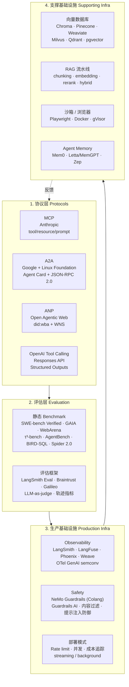

# Agent 技术全景图（Technology Landscape）

> 配套 `README.md` 的"专题列表"。在写每个专题的 notebook 之前，先看这张图建立全景心智模型。
> 数据来源：`/home/royenheart/projects/benches/.omo/ulw-research/20260723-agent-curriculum/SYNTHESIS.md`
> 研究日期：2026-07-23。研究方法：ulw-research 多波次并行检索。

## 全景图（Mermaid）



## 1. Agent Protocols

| 技术 | 解决什么 | 在 Agent 栈中的位置 | 关键资源 |
|---|---|---|---|
| **MCP** (Model Context Protocol, Anthropic) | 标准化 LLM 应用如何连接外部数据/工具 | 客户端↔服务器：单 agent ↔ 工具/数据 | [官方规范](https://modelcontextprotocol.io) · [GitHub spec](https://github.com/modelcontextprotocol/modelcontextprotocol) |
| **A2A** (Agent2Agent, Google→Linux Foundation) | 让不同框架构建的 opaque agent 之间能协作、发现、流式通信 | agent↔agent：跨框架、跨厂商 | [a2a-protocol.org](https://a2a-protocol.org) · [GitHub](https://github.com/a2aproject/A2A) |
| **ANP** (Agent Network Protocol) | 开放 agent 网络栈：去中心化身份 (did:wba) + 跨域消息 + 支付 | 互联网级开放协议，与 MCP 互补而非竞争 | [agent-network-protocol.com](https://agent-network-protocol.com) |
| **OpenAI Tool Calling** | 单一厂商协议，从 function calling → tools → Responses API | OpenAI 生态的事实标准；其他厂商在功能上对齐 | [OpenAI Function Calling](https://platform.openai.com/docs/guides/function-calling) |

**选型决策树**：
- 单 agent 接数据库/API/工具 → **MCP**（或 OpenAI tool calling 简单情况）
- 多 agent 跨框架协同 → **A2A**
- 跨域开放 agent 网络（支付、身份、联邦）→ **ANP**

## 2. Agent Evaluation

### 2.1 静态 Benchmark（用于离线回归和 SOTA 对比）

| Benchmark | 评估什么 | 难度/规模 | 关键资源 |
|---|---|---|---|
| **SWE-bench Verified** | 真实 GitHub issue 修复 (Python, 12 repo) | 500 人工校验样本；GPT-4o 33.2%，mini-SWE-agent v2 65% (Jul 2025) | [swebench.com](https://www.swebench.com/) · [OpenAI blog](https://openai.com/index/introducing-swe-bench-verified/) |
| **SWE-bench Multimodal** | 含视觉元素的 issue | 517 任务 | [multimodal.html](https://www.swebench.com/multimodal.html) |
| **SWE-bench Multilingual** | 9 种编程语言 | 300 任务 | [multilingual-leaderboard.html](https://www.swebench.com/multilingual-leaderboard.html) |
| **τ³-bench** | 动态多轮对话 (tool-agent-user)，含 airline/retail/**banking**/voice | τ²/τ³ 替代 τ-bench | [github.com/sierra-research/tau2-bench](https://github.com/sierra-research/tau2-bench) |
| **AgentBench FC** | LLM-as-agent：OS/DB/KG/DCG/LTP/ALFWorld/WebShop/Mind2Web 8 个环境 | ICLR'24 + 2025 函数调用升级版 | [github.com/THUDM/AgentBench](https://github.com/THUDM/AgentBench) |
| **GAIA** | 通用 AI 助手：真实世界、需要多步推理 + 工具使用 | HuggingFace leaderboard | [huggingface.co/spaces/gaia-bench](https://huggingface.co/spaces/gaia-bench) |
| **WebArena / VisualWebArena** | 浏览器代理：电商/社交论坛/软件工具 | NeurIPS 2024 Oral | [webarena.dev](https://webarena.dev/) |
| **BIRD-SQL** | text-to-SQL，企业级脏数据 + 外部知识 | 12,751 问题/95 DB/33.4 GB；BIRD-Interact (ICLR'26 Oral) | [bird-bench.github.io](https://bird-bench.github.io/) |
| **Spider 2.0** | 企业级 text-to-SQL（更大 schema、更复杂 SQL） | ICLR 2025；test set 2024-11 | [spider2-sql.github.io](https://spider2-sql.github.io/) |

### 2.2 评估方法

| 方法 | 适用场景 | 工具实现 |
|---|---|---|
| **人工评估 (Human eval)** | 主观质量维度（helpful, on-brand） | LangSmith Annotation Queues, Braintrust Annotate |
| **Code-based eval** | 确定性检查（schema、空响应、JSON 格式） | LangSmith Code evaluators, Braintrust |
| **LLM-as-judge** | 模糊质量（faithfulness, helpfulness），可参考或无参考 | LangSmith, Braintrust, Galileo, LangFuse |
| **Pairwise eval** | 直接打分难，A/B 对比易（摘要偏好） | LangSmith Pairwise, Braintrust |
| **轨迹级指标** | 工具选择准确性、调用次数、效率 | τ-bench 自带 auto_error_identification, Braintrust |

### 2.3 评估框架

| 框架 | 定位 | 特点 |
|---|---|---|
| **LangSmith Evaluation** | LangChain 原生，闭环（trace→eval→prompt→deploy） | Offline + Online；4 种 evaluator 类型；ref-free vs ref-based |
| **Braintrust** | "主动 observability"，自动从 traces 中提取关键 pattern | 结构化工作流：Instrument→Observe→Annotate→Evaluate→Deploy→Admin |
| **Galileo** | observability + evaluation + production guardrails 三合一 | 集成 Ragas/DeepEval/Cleanlab |

## 3. Production Infrastructure

### 3.1 Observability（统一收敛到 OpenTelemetry GenAI semconv）

| 平台 | 模型 | 关键特点 | 链接 |
|---|---|---|---|
| **LangSmith** | SaaS / hybrid / self-hosted | LangChain 一等公民；prompt + experiments + deploy 全闭环 | [docs.langchain.com/langsmith](https://docs.langchain.com/langsmith) |
| **LangFuse** | 开源 (MIT)，self-host | OpenTelemetry-native；100+ 集成；prompt mgmt + eval | [langfuse.com/docs](https://langfuse.com/docs) |
| **Arize Phoenix** | 开源 | OpenInference 驱动；Python + TS；内置 agent (PXI) 调试 traces | [docs.arize.com/phoenix](https://docs.arize.com/phoenix) |
| **Weights & Biases Weave** | SaaS | 与 W&B experiment tracking 深度集成 | (URL 迁移中) |
| **OpenTelemetry GenAI semconv** | 标准 | spans/events/metrics for OpenAI/Anthropic/Bedrock/Azure/MCP | [semantic-conventions-genai](https://github.com/open-telemetry/semantic-conventions-genai) |

**关键抽象**：trace → spans (LLM call, tool call, retrieval) → events (token usage, latency) → evaluations。

### 3.2 Safety / Guardrails

| 工具 | 形态 | 适用场景 |
|---|---|---|
| **NeMo Guardrails** | 编程式 (Colang 1.0/2.0)，5 类 rail | input/output/dialog/retrieval/execution rails；与 LangChain 集成 |
| **Guardrails AI** | Python 框架 + Hub 验证器 | 结构化数据生成；ragas/deepeval 验证器市场 |

**威胁模型**：jailbreak、prompt injection、幻觉、PII 泄露、topic drift、tool misuse。每类威胁对应一种 rail 类型或验证器。

### 3.3 部署模式

| 模式 | 工具 | 说明 |
|---|---|---|
| Streaming (SSE / WebSocket) | OpenAI Realtime API, A2A SSE transport | 降低首 token 延迟 |
| Background mode | OpenAI Responses API | 长时间异步任务 |
| Rate limiting | OpenAI tier-based + 自建 | tier 提升 RPM/TPM |
| Concurrency | asyncio / semaphore | 控制并发 LLM 调用 |
| Cost tracking | LangFuse / LangSmith | 按 user/feature 追踪 token 消耗 |
| Caching | OpenAI prompt caching, LangFuse | 重复 prompt 命中缓存 |

## 4. Supporting Infrastructure

### 4.1 Vector Databases

| 数据库 | 形态 | 关键差异 | 适用场景 |
|---|---|---|---|
| **Chroma** | 开源 Apache 2.0 | 内置 embeddings；dense+sparse+hybrid；serverless cloud | 原型、轻量自托管、混合检索 |
| **Pinecone** | SaaS serverless + pod | 高 QPS、大规模；自建 MCP server | 生产级大规模、低运维 |
| **Weaviate** | 开源 + WCD 云 | 模块化生态、Engram（agent memory）、Query Agent | 自托管、需要 RAG+agent 组合 |
| **Milvus** | 开源分布式 | 十亿级、GPU 加速 | 大规模企业部署 |
| **Qdrant** | 开源 (Rust) | Qdrant Edge（嵌入式离线）；FastEmbed；ColBERT 多向量 | 高性能、边缘/离线场景 |
| **pgvector** | Postgres 扩展（22.3k stars） | 与现有 Postgres 数据/事务一起；HNSW/IVFFlat；ACID | 已有 Postgres 基础设施，避免多数据库 |

### 4.2 RAG 流水线

```
[Docs] → [Chunking] → [Embedding] → [Vector DB]
                                            ↓
[User Query] → [Embed] → [Retrieve top-k] → [Rerank] → [Hybrid merge] → [Context] → [LLM]
```

关键组件：
- **Chunking**：fixed-size / sentence / semantic / AST-aware (代码专用)
- **Embedding**：OpenAI text-embedding-3, Cohere embed-v3, BGE, GTE-Qwen
- **Rerank**：Cohere Rerank, BGE-reranker, ColBERT late interaction
- **Hybrid search**：BM25 + dense 加权融合（RRF 算法），pgvector 原生支持
- **Metadata filtering**：在 vector search 之前/之后过滤

### 4.3 Sandboxing / Browser Automation

| 工具 | 用途 |
|---|---|
| **Playwright** (Microsoft) | 浏览器代理事实标准；Chromium/WebKit/Firefox；headed/headless；MCP server 可用 |
| **Docker** | Code execution 隔离；SWE-bench Verified 用 Docker 镜像做环境评测 |
| **gVisor / Firecracker** | OS 级沙箱，多租户 agent 安全（生产级） |
| **Modal / Replicate** | 远程 code execution 服务 |

### 4.4 Agent Memory

| 系统 | 架构 | 关键差异化 |
|---|---|---|
| **Mem0** (61.5k stars, YC S24) | 单次 ADD-only 提取；entity linking；多信号融合（dense+BM25+entity） | LoCoMo 92.5, LongMemEval 94.4 (managed platform) |
| **Letta / MemGPT** (UC Berkeley) | 虚拟 context management (paged memory)；sleep-time compute；context repositories (git-based) | 学术血统最深；面向 continual learning |
| **Zep** | Context Lake of temporal graphs；自动 invalidation；企业治理 (SOC 2, HIPAA, ABAC) | LoCoMo 94.7, p95 168ms @ 200M graphs；面向 enterprise |

**Memory 决策维度**：延迟要求（ms vs s）、规模（用户数 / 记忆条数）、企业治理（retention/legal hold/audit）、跨会话/跨用户、是否需要 temporal invalidation。

## 全景图的"反模式"：常见误区

1. **MCP = agent 协议**：MCP 是 tool/resource 协议，不是 agent↔agent 协议。Agent 协作要看 A2A。
2. **vector DB = Chroma**：生产中 pgvector 往往够用，避免引入新的运维负担。
3. **LLM-as-judge = 准确**：judge LLM 自身有偏差，需要 few-shot + reference + pairwise 综合。
4. **Memory = 向量检索**：Mem0/Zep 都证明，仅靠 dense search 远不够；BM25 + entity + temporal 缺一不可。
5. **Observability = trace 收集**：observability 的目的是检测 drift、定位问题、量化 ROI，不是日志库。

## 学习路径建议

1. **第一阶段：协议 + 工具调用**（2-3 周）
   - MCP 协议精读 + 写一个 stdio/HTTP MCP server
   - OpenAI tool calling + Responses API
   - A2A 协议精读 + 一个 client/server 对

2. **第二阶段：评估**（1-2 周）
   - SWE-bench Verified / τ³-bench 跑通一次
   - LangSmith Eval：offline + online evaluator
   - LLM-as-judge + Pairwise

3. **第三阶段：Observability + Safety**（1-2 周）
   - LangFuse 或 Phoenix 接入实际 agent
   - NeMo Guardrails Colang 写 input/output rail
   - OTel GenAI semconv 理解

4. **第四阶段：支撑设施**（1-2 周）
   - 选一个 vector DB（推荐 pgvector 起步）
   - RAG 全链路：chunk → embed → retrieve → rerank
   - Playwright + 一个浏览器代理任务
   - Mem0 或 Zep 接入一个对话 agent

5. **第五阶段：生产化整合**（持续）
   - 部署模式：streaming + background + rate limit
   - Cost tracking
   - Red team：prompt injection / jailbreak 测试

## 更新与维护

- 本文件应随新版本（如 MCP spec 升级、新 benchmark 发布、新 vector DB 涌现）每季度 review 一次。
- 当前快照基于 ulw-research 在 2026-07-23 的研究输出。
