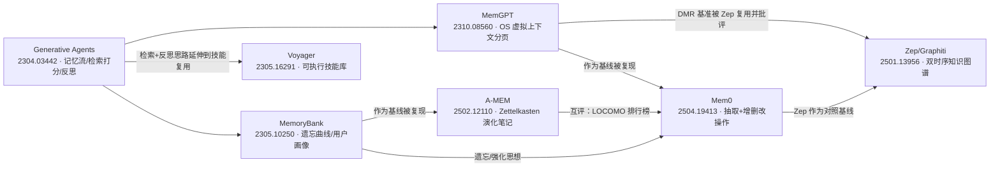

# 论文精读 01：Agentic Memory 奠基

七篇论文勾勒出 agentic memory 从"记录与检索"到"组织与演化"的演化主线，建议按下面顺序读：先读 Generative Agents（arXiv:2304.03442）建立"记忆流 + 相关性/新近性/重要性检索 + 反思"的概念地基；再读 MemoryBank（arXiv:2305.10250）看遗忘曲线如何给记忆加"时间维度"；然后读 MemGPT（arXiv:2310.08560）把 OS 分页思想搬进上下文管理；Voyager（arXiv:2305.16291）把记忆从"文本片段"升级为"可执行技能"，回答"记忆如何跨 run 复用"；最后三篇是 2025 年的结构化竞争：A-MEM（arXiv:2502.12110）用 Zettelkasten 笔记法做动态链接与记忆演化，Mem0（arXiv:2504.19413）把记忆维护收敛为 add/update/delete/noop 四种工程化操作，Zep/Graphiti（arXiv:2501.13956）用时序知识图谱解决"事实过期"问题。它们共用 LoCoMo/DMR 两个基准互相打分，因此读的时候要把"谁的评测、谁的实现"一直挂在心上。

证据标注约定（全文统一）：**[自报]** = 论文作者自己报告、未见独立复现；**[厂商数据]** = 公司出品的 preprint/白皮书，自带商业动机；**[转引]** = 数字来自另一篇论文对其的引用；**[未核实]** = 本次精读无法从原文确认的说法。外部批评若来自 arXiv preprint 同样标注，不因为是"批评"就免检——MIRIX 式教训是：记忆系统的排行榜数字普遍是厂商自报，跨论文不可直接比较。

**七系统总览对比**（与文末附表互补，那张表按"记忆单元/写入语义"组织，这张按系统组织）：

| 系统 | 记忆单元 | 写入策略 | 读取/检索 | 失效机制 | 证据等级 |
|---|---|---|---|---|---|
| Generative Agents | 自然语言观察 | 追加，反思与计划回写 | 三因子等权检索打分 | 无遗忘，重要性加权代替 | [自报]，UIST 2023 已评议 |
| MemoryBank | 对话原文 + 分层摘要 + 画像 | 追加，召回时强化 | DPR 式双塔稠密检索，FAISS | Ebbinghaus R=e^(−t/S) 衰减 | [自报]，AAAI 2024 已评议 |
| MemGPT | 主上下文队列 + 归档与召回库 | LLM 函数调用自编辑 | 分页函数查询，可链式 | 水位驱逐 + 递归摘要 | [自报]，DMR 数字有 [转引] |
| Voyager | 可执行代码技能 | 自验证通过后入库 | 描述 embedding 取 top-5 | 无 | [自报] |
| A-MEM | 结构化笔记卡 | LLM 生成属性并连边演化 | 向量 top-k + 同盒链接扩展 | 演化改写旧笔记 | [自报] |
| Mem0 | 向量库事实，可选图 | 抽取后四操作增删改 | 向量相似 top-10 | DELETE 真删；图版标记失效 | [厂商数据] |
| Zep/Graphiti | 时序知识图谱三层 | 抽取 + 实体消歧 + 预定义 Cypher | 搜索、重排、构造三段 | 双时序失效不删除 | [厂商数据] |



### Generative Agents: Interactive Simulacra of Human Behavior（arXiv:2304.03442）

- **元信息**：Joon Sung Park、Joseph C. O'Brien、Carrie J. Cai、Meredith Ringel Morris、Percy Liang、Michael S. Bernstein / 2023 / UIST 2023（ACM，已同行评议，DOI 10.1145/3586183.3606763）/ 代码 github.com/joonspk-research/generative_agents（原文附录给出）/ 精读日期 2026-10-05
- **一句话总结**：让 25 个 LLM agent 在《模拟人生》式小镇里"像人一样生活"的架构：全部经验以自然语言存入记忆流，按相关性/新近性/重要性加权检索，周期性反思生成高层结论，再自上而下分解为日计划，反思与计划也回写记忆流参与后续检索。
- **问题与动机**：可信的人类行为模拟需要 agent 同时依赖"当前环境"和"大量过去经验"，而 LLM 上下文窗口装不下全部历史，朴素摘要又会抹掉细节（论文用 Isabella 回答"最近热衷什么"的例子对比了摘要式与检索式回答的质量差）。此前工作多是一阶模板提示，只条件于当前环境。
- **核心设计**：
  1. 记忆流（memory stream，§4.1）：全部观察以自然语言记录，每条带创建时间戳与最近访问时间戳。
  2. 检索打分（§4.1）：三项分数 min-max 归一化到 [0,1] 后等权相加（论文实现中三个 α 均取 1）：新近性 = 按沙盒游戏小时指数衰减，衰减因子 0.995；重要性 = 创建时让 LLM 打 1–10 整数（"打扫房间"得 2，"约暗恋对象出去"得 8）；相关性 = 记忆文本 embedding 与查询 embedding 的余弦相似度。得分最高且装得下的记忆进入提示。
  3. 反思（§4.2）：当最新事件的重要性分数累计超过阈值 150 时触发（实际约每天 2–3 次）。取最近 100 条记录让 LLM 生成 3 个"高层问题"，对每个问题做检索，再让 LLM 基于检索结果提炼洞见并引用证据记录；洞见作为新记忆写回流，可对其他反思再反思，形成反思树（叶子是观察，越往上越抽象）。
  4. 规划（§4.3）：自上而下递归分解——先出全天计划，再压成小时块，再压成 5–15 分钟动作块；每个时间步 agent 依据新观察决定"继续原计划"还是"反应"，计划同样入流参与检索。
  5. 动作循环：感知 → 入流 → 检索 → 决策，全部用 gpt-3.5-turbo 提示完成，无微调。

  核心设计图示——记忆流、三因子检索与反思回写如何构成闭环：

  ```mermaid
  flowchart TD
      OBS["观察：环境感知事件"] --> STREAM["记忆流<br/>自然语言 + 创建戳 + 最近访问戳"]
      QUERY["当前情境作为 query"] --> RETR["检索打分<br/>recency 每小时乘 0.995<br/>+ importance 1 到 10 + relevance 余弦<br/>min-max 归一后等权相加"]
      STREAM --> RETR
      RETR --> PROMPT["top-k 记忆进入提示"]
      PROMPT --> ACT["行动决策：继续原计划或反应"]
      ACT -->|"累计重要性 ≥ 150 触发"| REFL["反思<br/>100 条近期记录生成 3 个高层问题<br/>逐题检索后提炼洞见并引用证据"]
      REFL -->|"洞见作为新记忆回写"| STREAM
      ACT --> PLAN["规划：日计划到小时块到 5-15 分钟块"]
      PLAN -->|"计划入流参与检索"| STREAM
  ```

- **关键结果**：[自报] 控制实验用 25 题"访谈"由人类评估者打可信度，TrueSkill 分数：完整架构 μ=29.89 > 去反思 26.88 > 去反思与计划 25.64 > 人类众包写手写基线 22.95 > 三无 21.21；完整架构相对"此前工作"条件效应量 Cohen's d=8.16。端到端模拟中，从单个种子想法（Isabella 想办情人节派对）出发，agent 们在两天游戏时间内自主传播邀请、结识新人、约伴出席——信息扩散经作者逐一核对记忆流排除了幻觉。消融显示观察、计划、反思三者各自关键。
- **局限与批评**：论文自认——模拟 25 个 agent 两天花费数千美元 token、耗时多日；最常见错误是检索不到相关记忆、对记忆添油加醋（fabrication）、继承 LLM 的过正式腔调。外部批评——打分权重 α 与 0.995、阈值 150 都是魔法数字，无消融；检索与反思完全依赖 GPT 提示质量；评估者只看"可信度"而非任务正确性。作为 HCI 会议论文，它定义了范式，但没义务回答工程正确性。
- **关系定位**：谱系起点——记忆流+三因子检索+反思这个三件套是后面所有对话记忆系统的原型；MemoryBank 把它的"流"加了遗忘曲线和画像，MemGPT 把"装不下"的问题升级为显式的分页架构，A-MEM 的"记忆演化"是它的"反思会回写记忆"的结构化版本。
- **启示**：对 cloud-agent 设计——"重要性分数在写入时由 LLM 一次算出、之后免费参与检索排序"是零基础设施就能落地的设计，比事后重排序便宜；反思触发用累积重要性阈值（而非固定周期）值得照搬，它天然让"事多的时候多反思"。对本仓库——三因子打分可以直接加进 `../scripts/memory_store_demo.py` 的 long-term store（目前只有相似度检索）；`../scripts/reflexion_demo.py` 的失败→反思→重试循环正是本文反思机制的朴素单 agent 版，读 §4.2 可看清"反思要检索证据、引用证据"这一被 demo 省略的步骤。
- **选读建议**：精读 §4.1（记忆与检索）、§4.2（反思）、§4.3（规划）；§5 评估方法略读；附录 A 的提示词模板值得收藏，附录 B 的 25 道访谈题可当记忆系统行为测试清单。

### MemoryBank: Enhancing Large Language Models with Long-Term Memory（arXiv:2305.10250）

- **元信息**：Wanjun Zhong、Lianghong Guo、Qiqi Gao、He Ye、Yanlin Wang（中山大学/哈工大/KTH）/ 2023（v3，5 月）/ AAAI 2024 接收（见 A-MEM 文献 [39] 引用的出版信息：AAAI vol. 38, pp. 19724–19731）/ 代码 github.com/zhongwanjun/MemoryBank-SiliconFriend（原文给出）/ 精读日期 2026-10-05
- **一句话总结**：给 LLM 配上"像人一样记和忘"的长期记忆：对话按时间全量入库，分层摘要出事件与用户画像，检索用 DPR 式双塔稠密检索 + FAISS，更新则按 Ebbinghaus 遗忘曲线 R=e^(−t/S) 让久未唤起的记忆指数衰减、被唤起的记忆强化。
- **问题与动机**：LLM 没有长期记忆，在 AI 陪伴、心理咨询、秘书助理等需要持续交互的场景里致命。作者要的不只是"存取"，还有三个拟人性质：选择性遗忘、记忆强化、从互动中归纳用户性格。
- **核心设计**：
  1. 记忆存储（§2.1）：三层——带时间戳的多轮对话原文；分层事件摘要（每日对话 → 每日事件摘要 → 全局事件摘要，用一句 prompt 让 LLM 逐层压缩）；动态用户画像（每日性格洞察 → 全局画像，同样逐层聚合）。
  2. 检索（§2.2）：每轮对话和每条事件摘要视为记忆片段 m，用编码器 E(·) 预编码，FAISS 建索引；当前上下文作 query 取最相关片段。SiliconFriend 实现里英文用 MiniLM、中文用 text2vec，可替换。
  3. 遗忘与强化（§2.3）：R=e^(−t/S)，t 为距上次学习经过的时间，S 为记忆强度（离散值，首次出现置 1）；记忆被召回时 S+1 且 t 归零——被反复提起的记忆越来越难忘。注意论文明说这是"探索性、高度简化"的模型，Ebbinghaus 原曲线的 overlearning、意义性材料效应都被舍弃。
  4. 落地（§3）：SiliconFriend 用 38k 条心理对话对 ChatGLM/BELLE 做 LoRA 微调（r=16，3 epochs，单张 A100），第二阶段接 MemoryBank；提示词组装 = 相关记忆 + 全局画像 + 全局事件摘要。

  存储三层与检索的数据结构：

  | 存储层 | 内容 | 生成方式 |
  |---|---|---|
  | 对话原文层 | 带时间戳的多轮对话记录 | 逐轮直接写入 |
  | 事件摘要层 | 每日事件摘要，再聚合为全局事件摘要 | LLM 逐层压缩 prompt |
  | 用户画像层 | 每日性格洞察，再聚合为全局画像 | LLM 逐层聚合 prompt |

  遗忘曲线更新规则的伪代码还原（§2.3）：

  ```text
  # 写入：记忆 m 首次出现在对话中
  S[m] ← 1                    # 记忆强度，离散值，论文取 1 为初值
  t[m] ← 0                    # 距上次学习经过的时间

  # 记忆被召回时：强化，对应 spacing effect
  ON recall(m):
      S[m] ← S[m] + 1         # 强度加 1
      t[m] ← 0                # 时间重置，曲线重新变陡前移

  # 保留率：Ebbinghaus 曲线 R = e^(−t/S)
  R(m) ← exp(−t[m] / S[m])    # R 越低越倾向被遗忘
  # 注：论文未给出显式遗忘阈值，只说会以更低概率被遗忘
  ```

- **关键结果**：[自报] 定量评测构造 10 天、15 个虚拟用户（ChatGPT 扮演）的记忆库，人工写 194 道探测题（中英各 97）。Table 2：英文集 ChatGPT 版正确率 0.716、连贯性 0.912，ChatGLM 检索准确率 0.809、BELLE 0.814；中文集 BELLE 正确率 0.603 为开源最佳。另有真实用户对话的定性案例（回忆荐书、识别未讨论过的事件）。论文宣称"有/无遗忘机制均适用"，但**本次精读的 v3 正文未见遗忘机制的独立量化消融表** [未核实]——遗忘曲线的效果主要靠定性论证。
- **局限与批评**：论文自认——遗忘模型是高度简化的探索；不同人/材料的遗忘曲线本就不同。外部批评——定量评测规模小（194 题）、用户全是 ChatGPT 扮演、"性格理解"没有 ground truth；被后续 A-MEM、Mem0 论文当作基线复现时 LoCoMo 上 F1 只有个位数（[转引] 自 A-MEM Table 1），说明这套"全量原文 + 摘要 + 向量检索"的组合对长程多跳问答很弱。
- **关系定位**：与 Generative Agents 同为"自然语言记忆流"一派，但 GA 管组织、它管时间——遗忘曲线是它独有的贡献，Mem0 的 DELETE 操作和 Graphiti 的失效机制都是"记忆会过期"这一思想的后续结构化解法；相比 MemGPT 的分页，它是被动的检索式，不给 agent 自编辑能力。
- **启示**：对 cloud-agent 设计——R=e^(−t/S) 三行代码就能实现，适合给"会话记忆"做自动保洁：被重复触发的工作流参数 S 升高常驻，一次性诊断 S=1 自然过期，免去人工 TTL 调参；分层摘要（日→全局）是便宜且可解释的压缩路径，适合写进 seed/session 资产。对本仓库——`../scripts/memory_store_demo.py` 可以给每条记忆加 (S, t) 两个字段演示强化/遗忘；recency 打分思路与 Generative Agents 的 0.995 衰减可对比实现。
- **选读建议**：精读 §2.1–§2.3（三件套机制都在这三节）；§3 SiliconFriend 的 LoRA 微调细节略读；§4 实验看 Table 2 即可。

### MemGPT: Towards LLMs as Operating Systems（arXiv:2310.08560）

- **元信息**：Charles Packer、Sarah Wooders、Kevin Lin、Vivian Fang、Shishir G. Patil、Ion Stoica、Joseph E. Gonzalez（UC Berkeley）/ 2023（v1 10 月，v2 2024 年 2 月）/ arXiv 预印本未评议（页面关键词标注 ICML，未见接收信息）/ 代码 research.memgpt.ai（原文给出；后发展为 Letta 开源项目）[厂商前身] / 精读日期 2026-10-05
- **一句话总结**：把操作系统的虚拟内存思想搬进 LLM：主上下文（=RAM，含系统指令、可读写工作区、FIFO 消息队列）+ 外部上下文（=磁盘，归档库与召回库），由 LLM 自己通过函数调用在两层之间换页，配合中断与函数链，在有限上下文窗口里营造"无限上下文"的假象。
- **问题与动机**：transformer 自注意力的平方开销使直接扩上下文不经济，且"lost in the middle"研究表明更长上下文未必被有效利用。作者反其道：不换模型，换管理——让固定上下文的 LLM 像 OS 管理虚拟内存一样管理自己的上下文。
- **核心设计**：
  1. 主上下文（§2.1）：三段式——只读系统指令（内存层级与函数用法说明）、固定大小可读写工作上下文（存用户关键事实与 persona）、FIFO 队列（滚动消息历史，队首存被逐出消息的递归摘要）。
  2. 队列管理器（§2.2）：提示 token 超过警告水位（论文用例 70%）时插入"内存压力"系统消息，提醒 LLM 把重要内容转存工作区或归档库；超过 flush 水位（100%）时逐出约 50% 消息并用"旧摘要 + 被逐出消息"生成新的递归摘要。被逐出消息永久留在召回库，可再取回。
  3. 函数执行器（§2.3）：LLM 的每个输出被解析为函数调用，执行结果（含运行时错误，如"主上下文已满"）反馈回模型形成闭环；检索自带分页防止一次拉爆窗口。记忆编辑与检索完全由模型自主决定（self-directed）。
  4. 控制流（§2.4）：事件驱动——用户消息、系统消息、用户交互、定时事件都触发推理；函数可带 request_heartbeat 标志请求执行完立刻续推下一轮（函数链，多步检索靠它），否则 yield 等下一事件。

  核心设计图示——两层内存与换页控制流：

  ```mermaid
  flowchart LR
      EVENT["事件：用户消息或系统消息或定时中断"] --> LLM["LLM 处理器<br/>输出被解析为函数调用"]
      subgraph MAIN["主上下文，相当于 RAM"]
          direction TB
          SYS["系统指令：只读"]
          WC["工作上下文：可读写，存用户事实与 persona"]
          FIFO["FIFO 队列：滚动消息，队首为递归摘要"]
      end
      subgraph EXT["外部上下文，相当于磁盘"]
          direction TB
          ARCH["归档库 archival：任意长文本"]
          REC["召回库 recall：消息数据库"]
      end
      MAIN --> LLM
      LLM --> EXEC["函数执行器<br/>执行并把结果与错误反馈回模型"]
      EXEC -->|"request_heartbeat 立即续链"| LLM
      EXEC -->|"archival 查询与写入"| ARCH
      EXEC -->|"conversation_search"| REC
      QM["队列管理器：约 70 警告，约 100 时驱逐一半"] -.->|"水位监控与驱逐"| FIFO
  ```

- **关键结果**：[自报] 对话侧提出 DMR（deep memory retrieval）任务：MSC 多会话数据加第 6 会话单轮问答，LLM 裁判 + ROUGE-L 召回打分；[转引] 按 Zep 论文 Table 1 标注出自 MemGPT 论文的数字：MemGPT + gpt-4-turbo 准确率 93.4%，递归摘要基线 35.3%（注意 Zep 自己的 full-context 基线做到 94.4%，见 Zep 节）。文档侧：文档 QA 中 MemGPT 通过多次分页查询突破固定窗口上限而截断基线随 K 增大而退化；嵌套 KV 检索（140 对 UUID、最多 4 层嵌套查找）中 MemGPT+GPT-4 不受层数影响，GPT-4 基线在 3 层掉到 0%，GPT-3.5 在 1 层即 0%。会话开场白任务 SIM 分数达到或超过人类手写。
- **局限与批评**：论文自认——MemGPT+GPT-4 Turbo 在嵌套 KV 上反而不如 MemGPT+GPT-4，说明强函数调用/指令跟随能力是前提；递归摘要是有损的。外部批评——Zep 论文（[厂商数据]，但有说服力地）指出 DMR 每段对话只有 60 条消息，现代模型 full-context 直接 98% 跑分，该基准已不能区分记忆系统；成本上函数链意味着多轮 API 调用，延迟和 token 开销随任务长度放大；Letta 之后的工程实践表明队列驱逐策略对提示词质量敏感。
- **关系定位**：OS 隐喻一派出处；与 Generative Agents 的"提醒：LLM 主动管记忆"不同，GA 的检索是隐式打分、MemGPT 是显式函数调用；Zep 直接以"击败 MemGPT 的 DMR"为卖点，Mem0/A-MEM 把它当基线复现——它是全谱系的公共对照物。与 Voyager 同为"跨 run 持久化"，但 MemGPT 存的是对话与文档，Voyager 存的是可执行代码。
- **启示**：对 cloud-agent 设计——"警告水位 + flush 水位"两级阈值是给任何长上下文服务做背压的标准模式；把"被逐出内容写递归摘要"用于会话归档，比每次全量重读便宜得多；定时事件让 agent 可以"无提示自发运行"，这正是 cron 触发器的理论依据（对照 `../../orchestration/notes/state-machine-forms.md` 里事件驱动与状态机形式化的讨论）。对本仓库——`../scripts/memory_store_demo.py` 的工作记忆/长期记忆两层可以升级为"队列 + 归档"演示，加入水位驱逐；注意 demo 的 store 目前无容量概念。
- **选读建议**：精读 §2（全部四小节，机制密度最高）；§3 实验看 DMR 与嵌套 KV 两个任务即可；附录 6.1 的 system prompt 是理解"如何提示模型管理自己记忆"的一手材料。

### Voyager: An Open-Ended Embodied Agent with Large Language Models（arXiv:2305.16291）

- **元信息**：Guanzhi Wang、Yuqi Xie、Yunfan Jiang、Ajay Mandlekar、Chaowei Xiao、Yuke Zhu、Linxi "Jim" Fan、Anima Anandkumar（NVIDIA、Caltech、UT Austin、Stanford、UW Madison）/ 2023（v1 5 月，v2 10 月）/ arXiv 预印本未评议（广泛报道后发表于 TMLR 2024，本次抓取未核实，[未核实]）/ 官方站点 voyager.minedojo.org；代码 github.com/MineDojo/Voyager（[未核实]：链接不在本次精读的 arXiv 页面正文中）/ 精读日期 2026-10-05
- **一句话总结**：Minecraft 里的终身学习 agent：GPT-4 自动生成课程提出越来越难的探索任务，把每次掌握的技能写成可执行 JS 代码存入向量技能库，用"环境反馈 + 执行错误 + 自验证"三轮反馈迭代改代码，技能可跨世界、跨 agent 复用——记忆的主体从文本变成了程序。
- **问题与动机**：开放世界里有效的终身学习 agent 应像人类玩家：按当前技能与世界状态提出合适任务、从环境反馈中打磨技能并入库复用、不断复合出新能力。RL/模仿学习苦于探索、可解释、泛化三重困难；已有 LLM agent 不会在时间尺度上积累知识。
- **核心设计**：
  1. 自动课程（§2.1）：bottom-up 生成。提示词含四样：鼓励多样性与难度约束的指令、agent 当前状态（背包/装备/生物群系/时间/血量/位置）、已完成与失败任务清单、由 GPT-3.5 自问自答的补充语境（省钱）。
  2. 技能库（§2.2）：每个技能 = 完成某课程任务的可执行程序。新技能经迭代验证后入库，向量数据库存储：key 是 GPT-3.5 生成的程序描述文本的 embedding（ada-002），value 是代码本身。检索时把"任务建议 + 环境反馈"作 query 取向 top-5 技能进提示，支撑组合式新技能合成。
  3. 迭代提示（§2.3）：每轮执行代码 → 收集环境反馈（bot.chat() 报告"还差 7 个铁锭"这类中间进度）与解释器报错 → 连同上一版代码一起喂回 GPT-4 改写；另起一个 GPT-4 实例做自验证 critic，判定任务成败并给出改进建议。卡住 4 轮就放弃换下一个课程任务。
  4. 组合性：技能被明确要求"通用、可复用"，新技能在旧技能之上合成，能力随库增长复合。

  核心设计图示——课程、迭代提示与技能库的闭环：

  ```mermaid
  flowchart TD
      CURR["自动课程 GPT-4<br/>状态 + 已完成失败清单生成新任务"] --> GEN["代码生成 GPT-4<br/>控制原语 + 检索到的旧技能"]
      LIB[("技能库<br/>key 为描述 embedding，value 为代码")] -.->|"检索 top-5 进提示"| GEN
      GEN --> RUN["在 MineDojo 执行代码"]
      RUN --> FB["收集环境反馈与执行错误"]
      FB -->|"未通过且少于 4 轮"| GEN
      RUN --> VER["自验证 GPT-4 critic<br/>判定成败并给改进建议"]
      VER -->|"失败"| GEN
      VER -->|"成功"| SAVE["入库：描述文本转 embedding"]
      SAVE --> LIB
      FB -->|"卡住 4 轮"| CURR
  ```

- **关键结果**：[自报] 160 轮迭代内发现 63 种独特物品（3.3× 于基线）；科技树解锁快 15.3×（木）/8.5×（石）/6.4×（铁），且是唯一解锁钻石等级的（102 轮，3 次试验成功 1 次）；行程 2.3×。零样本泛化：清空背包进新世界，四个未见过任务全部 3/3 完成（18–21 轮）；技能库移植给 AutoGPT 后后者从 0/3 变成部分成功，证明库是即插即用的资产。技能检索 top-5 准确率 96.5%±0.3。消融：随机课程使物品发现 −93%；去自验证 −73%；GPT-3.5 替换 GPT-4 写代码则物品数 ÷5.7。
- **局限与批评**：论文自认——GPT-4 API 成本是 GPT-3.5 的 15×；仍会被卡住；课程会幻觉出不存在的物品（铜剑）；代码也会幻觉（拿圆石当燃料、调用不存在的 API）；自验证可能认不出"打败蜘蛛掉落蜘蛛丝"这种成功信号。外部批评——依赖 Mineflayer 高级 API 而非原始像素输入，与 VPT 类低层控制器不可比；整套系统对 GPT-4 代码能力高度敏感，换成当代开源模型的可迁移性存疑。
- **关系定位**：程序性记忆的标杆：Generative Agents/Voyager 分别代表"陈述性记忆"与"程序性记忆"两条线的源头；它的技能库直接预演了后来一切"工具/技能资产化"工作，也是本仓库种子资产（seed scripts）思想的直接祖先；与 MemGPT 同做跨会话持久化，但它跨的是全新世界与不同 agent。
- **启示**：对 cloud-agent 设计——"技能 = 可执行代码 + 描述 embedding 索引"的资产格式应当照抄：MaintainAll 式任务资产里 scripts/ 就是技能库，加一个描述向量索引即可实现跨任务检索复用；自验证 critic（独立 LLM 判定成败）是廉价可靠的成败信号源，比规则校验好写得多；迭代提示的失败记录值得入库，它既是 Mem0 的 UPDATE 也是 GA 的反思。对本仓库——`../scripts/reflexion_demo.py` 的 math 任务可扩展一个"把验证通过的解法存成可复用技能"步骤，直接对应 Voyager 的技能入库；`../notebooks/02_episodic_reflexion.ipynb` 的情节记忆讨论可对照本文的环境反馈类型。
- **选读建议**：精读 §2.1–§2.3（三组件）与 §3.3 结果、§3.4 消融；§3.5 人类多模态反馈略读；附录 A 的完整提示词结构适合当迭代提示模板库。

### A-MEM: Agentic Memory for LLM Agents（arXiv:2502.12110）

- **元信息**：Wujiang Xu、Zujie Liang、Kai Mei、Hang Gao、Juntao Tan、Yongfeng Zhang（Rutgers University 等）/ 2025（v1 2 月；本次读 v11，2025 年 10 月）/ arXiv 预印本未评议 / 代码：评测 github.com/WujiangXu/AgenticMemory，生产版 github.com/WujiangXu/A-mem-sys（原文均给出）/ 精读日期 2026-10-05
- **一句话总结**：把 Zettelkasten 卡片笔记法搬进 agent 记忆：每条记忆是一张结构化原子笔记（原文 + 关键词 + 标签 + LLM 生成的语境描述），新笔记入库时先向量检索近邻、再由 LLM 决定与谁连边，且会反向演化——用新记忆改写旧笔记的语境/关键词/标签，使记忆网络随经验自组织。
- **问题与动机**：现有记忆系统（含 Mem0 的图数据库路线）依赖预设 schema 与固定工作流，agent 学到新知识只能塞进既有框架，无法建立新颖联系；作者要把"组织记忆"这个行为本身 agent 化——与 agentic RAG 只把检索 agent 化不同，A-MEM 的能动性在存储与演化层（§2.2 明确区分了这点）。
- **核心设计**（§3，公式号引原文）：
  1. 笔记构造（§3.1，式 1–3）：m_i = {c_i 原文, t_i 时间戳, K_i 关键词, G_i 标签, X_i 语境描述, e_i 嵌入, L_i 链接集}；K/G/X 由 LLM 用模板 P_s1 从原文+时间戳生成；嵌入 e_i = enc(concat(c_i, K_i, G_i, X_i))——检索和连边都用这个富文本表示。
  2. 连边生成（§3.2，式 4–6）：新笔记与库内所有笔记算余弦相似度，取 top-k 近邻，再让 LLM 依据"共同属性"判断该不该连边，更新 L_i。论文用"盒子"（box）类比 Zettelkasten 的抽屉：相似笔记聚成盒，但一条笔记可同时属于多个盒。
  3. 记忆演化（§3.3，式 7）：连边之后，对每条近邻笔记 m_j，LLM 参考新笔记与其余近邻，决定是否更新其语境描述、关键词、标签，更新后直接替换原笔记——旧记忆被新经验持续重写。
  4. 检索（§3.4，式 8–10）：查询向量化后与全部笔记算余弦，取 top-k（主实验 k=10）；被命中的笔记其同盒链接笔记一并带出。

  核心设计图示——笔记卡结构、连边与盒、记忆演化：

  ```mermaid
  flowchart LR
      NEW["新交互原文 c 与时间戳 t"] --> NOTE["原子笔记卡<br/>关键词 K + 标签 G + 语境描述 X，均由 LLM 生成"]
      NOTE --> EMB["嵌入 e = enc 拼接全部文本字段"]
      EMB --> NEAR["余弦相似取 top-k 近邻"]
      NEAR --> LINK["LLM 判定连边：同盒笔记互链"]
      NEAR --> EVOL["记忆演化：LLM 改写近邻的 X 与 K 与 G，替换原笔记"]
      subgraph BOX["盒：相似笔记的聚簇，一条笔记可同属多盒"]
          direction TB
          N1["笔记 A"]
          N2["笔记 B"]
          N3["笔记 C"]
      end
      LINK --> N1
      LINK --> N3
      N1 --- N2
      Q["查询向量化"] --> RT["top-k 检索<br/>命中笔记带出同盒链接"]
      N1 -.-> RT
      N3 -.-> RT
  ```

- **关键结果**：[自报] LoCoMo 基准、六个基础模型（GPT-4o-mini/4o、Qwen2.5-1.5B/3B、Llama-3.2-1B/3B），对比 LoCoMo/ReadAgent/MemoryBank/MemGPT 四个基线。GPT-4o-mini 上 F1：多跳 A-Mem 27.02 vs MemGPT 26.65 vs MemoryBank 5.00；时间推理 45.85 vs 25.52 vs 9.68；平均排名 1.2，每问 token 2,520 vs 基线约 16,900（省 85–93%，单次记忆操作 < $0.0003）。DialSim 数据集 F1 3.45 vs LoCoMo 方法 2.55、MemGPT 1.18。消融（GPT-4o-mini，多跳 F1）：去连边与演化 9.65，只去演化 21.35，完整 27.02——连边是地基，演化是增益。规模实验：100 万条记忆检索时间仅从 0.31μs 涨到 3.70μs。
- **局限与批评**：论文自认（§6）——组织质量受底层 LLM 能力影响，不同模型生成的描述与连边会不同；只支持文本。外部批评——全部数字为作者自报，LoCoMo 绝对 F1 普遍低（最好 50 上下），分数差异的实操意义存疑；v1 到 v11 换了多轮基础模型与表格，引用时务必注明版本；评测只到问答 F1/BLEU，没测"记忆网络结构本身"的下游因果效应（t-SNE 可视化只是示意）。
- **关系定位**：Zettelkasten 一派的代表：与 Generative Agents 的反思同属"记忆被写回后改变未来检索"思想，但 GA 生成自由文本洞见、A-MEM 更新结构化属性；与 Zep 的图相比，它的"图"无 schema、由 LLM 自由连边，Zep 则有严格的本体与时序；它被 Mem0 论文当基线复现（J=48.38，低于 Mem0 的 66.88，[厂商数据]）。
- **启示**：对 cloud-agent 设计——"写入时生成语境描述"是以小成本大幅提升可检索性的技巧，值得加进任何记忆写入路径；"新记忆触发旧记忆改写"对应任务资产的维护：当 seed 资产里的某条经验被多次运行修正时，应回写资产本体而非只追加日志。对本仓库——`../scripts/memory_store_demo.py` 可增加"笔记卡"字段（关键词/标签/语境）与连边演示；注意 demo 的 memory store 目前写入后不可变，A-MEM 的演化机制是它的自然进阶。
- **选读建议**：精读 §3.1–§3.3（机制核心，公式 1–7）；§4.3 结果与 §4.4 消融看表即可；附录 B 的三套提示词模板（P_s1/P_s2/P_s3）是复现关键，值得逐字读。

### Mem0: Building Production-Ready AI Agents with Scalable Long-Term Memory（arXiv:2504.19413）

- **元信息**：Dev Khant、Saket Aryan、Taranjeet Singh、Deshraj Yadav（mem0.ai）/ 2025（v1，4 月）/ arXiv 预印本未评议，厂商论文 [厂商数据] / 代码 mem0.ai/research；开源实现 github.com/mem0ai/mem0 / 精读日期 2026-10-05
- **一句话总结**：把记忆维护收敛成一条两阶段流水线——抽取阶段用"对话摘要 + 最近 m 条消息 + 新消息对"让 LLM 抽出候选事实，更新阶段检索 s 条最相似旧记忆，由 LLM 通过 function calling 在 ADD / UPDATE / DELETE / NOOP 四种操作里选一个执行；增强版 Mem0g 再把记忆落成 Neo4j 有向图（实体为点、关系三元组为边），冲突检测把过期关系标记失效而非删除。
- **问题与动机**：固定上下文窗口装不下周月尺度的多会话关系，且真实对话主题跳跃，全量上下文会让关键偏好淹没在无关 token 里；单纯扩窗口只是推迟问题。目标是生产可用的记忆层：选择性存、合并相关、按需取。
- **核心设计**：
  1. 抽取（§2.1）：输入消息对 (m_{t−1}, m_t)，拼上数据库里的整段对话摘要 S 与最近 m=10 条消息，LLM 抽出新交换中的显著事实集 Ω；摘要由异步模块定期刷新，不阻塞主流水线。
  2. 更新（§2.1）：对每条候选事实检索 top s=10 相似旧记忆，连同事实一起交给 LLM 的 tool-call 接口，由其自主选 ADD（无等价记忆则建）/ UPDATE（互补则补）/ DELETE（被矛盾信息反驳则删）/ NOOP（不动）。不用单独分类器，操作选择靠 LLM 推理。全部 LLM 操作用 GPT-4o-mini。
  3. Mem0g（§2.2）：图 G=(V,E,L)，点=实体（类型 + 嵌入 + 建点时间戳），边=(v_s, r, v_d) 关系三元组；实体抽取→关系生成两段式 LLM 流水线；写入时按相似度阈值 t 做节点去重/复用；冲突检测发现矛盾关系时标记 invalid 而非物理删除，保留时序推理能力；检索双通道——实体中心子图扩展 + 三元组语义相似。
  4. 评测设计（§3）：LOCOMO（10 段对话、每段约 600 轮/26k token、每段约 200 题；adversarial 类因无 ground truth 被剔除）；指标 F1/BLEU-1 + LLM-as-Judge（J，跑 10 次取均值 ±1 标准差），另报 token 消耗与 p50/p95 延迟。

  核心设计图示——两阶段流水线与四操作：

  ```mermaid
  flowchart TD
      MSG["新消息对"] --> EX["抽取阶段<br/>摘要 S + 最近 10 条 + 消息对"]
      SUMM["异步摘要刷新模块"] -.-> EX
      EX --> OMEGA["候选事实集"]
      OMEGA --> SIM["向量检索 top-10 相似旧记忆"]
      DB[("记忆数据库")] --> SIM
      SIM --> TC["LLM tool-call 决策"]
      TC -->|"ADD 无等价记忆"| DB
      TC -->|"UPDATE 互补并入"| DB
      TC -->|"DELETE 被矛盾反驳"| DB
      TC -->|"NOOP 无需变更"| SKIP["跳过"]
  ```

  更新阶段的决策伪代码（§2.1，Algorithm 1 的展开）：

  ```text
  # 抽取阶段
  P ← (S, 最近 m=10 条消息, 消息对)     # S = 异步刷新的整段对话摘要
  Ω ← LLM_extract(P)                    # 新交换中的候选事实集

  # 更新阶段：逐事实决策
  for ω in Ω:
      C ← top_s_similar(ω, DB, s=10)    # 向量检索最相似旧记忆
      op ← LLM_tool_call(ω, C)          # LLM 直接选操作，无独立分类器
      if   op == ADD:    insert(ω)      # 无语义等价记忆则新建
      elif op == UPDATE: merge(c_j, ω)  # c_j 属于 C：互补信息并入
      elif op == DELETE: remove(c_k)    # c_k 属于 C：被 ω 矛盾反驳
      else:              pass           # NOOP：无需变更
  ```

- **关键结果**：[厂商数据/自报] 总体 J：Mem0 66.88±0.15，Mem0g 68.44±0.17，对照 Zep 65.99、OpenAI memory 功能 52.90、full-context 72.90、A-Mem 复跑 48.38——摘要宣称"较 OpenAI 相对提升 26%"即 66.88/52.90−1≈26%，与 Table 2 自洽。分题型：single-hop Mem0 F1 38.72 最佳；temporal Mem0g 最佳（F1 51.55，J 58.13）；open-domain 诚实地报告 Zep 反超（J 76.60 vs Mem0g 75.71）。部署：Mem0 p95 总延迟 1.440s vs full-context 17.117s（降约 91%），每问 token 1,764 vs 26,031（省 >90%）。注意 OpenAI 基线是作者用特权方式整段喂入生成的记忆，仍不敌 Mem0。
- **局限与批评**：论文自认——图记忆在 multi-hop 上未带来增益（结构化表示存在冗余/开销）；OpenAI 基线缺外部 API 只能特权注入。外部批评——厂商自评，LOCOMO 绝对分数普遍低（最佳 F1 不到 52），且 MIRIX（arXiv:2507.07957，同为厂商 preprint，[未核实]其细节）随后自报 85.4%  overall，说明各家指标口径不可直接比较（MIRIX 式告诫）；DELETE 是真删除，时序推理靠 Mem0g 的失效标记补齐，设计上不如 Graphiti 的双时间轴彻底；**"OpenMemory MCP server"不在本文中** [未核实/平台资料]——MCP 是 mem0 平台后续发布的接入层，属于厂商材料而非论文内容。
- **关系定位**：工程化一派的顶点：把 A-MEM/Generative Agents 里"让 LLM 决定记忆怎么变"的思想压缩成四个确定性操作，写库语义清晰、可测试；与 Zep 同属结构化路线但 Mem0 轻（向量库+可选图）、Zep 重（强制图谱+双时序）；它的 ADD/UPDATE/DELETE 是 Graphiti"失效不删除"的轻量子集。
- **启示**：对 cloud-agent 设计——四操作语义应直接抄进任务资产的 manifest 更新路径：回放运行产生新事实时，走"检索相似→LLM 选操作"而不是整文件重写，与 MaintainAll 的原子 JSON 写入（registry.json 等）天然互补；异步摘要刷新解耦了"全局语境新鲜度"与"写入延迟"。对本仓库——`../scripts/memory_store_demo.py` 的写入接口可升级为 add/update/delete/noop 四操作版，是最小可行改造；四操作还给了 demo 写单测的确定性断言点。
- **选读建议**：精读 §2.1（两阶段流水线与四操作）与 §4.1–4.2（结果与跨题型分析，注意作者对 Zep 反超的诚实报告）；§2.2 图变体略读；附录 A 的 judge 提示词与 Appendix B 的 Algorithm 1 值得看。

### Zep: A Temporal Knowledge Graph Architecture for Agent Memory（arXiv:2501.13956）

- **元信息**：Preston Rasmussen 等，Zep Software, Inc. / 2025（v1，1 月）/ arXiv 预印本未评议，厂商白皮书 [厂商数据] / 代码 github.com/getzep/graphiti（原文文献 [6] 给出）；服务 getzep.com / 精读日期 2026-10-05
- **一句话总结**：agent 记忆 = 一个随对话持续更新的时序知识图谱：原始消息无损存为 episode，从中抽取实体与关系事实构成语义层，再做社区聚类形成摘要层；每条事实边带双时序四时间戳（事实何时成立、系统何时写入/失效），新事实矛盾时把旧边标记失效而非删除，检索走"搜索→重排→构造"三段流水线。
- **问题与动机**：企业场景需要把持续演化的对话与业务数据整合进 agent 记忆，而静态 RAG 只能检索不变的语料；知识会更新——"用户上周在 A 公司"在"用户入职 B 公司"之后应当过期，但历史轨迹仍需可查。这是"记忆演化"问题在图上的严格形式化。
- **核心设计**：
  1. 三层图（§2）：episode 子图存原始消息/文本/JSON（无损源存储，可与语义层双向回溯）；semantic entity 子图存实体节点与事实边；community 子图用标签传播算法聚类实体并生成 map-reduce 摘要，新增节点按"邻居多数社区"动态挂靠、定期全量刷新。语义/情节双层对应心理学语义记忆与情节记忆之分。
  2. 双时序与失效（§2.1、§2.2.3）：T 时间轴记事实有效期 t_valid/t_invalid，T′ 时间轴记系统写入事务 t′_created/t′_expired；抽取时间信息时以消息自带的时间戳 t_ref 为锚解析"下周四""两周后"等相对时间；LLM 对比新旧边发现矛盾后，把旧边 t_invalid 设为替换边 t_valid，并一律以新信息为准（沿 T′ 优先）。
  3. 构建细节（§2.2）：实体抽取看当前消息 + 前 n=4 条消息；用 reflexion 式反思步骤减少抽取幻觉；实体名嵌入 1024 维向量 + 全文搜索 + LLM 判定做实体消歧；写库用预定义 Cypher 查询而非 LLM 生成 SQL，防幻觉。
  4. 检索（§3）：f = χ∘ρ∘φ——φ 搜索三选一或混用（余弦语义、BM25 全文、图上 BFS n-hop 扩展）；ρ 重排（RRF、MMR、episode 提及频次、节点距离、cross-encoder）；χ 把选中的边/点/社区渲染成带日期区间的文本上下文（"FACT (Date range: from - to)"）。

  核心设计图示——episode 抽取、双时序失效与三段检索：

  ```mermaid
  flowchart TD
      EP["episode 原始消息<br/>无损存储，t_ref 锚时间戳"] --> EX["实体抽取<br/>当前消息 + 前 4 条 + 反思步骤"]
      EP --> FX["事实抽取：关系三元组"]
      EX --> RES["实体消歧：1024 维嵌入 + 全文 + LLM"]
      FX --> DED["边去重：同实体对内搜索"]
      RES --> GRAPH[("Neo4j 三层图<br/>episode 层 语义层 社区层")]
      DED --> GRAPH
      GRAPH -->|"语义相关旧边"| CON["LLM 矛盾检测"]
      CON --> INV["失效不删除：旧边 t_invalid<br/>设为替换边的 t_valid，新信息优先"]
      INV --> GRAPH
      Q["查询"] --> SE["搜索 φ：余弦或 BM25 或 BFS"] --> RE["重排 ρ：RRF 或 MMR 或 cross-encoder"] --> CHI["构造 χ：带日期区间的上下文"]
  ```

- **关键结果**：[厂商数据] DMR：Zep 94.8% vs MemGPT 93.4%（[转引] MemGPT 论文）vs full-context 94.4% vs 会话摘要 78.6% vs 递归摘要 35.3%（gpt-4-turbo）；换 gpt-4o-mini 后 full-context 98.0%、Zep 98.2%——作者自己承认 DMR 每段仅 60 条消息、直接装进上下文，基准已失效。LongMemEval（平均约 115k token 对话）：较 full-context 基线准确率 +15.2%（gpt-4o-mini）/+18.5%（gpt-4o），延迟降约 90%；但 single-session-assistant 类反而 −9.06%/−17.7%，作者如实报告。MemGPT 无法在 LongMemEval 上复现（不支持直接灌历史），未比成。
- **局限与批评**：论文自认——DMR 类基准简单、社区刷新会偏离全局最优、领域本体未探索、记忆基准整体匮乏。外部批评——DMR 的"胜"幅度在误差量级内，真正的论据是 LongMemEval，而后者是自选的、full-context 基线本来就受 115k 上下文注意力稀释影响；厂商自测，网络延迟还只算在 Zep 一侧（作者声明了这一点）；图构建成本（每消息多轮 LLM 抽取+消歧）在论文中未给出端到端写入吞吐数字 [未核实]。
- **关系定位**：结构化记忆的最重形态：Mem0g 的图是可选增强，Zep 的图是唯一存储且带双时序——"失效不删除"是它对 Mem0 DELETE、MemoryBank 遗忘曲线的严格升级版（精确到事实级、可回答"当时如此"的 as-of 查询）；A-MEM 的连边靠语义相似+LLM 判断，Zep 的边有类型、有时间、有源 episode 引用；它直接把 MemGPT 的 DMR 当靶子，是谱系内公开对线最多的一篇。
- **启示**：对 cloud-agent 设计——事实过期必须"失效不删除"：任务资产里"上周的部署参数"被新值替代时应保留有效期区间，否则审计与回滚都无从谈起，这与 run-map/trigger-state 的原子 JSON 写入结合时尤其重要；"相对时间解析需要锚时间戳"提醒所有日志类记忆必须存 t_ref；检索三段流水线（召回→重排→构造）是通用模式，构造阶段带日期区间的格式化直接可抄。对本仓库——`../scripts/memory_store_demo.py` 若加"事实有效期"字段即可演示 Graphiti 式失效；`../../orchestration/notes/state-machine-forms.md` 的状态机视角可对照本文"边失效=状态迁移留痕"的图语义。
- **选读建议**：精读 §2.2.3（时序抽取与失效，全文精华）与 §3（检索流水线）；§2.3 社区检测略读；§4 实验重点读作者对 DMR 基准失效的自评（4.2 节末段），这是全篇最诚实的一段。

---

## 附：跨论文速查

| 论文 | 记忆单元 | 写入语义 | 遗忘/更新机制 | 评测基准 | 证据等级 |
|---|---|---|---|---|---|
| Generative Agents | 自然语言观察 | 追加 + 反思回写 | 无遗忘；重要性加权检索 | 访谈可信度（人类评） | [自报]，HCI 口径 |
| MemoryBank | 对话原文 + 分层摘要 + 画像 | 追加 | Ebbinghaus R=e^(−t/S)，召回强化 | 194 道探测题（自建） | [自报]，AAAI 2024 |
| MemGPT | 主上下文队列 + 归档/召回库 | 函数调用自编辑 | 水位驱逐 + 递归摘要 | DMR、文档 QA、嵌套 KV | [自报]，部分数字 [转引] |
| Voyager | 可执行代码技能 | 验证通过后入库 | 不遗忘；检索 top-5 复用 | Minecraft 物品/科技树/迁移 | [自报] |
| A-MEM | 结构化笔记卡 | LLM 生成属性 + 连边 | 记忆演化（改写旧笔记） | LoCoMo、DialSim | [自报] |
| Mem0 | 向量库事实（+可选图） | 抽取后四操作 | DELETE 真删；Mem0g 标记失效 | LOCOMO | [厂商数据] |
| Zep/Graphiti | 时序知识图谱 | 抽取 + 实体消歧 | 双时序失效不删除 | DMR、LongMemEval | [厂商数据] |

读完全文后值得记住的三句话：一，记忆系统之间比的是"写入语义"（追加 / 四操作 / 失效标记），不是检索算法；二，2025 年后的记忆论文排行榜几乎全是厂商自报，LOCOMO 上各家口径互不兼容（MIRIX 式告诫）；三，"反思回写记忆"（GA）→"记忆演化"（A-MEM）→"事实失效"（Graphiti）是同一条思想的逐步严格化，设计 cloud-agent 的记忆层时按这个顺序补需求即可。
