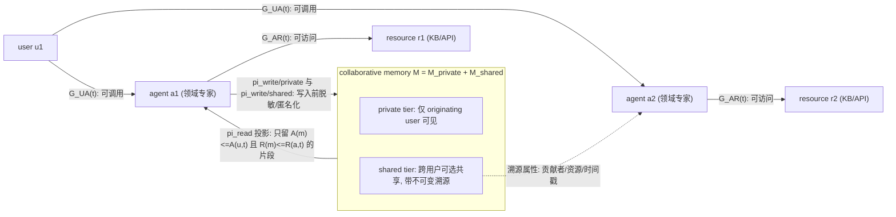
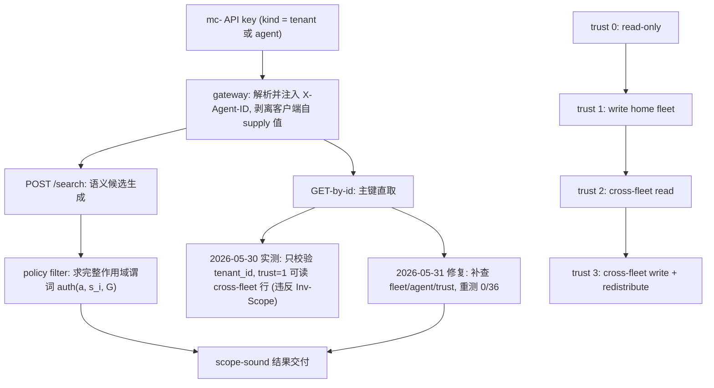
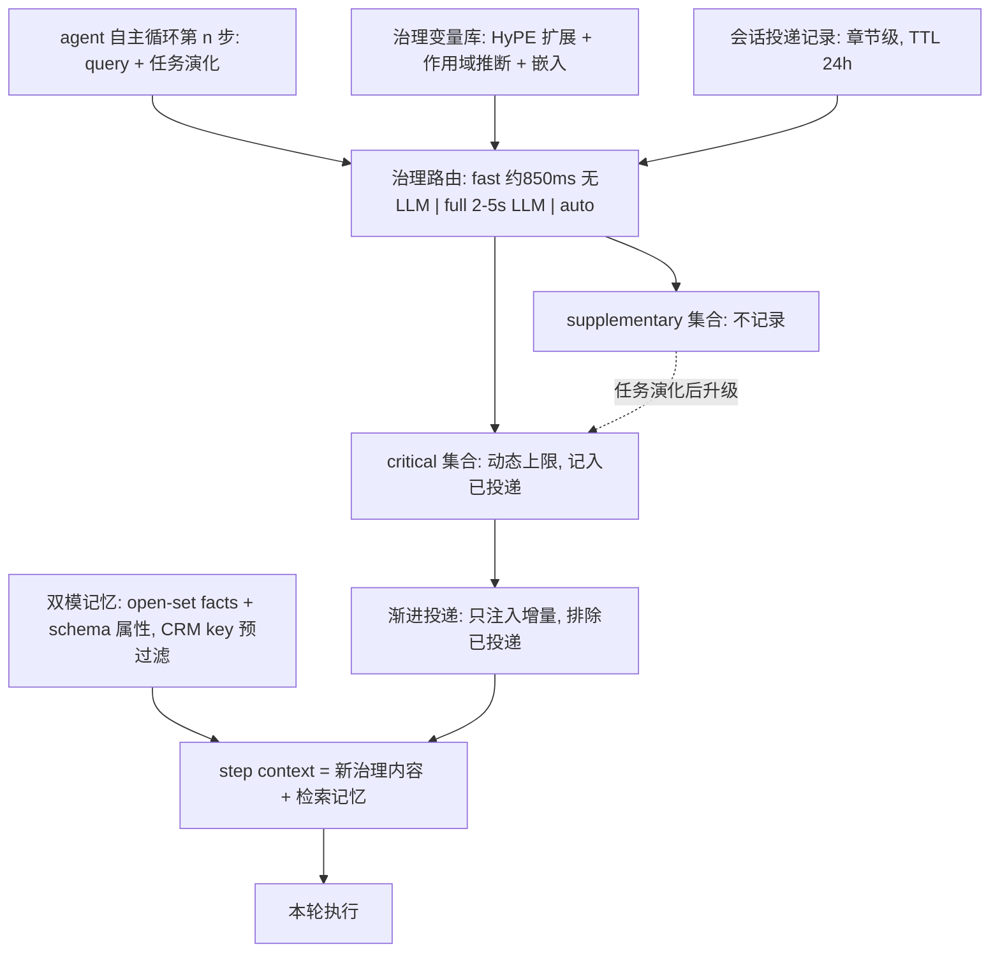
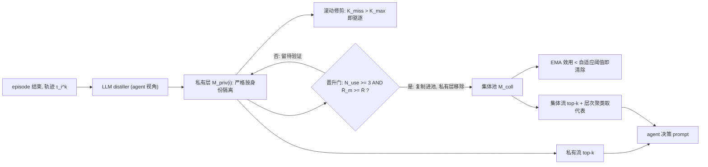
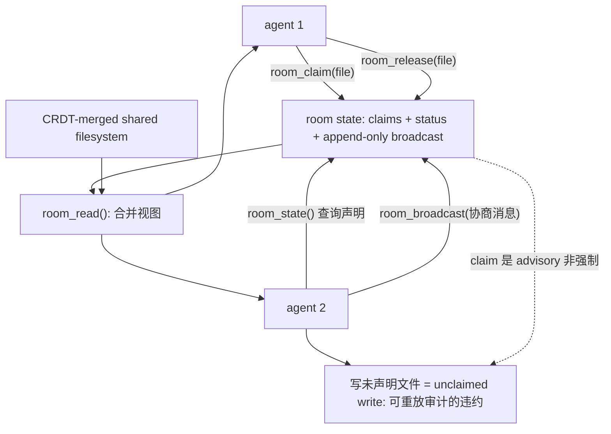
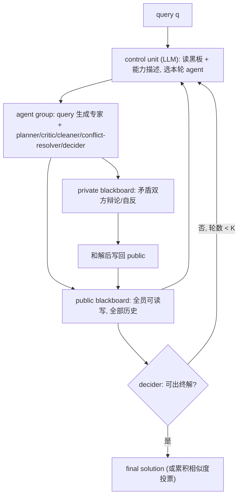
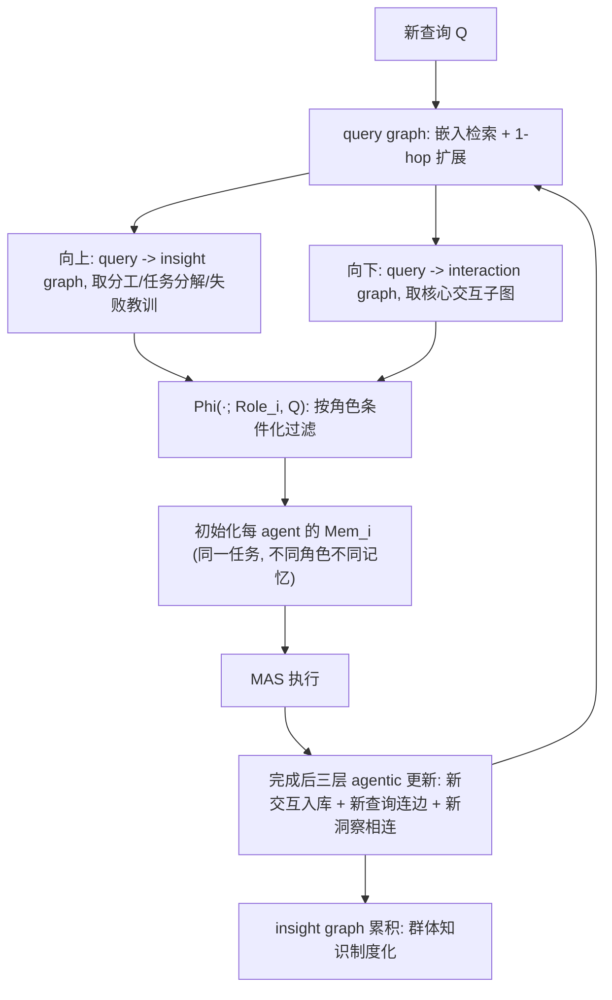

# 论文精读 02：共享与组织记忆系统

单 agent 的记忆问题（见 [../README.md](../README.md)：工作/短期/长期、RAG、Reflexion）有一个隐含前提：一个用户、一个 agent、一条检索流。本组八篇论文回答的是组织场景下的问题——每个成员的 agent 各自持有私有记忆，设计决策相互错位，同一实体被各工作流重复询问、重复遗忘。通读之后可以看到一个收敛架构：私有层（per-agent / per-user tier）几乎被所有系统默认；其上是受治理的共享层，治理机制各异——访问投影、作用域+时序+溯源、治理路由、共享工作区、内容分层图；而私有层与共享层之间都有一道门，决定什么经验值得进入组织记忆（统计晋升门、schema 生命周期、蒸馏沉淀，形式不同但都存在）。本笔记按此线索组织，关键结果一律标注 [自报] / [厂商] / [独立复现] 证据强度。

| 系统 | 共享粒度 | 治理机制 | 证据强度 |
|------|----------|----------|----------|
| Collaborative Memory | 记忆片段级，按 (user, agent, resource, t) 投影视图 | 时变二分图读写策略 + 不可变溯源 | 中：公开 benchmark + 合成多用户模拟 [自报] |
| MemClaw / ArgusFleet | 记忆行级，作用域 agent⊑fleet⊑tenant | 作用域过滤 + 时序取代 + 溯源链 + 策略传播 | 中：自家生产服务线上实测，trace 已提交 [厂商] |
| Governed Memory | 实体作用域（CRM key 预过滤） | 治理路由 + 渐进投递 + 反思有界检索 + schema 闭环 | 中：合成受控数据 + LoCoMo 外部基准 [厂商] |
| CoMem | 双层：私有槽 + 集体池 | 经验晋升门（使用次数 ∧ 高于滚动基线奖励） | 中：ALFWorld/PDDL 标准基准，未经评审 [自报] |
| AgentRoom | 文件级，CRDT 共享工作区 | claim/release 等 MCP 协调工具（advisory） | 中：matched-compute 消融 + 三评分器交叉验证 [自报] |
| bMAS / LbMAS | 黑板全量信息流，公共/私有分区 | LLM 控制单元选 agent + cleaner 删冗余 | 弱-中：公开基准，预印本，venue 未证实 [自报] |
| G-Memory | 三层图（交互/查询/洞察） | 角色条件化投影 + 蒸馏式沉淀 | 较强：NeurIPS 2025 Spotlight，代码公开 [同行评审] |
| MIRIX | 六类 typed store（单用户内部） | Meta Memory Manager 路由 + 六专职 manager | 中：自建多模态基准 + LOCOMO，注意命名碰撞 [自报] |

### Collaborative Memory（arXiv:2505.18279）

- **元信息**：Alireza Rezazadeh, Zichao Li, Ange Lou, Yuying Zhao, Wei Wei, Yujia Bao（Accenture Center for Advanced AI）/ 2025-05 / arXiv 预印本（页面无会议标注）/ 代码：论文称将公开，截至精读日未见仓库链接 / 精读日期 2026-10-05
- **一句话总结**：把多用户多 agent 的记忆访问控制形式化为随时间演化的 user–agent–resource 二分图，配合私有/共享双层记忆与读写两端的策略投影，让跨用户知识共享在不越权的前提下成立。
- **问题与动机**：MemGPT、MemTree、GraphRAG 等持久记忆默认单用户全局可见，而协作助手、多用户生产力平台天然是多用户多 agent 的：权限不对称且随时间变化。完全共享会泄露无权信息，完全隔离又让每个用户重复检索、重复付费。论文以分布式认知（Distributed Cognition）为理论起点，要回答：动态不对称权限下如何安全地跨用户共享。
- **核心设计**：
  - 两张时变二分图 G_UA(t)⊆U×A、G_AR(t)⊆A×R 编码"用户可调用的 agent"与"agent 可访问的资源"，随授权/撤销演化（§3.1）。
  - 记忆分私有层 M_private 与共享层 M_shared；每个片段携带不可变溯源属性：创建时间、贡献用户、贡献 agent 集合、创建时访问的资源集合（§3.2）。
  - 可访问集 M(u,a,t) := {m | A(m)⊆A(u,t) ∧ R(m)⊆R(a,t)}——只有"贡献 agent ⊆ 用户可调用 agent 且 资源 ⊆ 当前 agent 可访问资源"的片段才进入该次会话（§3.2 式 3）。
  - 读策略 π_read 在检索后、入 prompt 前做投影变换（截断、过滤、LLM 改写/匿名化）；写策略分 π_write/private 与 π_write/shared，决定留存与共享前的脱敏；两者均可按 global/user/agent/time 四级配置（§3.3–3.4）。
  - 实现用 gpt-4o + text-embedding-3-large：检索分 user 层 top-k_user 与 cross-user 层 top-k_cross 两路并受溯源约束过滤；实验采用"简单读 + 变换写"组合（§4）。



- **关键结果**（[自报]；benchmark 公开，但多用户环境为合成模拟）：
  - 场景一（MultiHop-RAG，5 用户共享查询）：协作记忆在 50%/75% 查询重叠下资源调用最多下降 61%/59%，准确率维持 0.90 以上（§5.1）。
  - 场景二（4 角色不对称权限，200 条合成商业查询）：部分共享即减少冗余调用，最高权限的 Strategy Director 汇总时冗余已被前序共享消除（§5.2）。
  - 场景三（SciQAG + 动态授权/撤销图）：准确率随授权增减同步升降，访问矩阵确认只触达图内显式授权（§5.3）。
- **局限与批评**：用户与权限图均为 KMeans 合成；规模中等，未触企业级并发；策略执行本身交给 LLM，论文承认存在概率性 policy breach；效率只用资源调用数代理；无隐私违规的独立审计。
- **关系定位**：与 Governed Memory 同为"治理层 + 双层记忆"，但控制面不同——本文管"谁能看"（访问图），Governed Memory 管"什么规则适用"（策略路由）；与 CoMem 互补：共享由写策略在写入时声明决定，而非经验式晋升门。
- **启示**：org memory 三平面中共享平面的访问矩阵应是随授权演化的时变图，而非部署时静态配置；溯源属性（谁、用哪些资源、何时）随片段不可变存储，读视图按 (u,a,t) 投影；写侧"写入即脱敏"优于"读取时再过滤"，可防止共享层被原始敏感内容污染。权限变迁本身即状态机，与 [../../orchestration/notes/state-machine-forms.md](../../orchestration/notes/state-machine-forms.md) 的读法互补。
- **选读建议**：§3.1–3.2 形式化必读；§4 的 Policy Instantiation 是工程落地节；§5.1 资源下降曲线是共享记忆价值的直接证据；§6 的 limitation 写得诚实。

### Governed Shared Memory for Multi-Agent LLM Systems（arXiv:2606.24535）

- **元信息**：Yanki Margalit, Nurit Cohen-Inger, Erni Avram, Ran Taig, Oded Margalit（Caura.ai + Ben-Gurion University）/ 2026-06 / arXiv 预印本（2026，无会议标注）/ 代码与 trace：github.com/caura-ai/argusfleet（论文注明 commit 2c55bb5）/ 精读日期 2026-10-05。即 MemClaw（生产服务，memclaw.net）+ ArgusFleet（评测 harness）。
- **一句话总结**：把"舰队级"多 agent 共享记忆定义成受治理的分布式系统问题 F=(A,M,G,P,T)，并用线上实测（而非离线对照）暴露并修复了自家生产服务的作用域执行缺口——长上下文检索撑不起生产共享记忆，治理抽象与实测验证缺一不可。
- **问题与动机**：MemGPT/Letta、Mem0、Zep、A-MEM 等记忆系统默认一个用户一条检索流；多个 agent 对共享状态读写时，正确性问题——谁可读、哪版有效、从哪来、何时传播——是分布式系统问题而非检索问题。核心主张：AI 记忆正从 context-window 问题演变为 governed distributed-memory 问题。
- **核心设计**：
  - 舰队记忆问题形式化 F=(A,M,G,P,T)：A 交互 agent 集合，M 共享记忆基底，G 治理/策略层，P 溯源元数据，T 时序与取代语义（§3.1）；写操作 w_i=(a_i,c_i,s_i,t_i,p_i) 是状态转移而非不可变日志。
  - 四种失败模式（§4）：未授权泄露（unauthorized leakage）、陈旧传播（stale propagation）、矛盾持续（contradiction persistence）、溯源坍塌（provenance collapse）；并给出可证伪不变量 Inv-Scope：检索结果中任何片段必须满足 auth(a_j, s_i, G)。
  - 四级作用域 agent⊑fleet⊑tenant（另含 public）：每条检索路径必须评估完整作用域谓词，不能只查 tenant 投影——这正是 §8.1 实测出错的根因。
  - MemClaw 记忆行携带 tenant/fleet/写者/RDF 三元组/作用域/状态/supersedes 链；REST 面含四种写模式（fast/strong/auto/stm）、search、GET-by-id、redistribute（trust_level≥3）。
  - ArgusFleet：四个实验对应四个治理维度（泄露探针、矛盾探针、溯源链行走、传播速率+一致性窗口），事件 trace 提交在仓库内可确定性复现（§6.2、§7）。



失败模式 → 治理原语 → ArgusFleet 实测对照（数字均为 [厂商] 自报）：

| 失败模式（§4） | 对应原语（§5） | ArgusFleet 实验 | 实测结果（§8） |
|----------------|----------------|-----------------|----------------|
| 未授权泄露 | scoped retrieval + Inv-Scope | 泄露探针（192 探针，双信号） | search 泄露率 0.439；GET-by-id tenant-only 缺口，修复后 0/36 |
| 陈旧传播 | temporal supersession + 写模式 | 传播实验（40+8 facts，200+ 探针） | fleet 内可见 0.975；写→可见 p50 0.83s；跨 fleet 泄露 0.000 |
| 矛盾持续 | contradiction detection + supersedes 链 | 矛盾实验（N=200 fact-run） | 双写均接纳时检测 1.000；总体 0.490（近重复门抢先拒绝） |
| 溯源坍塌 | provenance graph（derived_from 链） | 溯源实验（50 链 × 深度 4） | 完整性/写者身份 1.000；单跳 p50 291ms |

- **关键结果**（全部 [厂商] 自报：测自家生产服务，无基线对照，但正负面结果都报告）：
  - 溯源（正面）：50 条深度 4 派生链全部重建成功，写者身份 100% 正确，单跳 p50 291ms / p95 491ms（§8.2）。
  - 传播（正面）：fleet 内可见率 0.975（120 探针），跨 fleet 泄露率 0.000（80 探针）；强写模式下写→可见 p50 0.83s / p95 1.63s（§8）。
  - 泄露（负面）：semantic search 路径泄露率 0.439（fleet 过滤只部分生效）；更严重的是 GET-by-id 只校验 tenant——trust=1 agent 能取回 cross-fleet 行，违反 Inv-Scope；2026-05-31 修复后重测 0/36（§8.1、§9.1）。
  - 矛盾（负面）：总检测率仅 0.490，但两个写入都被接纳时 1.000；同步近重复门会在异步矛盾检测器看到之前拒绝矛盾写入——流水线顺序冲突（§8、§9）。
- **局限与批评**：单租户单服务自测，作者明言这是"measurement of one production service rather than a comparison against baselines"，外部效度有限；服务器端行为不可独立复现（trace 只覆盖客户端观测）；矛盾检测依赖谓词被判为单值，覆盖面受限。
- **关系定位**：与 Collaborative Memory 互补——前者给动态权限图，本文补上 T（时序取代）并给出线上验证方法；与 Governed Memory 同为生产共享层，但本文从分布式系统视角出发，后者从组织知识管理视角出发；八篇中唯一把"实测暴露 bug"列为中心贡献的。
- **启示**：org memory 共享平面应把"作用域谓词在每条 API 路径上完整求值"写成可证伪不变量（Inv-Scope 的 predict→measure→remediate 闭环可直接借用）；共享平面需要独立的时序（T）子平面处理矛盾与取代；若晋升门/去重门与矛盾检测共用流水线，执行顺序错误会真实吞掉矛盾信号——这对设计 cloud-agent 的记忆写入管线是直接的故障模式清单。
- **选读建议**：§3 形式化与 §4 失败模式清单可直接当共享记忆系统的故障检查表；§8.1 是系统论文诚实报告的范本；§9 两个 architectural issues 比正面数字更有工程价值。

### Governed Memory（arXiv:2603.17787）

- **元信息**：Hamed Taheri（Personize.ai；arXiv 作者栏仅列一人）/ 2026-03 / arXiv 预印本（2026，无会议标注）/ 代码与数据：github.com/personizeai/governed-memory / 精读日期 2026-10-05
- **一句话总结**：企业 agent 舰队的"共享记忆 + 治理层"生产架构：双模记忆、分层治理路由、反思有界检索与实体作用域隔离，受控实验证明治理不付检索质量税。
- **问题与动机**：企业部署几十个跨工作流自治 agent 节点，对同一批客户/公司/交易各记各的。论文命名"记忆治理鸿沟"，列出五个结构性症状（§1.1）：跨工作流的记忆孤岛；跨团队/工具治理碎片化（法务更新了数据处理政策，没有任何机制把新规则同步到三个团队 14 份 agent 配置）；非结构化记忆对下游系统不可用；自主多步执行中的上下文冗余投递；无反馈回路的静默质量退化。
- **核心设计**：
  - 双模记忆（§4）：开放集原子事实（完整性/自包含/共指消解/时间锚定/原子性五不变量，写侧 0.92 余弦去重）+ schema 强类型属性（六种类型），单次 LLM 调用双路抽取；写侧三个轻量质量门。
  - 治理路由（§5）：治理变量入库时做 HyPE 假想查询扩展、作用域推断与内容感知嵌入；fast 模式（约 850ms，无 LLM）/ full 模式（2–5s，LLM 分析）/ auto 默认。
  - 渐进上下文投递（§5.3）：会话记录已投递变量（到章节级），自主循环每步只注入增量，解决 token 膨胀、注意力稀释、重复计费；supplementary 不记录，任务演化后可升级。
  - 反思有界检索 + 实体作用域隔离（§6）：检索先按组织分区 + CRM key 预过滤（隔离靠预过滤而非嵌入区分度），反射环最多 2 轮；实体上下文注入端点按 token 预算编译 Properties + Observations 块。
  - Schema 生命周期闭环（§7）：AI 辅助 authoring、rubric 评分、结构化执行日志（可诊断"没召回"还是"召回没用"）、自动逐属性 refinement；每实体约 7 条治理记忆时输出饱和。



- **关键结果**（[厂商] 自报：合成受控数据 + 自家生产 API，LoCoMo 为外部公开基准）：
  - N=250 五类内容：事实召回 99.6%（作者明言是合成受控数据的上界演示）；路由 precision 92% / recall 88%；渐进投递省 50% token；质量门使信噪比 1.1:1→4.2:1。
  - 实体隔离：100 个相近实体、500 条对抗查询共 3,800 条结果零跨实体泄露（标记全部为共享名字 token 的假阳性）。
  - 对抗治理：50 个绕过场景 100% 合规；语义冲突用指数新近衰减（半衰期 38 天），有效正确率 83.3%。
  - LoCoMo 74.8%（开放式推理 83.6% 反超人类 75.4%），据此主张治理/schema/隔离不加检索质量税。
- **局限与批评**：自评体系（LLM-as-judge 偏差以 rubric-first、跨模型评估缓解但不消除）；质量门与 PII 脱敏是启发式/正则式；作者自列"多 agent 并发写冲突未验证"——E14 只测顺序写的时序冲突，与 MemClaw 的矛盾检测缺口互补成一个开放问题；单厂商生产部署，外部效度未验。
- **关系定位**：与 Collaborative Memory 同为双层治理但控制面不同（策略路由 vs 访问图）；与 MemClaw 共享生产共享层目标，但只做新近衰减排序、不做时序取代的分布式语义；实体作用域隔离即组织级的"私有 tier"。
- **启示**：org memory 三平面中"治理平面"的具体化样本：治理不是 prompt 静态段落，而是带作用域、版本、投递状态的显式变量库，可路由、可审计；渐进投递本质是"已投递集合"随步骤演化的会话级状态机（呼应 [../../orchestration/notes/state-machine-forms.md](../../orchestration/notes/state-machine-forms.md)）；schema 强类型层是共享记忆从"可检索"到"可被下游消费"的关键差异。
- **选读建议**：§1.1 五症状清单可直接当需求检查表；§5.3 渐进投递最可迁移；§8.2 与 §9.1 的作者自我设限应对照 MemClaw 负面结果读。

### CoMem（arXiv:2609.15009）

- **元信息**：Chengxin Yu, Zhaoxin Fan, Faguo Wu, Hongwei Zheng, Yun Zhou, Zhiyu Li（北航未来区块链与隐私计算高精尖创新中心等 + MemTensor）/ 2026-09 / arXiv 预印本，页面备注 "Submitted to AAAI 2027"（录用未证实）/ 代码：论文 HTML 中无可解析的外部仓库链接（存疑）/ 精读日期 2026-10-05
- **一句话总结**：提出"集体–个体记忆协同"：私有层经验沉积 + 集体池严格晋升门（只有被反复使用且平均奖励高于环境基线的记忆才晋升共享）+ 双路并行检索，系统性抑制扁平共享记忆的"记忆污染"。
- **问题与动机**：MAS 共享记忆多为扁平无结构：未验证的试错记录不断涌入（噪声累积），不同角色的策略轨迹在互相覆写中被平均化（行为同质化，形式化为 lim H(π_ai∥π_aj)→0），二者互相强化使群体走向平庸。设计借鉴人类社会"个体提议、集体筛选、共识结晶"的知识演化过程。
- **核心设计**：
  - 双层隔离（§3.1）：每 agent 独占私有集合 M_priv(i)（按身份过滤，存储级杜绝跨污染）+ 全体共享集体池 M_coll；统一元数据 m = ⟨doc, {agent_name, S, n_use, n_succ, ι_prom}⟩。
  - 私有经验沉积（§3.2）：episode 结束后由该 agent 视角的 LLM distiller 把轨迹蒸馏成少量可执行洞察；滚动修剪：每条私有记忆带连续未命中计数 K_miss，超 K_max（PDDL 5 / ALFWorld 6）即永久删除。
  - 集体智慧策展（§3.3）：晋升门 ι_prom = 𝟙[N_use(m) ≥ N_min ∧ R̄_m ≥ R̄]（N_min=3，R̄ 为环境滚动基线）——使用次数给统计下限防偶发激活，均值奖励要求高于基线；晋升后从私有层移除并复制进集体池；池内条目按 U_t = w·R_norm + (1−w)·(LLM 主观均分/L_max) 打分、EMA 更新（α=0.5），持续低于自适应阈值即清除。
  - 并行双流检索（§3.4）：私有 top-k 与集体 top-k 同时检索注入；集体流经在线层次聚类过滤，每簇只取代表条目，保证共识上下文简洁且多样（k=3 默认）。

两层结构与晋升通路：



晋升与维护逻辑的完整流程（公式见 §3.3）：

```text
on episode_end(agent a_i, trace τ):
    for m in Distiller_a_i(τ):                       # 该 agent 视角的 LLM 蒸馏
        store m into M_priv(i) with S0, n_use=0, n_succ=0, prom=false
    for m in M_priv(i):                              # 私有经验沉积 + 滚动修剪
        if retrieved(m) this episode: K_miss(m) <- 0
        else: K_miss(m) += 1; if K_miss(m) > K_max: evict m
    for m in M_priv(i) where not prom(m):            # 集体智慧策展: 经验晋升门
        R̄_m <- mean(episode reward where m was used)
        if N_use(m) >= N_min(=3) AND R̄_m >= R̄(env rolling baseline):
            copy m -> M_coll; delete m from M_priv(i); prom <- true
    for m in M_coll:                                 # 入池后持续质量控制
        U_t <- w * R_norm + (1-w) * mean_a(LLM_a(m))/L_max
        S(m) <- (1-α) * S(m) + α * S_max * U_t       # α=0.5
        if S(m) < adaptive_threshold: purge m

on task_start(query q):
    P <- top-k by embedding from M_priv(i)           # 私有流
    C <- top-k from M_coll -> hierarchical clustering -> pick per-cluster representative
    inject P parallel C into agent prompt            # 双流并行
```

- **关键结果**（[自报]；ALFWorld + PDDL，主骨架 DeepSeek-V4-Flash，Qwen3-32B 补充验证）：
  - MacNet：ALFWorld 79.85→89.55、PDDL 60.78→70.19；AutoGen/DyLAN/CARD 上平均 +8.02 / +4.70（对 No-memory）。
  - 关键负面证据：常规共享记忆常不及 No-memory——DyLAN+PDDL 上 G-Memory 59.53 vs No-memory 67.78，MetaGPT 式共享池 52.80（§4.2），为"无治理共享反而有害"提供对照。
  - 消融（AutoGen+PDDL）：去集体层 −12.03，去私有层 −9.34——私有层略更根本（§4.4）。
  - 敏感性：k∈{3,5} 稳健；K_max 与 α 均呈倒 U；α=0.8 会把单试噪声晋升进集体池。
- **局限与批评**：晋升统计依赖环境成功信号，换到弱反馈环境门可能失效；LLM 主观分与滚动基线引入额外方差；只覆盖对话式协作 MAS，未涉代码/工具型；预印本未经同行评审；与 G-Memory 原论文的增益叙述存在张力（设置不同，见 G-Memory 条）；代码可得性存疑。
- **关系定位**：与 G-Memory 构成"全量沉淀 vs 门控晋升"的实证对照组；八篇中晋升门设计最量化的一个；与 Collaborative Memory 互补——经验式门（用出来才算数）vs 声明式策略（写入时声明共享）。
- **启示**：org memory 晋升门的直接设计模板：N_use ≥ N_min ∧ R̄_m ≥ R̄ 是可实现的确定性判据，使用计数/成功计数/EMA 效用应作为记忆元数据标准字段；消融显示去私有层损失大于去集体层——私有 tier 不是共享层的附属，而是抗污染的保险，三平面设计中私有层不可裁剪。
- **选读建议**：§3.3 晋升门公式与 §4.4 双层消融是精华；§4.2 Takeaway 2 的反向证据务必记住；与 G-Memory §4 对照读，能看到"全量共享 vs 门控共享"的实证分歧。

### AgentRoom（arXiv:2608.23740）

- **元信息**：Seonglae Cho, Donghyun Lee（UC Berkeley）/ 2026-08 / arXiv 预印本（2026，无会议标注）/ 代码：论文未给出仓库链接 / 精读日期 2026-10-05
- **一句话总结**：给并发 coding agent 造一个 CRDT 合并的共享工作区 + 文件级 claim/release 等 MCP 协调工具；matched-compute 消融显示收益主要来自显式协调而非并行或 CRDT 合并——Solo 的弃任务比值比是 AgentRoom 的 13.7 倍。
- **问题与动机**：现有多 agent 编码要么 ChatDev 式阶段交接串行化，要么无协调并行采样后合并；单 agent 在难任务上会"单文件骨架 stub-and-exit"放弃（作者称最高占难任务一半）。隐式 CRDT 协调（CodeCRDT）结果不稳定（21% 提速 / 39% 降速）。核心问题：显式协调能否在同等算力下同时击败串行与隐式 CRDT 两种方案。
- **核心设计**：
  - 运行时对象 "room"：文件级 claim 语义 + append-only 广播日志 + 每 agent 状态，以五个 MCP 工具暴露——room_claim / room_release / room_state / room_broadcast / room_read——架在 CRDT 合并的共享文件系统上（§2）。
  - 协议是 advisory（建议性）而非强制：无角色预分配、无编排交接，与 CodeCRDT 的隐式协调 + 预分配角色形成对照（§2.3）。
  - matched-compute 评测：agent 相同、组合方式不同；五个前沿 coding-CLI 模型（Sonnet 4.6 / Haiku 4.5 / GPT-5.4 / GPT-5.4-mini / Gemini 3 Flash；GPT-5.4-mini 因厂商 CLI 并发崩溃被排除）；Express.js 后端任务 T1/T2/T4/T5，并以 Python DevBench 与 Rust+axum 做跨语言检查。
  - 三评分器交叉验证：LLM-judge（spec 覆盖/正确性信号/代码质量/测试严谨四维，权重 0.35/0.30/0.20/0.15）为主，regex 与 AST 评分器复现同样的条件排序；放弃判定用确定性 1 文件分类器（Tier I CMH 二值结局）。
  - 协议遵从用 room log 重放审计：LLM 抽取自由文本声明与文件变更记录对账，可统计 unclaimed write（附录 B）。

claim/release 在 CRDT 共享文件系统上的生命周期：



advisory 协调协议（单 agent 视角）：

```text
on start(task):
    room_state()                                   # 看 claims / 队友 status / 文件视图
loop until done:
    f <- choose_next_file()
    if f is claimed by another agent:              # room_state 查询
        room_broadcast("need " + f + ", swap?")    # 协商; 非强制, 可换别的文件
        f <- choose_another_file() or wait
    room_claim(f)                                  # 文件级所有权声明
    edit f in CRDT workspace                       # 合并由 CRDT 承担, claim 消除同文件并发写
    room_broadcast(progress + blockers)            # 只广播信号, 不广播全文
    if tests_pass(f): room_release(f)              # 完成释放
    else: room_release(f); room_broadcast("stuck on " + f)
on audit: replay room log -> extract claims -> diff file-change records -> count unclaimed writes
```

matched-compute 六条件排序（LLM-judge 复合分，[自报]，n 为预算公平池样本数）：

| 条件 | 含义 | 复合分 |
|------|------|--------|
| ChatDev 式串行管线 | 阶段交接，sequential | 0.333 (n=6) |
| parallel-merge | 并发但无协调，事后文件并集 | 0.456 (n=12) |
| Solo | 单 agent | 0.544 (n=32) |
| shared-only | 共享 CRDT 工作区，无协作提示与 MCP | 0.575 (n=11) |
| shared+collab 无 MCP | 有 CRDT + 协作提示，无工具面 | 0.588 (n=7) |
| AgentRoom（完整） | CRDT + 提示 + 五个 MCP 工具 | 0.669 (n=14) |

- **关键结果**（全部 [自报]，单实验室）：
  - 弃任务：12 个 model×task 分层合并 CMH 比值比 13.7（95% CI [3.9, 48]，p<10⁻⁵，Tarone 齐性 p=0.92），每个有事件的分层 Solo 优势比均 >1；T4 单独 11.9 [3.0, 47]（§4.1）。
  - 六条件排序（T4/Sonnet/LLM-judge 复合分）：ChatDev 串行 0.333 ≪ parallel-merge 0.456 << solo 0.544 << shared-only 0.575 << shared+collab 无 MCP 0.588 << AgentRoom 0.669；对 parallel-merge +0.213（Welch t=3.35，p=0.003）（§4.2–4.3）。
  - bundle 探针（弱证据）：去掉 MCP 工具面只留 CRDT+协作提示仅 +0.013，最大一步在 MCP 协调层（+0.081），但 n=7 区间跨零，作者只主张排序 shared-only << prompt-only << AgentRoom，不主张百分比拆分（§4.2、附录 B.13）。
  - 方差：AgentRoom 使 σ 收缩约 30–45%；文件级 claim 带来 0% 语义冲突（CodeCRDT 字符级为 5–10%）；N>2 质量下降；跨语言检查仅作描述性报告，未入主结论（§4.5）。
- **局限与批评**：4 个教学式后端任务，外部效度有限；质量主指标是 LLM-judge 而非执行 oracle（vitest 套件为 agent 自撰）；bundle 探针功效不足（n=7）；GPT-5.4-mini 被排除削弱模型覆盖；advisory 协议的真实违约率只能靠 room log 重放估计（n=67）。
- **关系定位**：共享记忆落到"共享工作区 + 协调信号"的具体形态——LbMAS（下条）共享全部信息流，AgentRoom 只共享 claim/status/broadcast 极小信号面；与 CoMem 互补：AgentRoom 管写入时的互斥，CoMem 管写入后的质量。
- **启示**：org memory 若允许多 agent 并发写同一设计文档/代码库，共享平面需要把"声明所有权"做成一等工具（claim/release），且收益来自协调协议本身而非合并算法；claim/release 即锁状态机，是 [../../orchestration/notes/state-machine-forms.md](../../orchestration/notes/state-machine-forms.md) 控制面状态机的最小实例；N=2 是当前质量最优点，扩展并发要付质量税。
- **选读建议**：§2（room 与五个工具）与 §4.1（CMH）必读；§4.2 六条件排序 + bundle 探针是"协调承载收益"的论证核心；附录 B.13 示范了如何诚实报告"n 太小不足以拆分效应"。

### Exploring Advanced LLM Multi-Agent Systems Based on Blackboard Architecture（arXiv:2507.01701）

- **元信息**：Bochen Han, Songmao Zhang（中国科学院数学与系统科学研究院）/ 2025-07 / arXiv 预印本（LaTeX 为 ACL 模板，但 arXiv 页未标注任何会议，投稿目标未证实，按预印本引用）/ 代码：论文称 "will be released soon"，无可解析链接 / 精读日期 2026-10-05。系统名 bMAS，实现名 LbMAS。
- **一句话总结**：把 1985 年的黑板架构搬进 LLM MAS——公共/私有分区的黑板替代各 agent 的记忆模块，LLM 控制单元按黑板当前内容每轮选人，迭代到达成共识为止。
- **问题与动机**：固定拓扑 MAS 需人工构造、通用性差；动态 MAS（GPTSwarm/AFlow/MaAS）要先监督式搜索工作流，费时且依赖训练数据。黑板架构天生为"没有良好定义结构的问题域"设计，正好互补。
- **核心设计**：bMAS 三件套——控制单元（LLM 担任，按 query+黑板内容+能力描述每轮选人）、黑板（公共区全员可见 + 私区供辩论/自反）、agent 群（§3）。LbMAS 预定义 decider/planner/critic/conflict-resolver/cleaner 五角色，按 query 生成专家，基座 LLM 随机从模型池抽取；agent 只经黑板通信，黑板取代 agent 自带记忆模块；停止条件为最大 4 轮或 decider 出解（§3.1–3.2）。

黑板循环与控制单元（每轮重复，直到 decider 出解或达到 K=4 轮）：



- **关键结果**（[自报]；Llama-3.1-70B + Qwen-2.5-72B 混合，6 基准）：平均超 CoT +4.33%、超静态 MAS +5.02%；MATH 上 token 总耗第二低（4.72M，远低于三个自主 MAS 的 5.4M–16.7M）而性能最高 72.60；共识率 MMLU 89.8% / GPQA 52.5% / MATH 29.4%，越难越依赖控制单元调度；消融显示去掉控制单元 token 显著上升，cleaner 只标记不删则性能下降（§4.2–4.5）。
- **局限与批评**：角色类型少、agent 生成朴素；数学任务成败被基座模型选择主导（单 Qwen 反超 CoT，单 Llama 不及）；黑板共享池 vs agent 记忆模块的差异未做对比实验（作者自列）；预印本未经同行评审，venue 未证实。
- **关系定位**：共享粒度的另一极端——AgentRoom 只共享 claim 信号，LbMAS 共享全部信息；无质量门，cleaner 是唯一内容治理，与 CoMem/Governed Memory 的门控构成光谱两端。
- **启示**：黑板是"共享平面"的最简 MVP——一个可写可删的公共空间 + 一个调度器即可起步；私有分区对应私有 tier 的会话级形态；控制单元每轮选 agent 即动态路由节点（见 [../../orchestration/notes/state-machine-forms.md](../../orchestration/notes/state-machine-forms.md)）。
- **选读建议**：§3.2 黑板循环与五角色；§4.3 token 成本表；§4.5 两个消融（控制单元、cleaner）。

### G-Memory: Tracing Hierarchical Memory for Multi-Agent Systems（arXiv:2506.07398）

- **元信息**：Guibin Zhang, Muxin Fu（共同一作）, Guancheng Wan, Miao Yu, Kun Wang, Shuicheng Yan（NUS / UCLA / A*STAR / Tongji / NTU）/ 2025-06 / NeurIPS 2025 Spotlight（经 neurips.cc 2025 议程页核实，非仅自报）/ github.com/bingreeky/GMemory / 精读日期 2026-10-05
- **一句话总结**：受组织记忆理论（Walsh & Ungson, Academy of Management Review 1991，见参考文献 [1]）显式启发的 MAS 三层图记忆：交互图存原始轨迹、查询图存任务元信息与连接、洞察图存可泛化经验，双向遍历同时取高层教训与细粒度轨迹。
- **问题与动机**：主流 MAS 记忆过于简陋——不区分协作轨迹的细粒度结构、无跨 trial 与按 agent 定制的检索，与单 agent 记忆（A-MEM、MemGPT）的表达能力差距大。
- **核心设计**：三层图（§3）——interaction graph（utterance 级原子交互）、query graph（节点带原查询、成败状态 Ψ、关联交互图，边编码语义关系）、insight graph（可泛化洞察 + 支撑查询集合 Ω）。查询时先检索 + 1-hop 扩展查询图，向上遍历取洞察（分工、任务分解、历史失败教训），向下遍历取核心交互子图（§4.1–4.2）；用 Φ(·; Role_i, Q) 按每个 agent 的角色评估相关性并初始化其记忆——同一任务给不同角色不同记忆；任务完成后三层 agentic 更新（新交互入库、新查询连边、新洞察结构相连），论文称之为群体知识的"制度化"（§4.3）。

查询时的双向遍历与任务后的三层更新：


- **关键结果**（经同行评审；5 基准 × 3 骨架 × 3 MAS 框架，即插即用不改框架）：具身动作成功率最高 +20.89%、知识 QA 准确率最高 +10.12%；token 成本低于多个基线。注意 CoMem（arXiv:2609.15009）报告 DyLAN+PDDL 上 G-Memory 59.53 低于 No-memory 67.78——增益依赖框架/任务，非普适。
- **局限与批评**：记忆更新依赖 LLM 蒸馏质量，洞察图继承幻觉；层间关联膨胀后的可维护性未讨论；只回放同团队内轨迹，无跨用户权限面（无治理）；其"多 agent"是单团队多角色，不是跨组织共享。
- **关系定位**：与 CoMem 构成"全量沉淀 vs 门控晋升"对照组；三层图是共享平面的内容分层实现（原始层/索引层/教训层），与 Collaborative Memory 的权限投影互补——一个管内容分层，一个管访问投影。
- **启示**：共享平面可按"交互→查询→洞察"三级沉淀，晋升不只是准入门，还可以是蒸馏（把交互蒸馏成洞察）；双向遍历（向上抽象、向下取证）是检索接口的设计模板；角色条件化下发说明"共享"不等于"同一份上下文"。
- **选读建议**：§3 三层图定义与 §4.2 双向遍历；§4.3 更新机制（institutionalization）；与 CoMem 的负面结果对读。

### MIRIX: Multi-Agent Memory System for LLM-Based Agents（arXiv:2507.07957）

- **元信息**：Yu Wang, Xi Chen 等 / 2025-07 / arXiv 预印本（无会议标注）/ github.com/Mirix-AI/MIRIX（public_evaluation 分支，论文内链接）/ 精读日期 2026-10-05
- **一句话总结**：六类专门记忆（Core / Episodic / Semantic / Procedural / Resource / Knowledge Vault）+ 每类一个专职 Memory Manager + 一个 Meta Memory Manager 做路由的单用户多模态记忆系统。
- **问题与动机**：主流记忆扁平窄域——单一平 store 不分类型、多模态支持差、无抽象层导致存储爆炸（2K–4K 截图场景长上下文模型也装不下）。
- **核心设计**：六类记忆各为分层结构 store；六个 Memory Manager 分掌更新与检索，Meta Memory Manager 负责任务路由，外加演示用 Chat Agent，论文自称共"八个 agent"（§1–2）；Active Retrieval：回答前先生成 topic 再检索；应用层每 1.5s 截屏、视觉去重、每 20 张触发更新，借 Gemini 云 URL 流式传图把延迟降到 5s 以下。

六类记忆与专职 manager 对照（命名碰撞提示：这六个 manager 都在单一用户-facing agent 内部，不是跨 agent 共享）：

| 记忆类型 | 存储内容 | 专职 Memory Manager |
|----------|----------|---------------------|
| Core Memory | 用户基本事实与偏好 | Core Manager |
| Episodic Memory | 用户事件与经历（时间戳情境） | Episodic Manager |
| Semantic Memory | 概念与命名实体 | Semantic Manager |
| Procedural Memory | 执行任务的分步指令 | Procedural Manager |
| Resource Memory | 用户共享的文档/文件/媒体 | Resource Manager |
| Knowledge Vault | 需逐字保留的关键信息（地址/电话等） | Vault Manager |
| （路由） | 任务分派到上述六类 | Meta Memory Manager |

- **关键结果**（[自报]；自建基准 + LOCOMO）：ScreenshotVQA（3 名博士生、各 1 个月、5k–20k 张 2K–4K 截图）比 RAG 基线 +35% 准确率、存储 −99.9%，比长上下文基线 +410%、存储 −93.3%；LOCOMO 85.38%，超当时最佳 +8.0。
- **局限与批评**：基准自建且仅 3 人，ground truth 作者标注；对比对象多为 RAG/长上下文弱基线而非记忆系统；持续截屏记忆带隐私敏感性（以本地存储回应，未独立评估）。
- **关系定位**：命名碰撞警示——本文的 "multi-agent" 指单一用户-facing agent 内部的六个管理 agent，不是跨 agent/跨用户共享；它回答"一个 agent 如何组织自己的记忆"，与本组其余七篇"多个 agent/用户如何共享"同名不同义，引用时切勿当作 org memory 的共享证据。
- **启示**：六类分型 + 每型一个 manager 是私有 tier 内部结构的参考设计；Meta Memory Manager 是私有层内的控制面；记忆类型化可先服务私有层，再经晋升门进入共享平面。
- **选读建议**：§1 六类定义；§2.1 应用流水线；实验细节不必深读。

## 横向对照：八篇论文的收敛与分歧

私有层几乎是全员默认：Collaborative Memory 的 private tier、CoMem 的 private layer、Governed Memory 的 per-organization 分区、LbMAS 的 private space、MIRIX 的六类 store（私有层内部结构）。分歧集中在共享层的治理机制上：访问投影（CM）、作用域+时序+溯源四件套（MemClaw）、策略路由（GM）、共享工作区信号（AgentRoom/LbMAS）、内容分层图（G-Memory）。分歧也集中在"什么值得进入组织记忆"：写入时声明（CM）、统计晋升门（CoMem）、蒸馏沉淀（G-Memory）、schema 生命周期（GM）、无门（LbMAS/AgentRoom——它们管写入时的互斥而非写入后的质量）。证据强度上，只有 G-Memory 经同行评审（NeurIPS 2025 Spotlight）且代码公开；MemClaw 与 Governed Memory 是厂商生产系统自测（前者把负面结果当贡献，后者诚实标注合成数据上界）；其余为预印本自报。读数时注意：CoMem 对 G-Memory 的负面复现与 MIRIX 的高 LOCOMO 分数（85.38% vs Governed Memory 74.8%，两者设置不同）都说明增益高度依赖任务与设置，不宜横向直接比大小。

## 证据完整性说明（不可核实声明清单）

- LbMAS 的 venue：正文为 ACL LaTeX 模板，但 arXiv 页未标注会议，投稿目标无法核实，一律按预印本引用。
- CoMem 的代码链接：摘要中一处 URL 在 HTML 渲染中损坏，全文无可解析的外部仓库链接。
- Collaborative Memory 的代码与数据：论文仅承诺 "will publicly release"，截至精读日（2026-10-05）未见链接。
- AgentRoom 与 LbMAS 未给代码链接（LbMAS 仅称 "soon"）。
- MemClaw 全部数字为运营商自家生产服务自测：trace 已提交（argusfleet 仓库），但服务器端行为无法独立复现；修复后的 0/36 重测同样为自报。
- Governed Memory 的 N=250 受控实验为合成数据（作者明言是上界演示）；LoCoMo 74.8% 与 MIRIX 85.38%、Mem0 64–67% 的方法学不同（text-match 优先 + LLM-judge 兜底 vs 各自口径），不宜直接比较。
- G-Memory 的 NeurIPS 2025 Spotlight 经 neurips.cc 议程页独立核实，是本组唯一外部核实到 venue 的论文。
- MIRIX 的 ScreenshotVQA 为作者自建基准（3 名捐献者），无独立复现。

## 相关链接

- 记忆系统基础（工作/短期/长期、RAG、Reflexion）：[../README.md](../README.md)
- 控制面状态机形态（权限变迁、claim/release 锁、渐进投递的读法）：[../../orchestration/notes/state-machine-forms.md](../../orchestration/notes/state-machine-forms.md)
