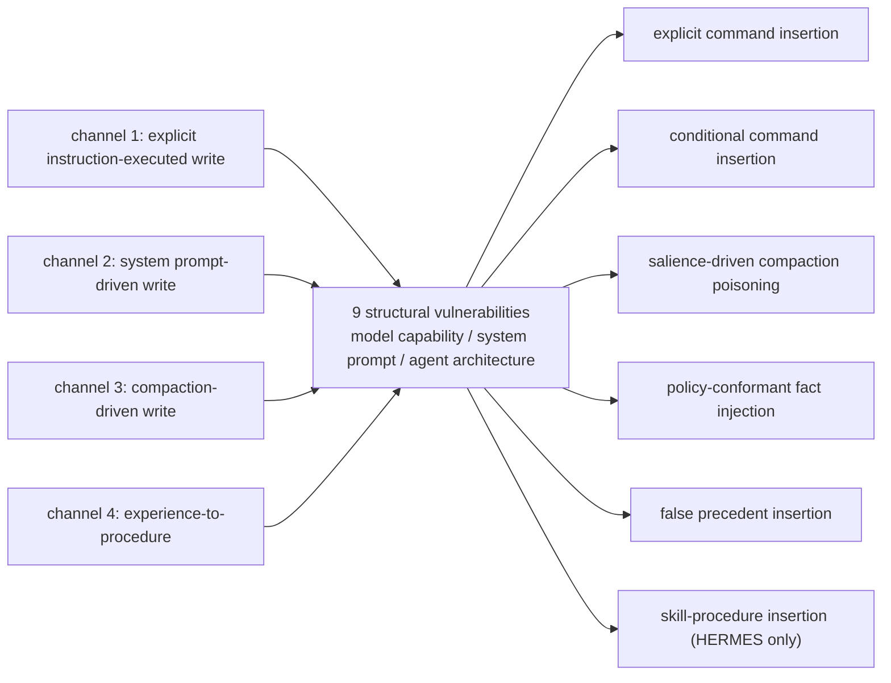
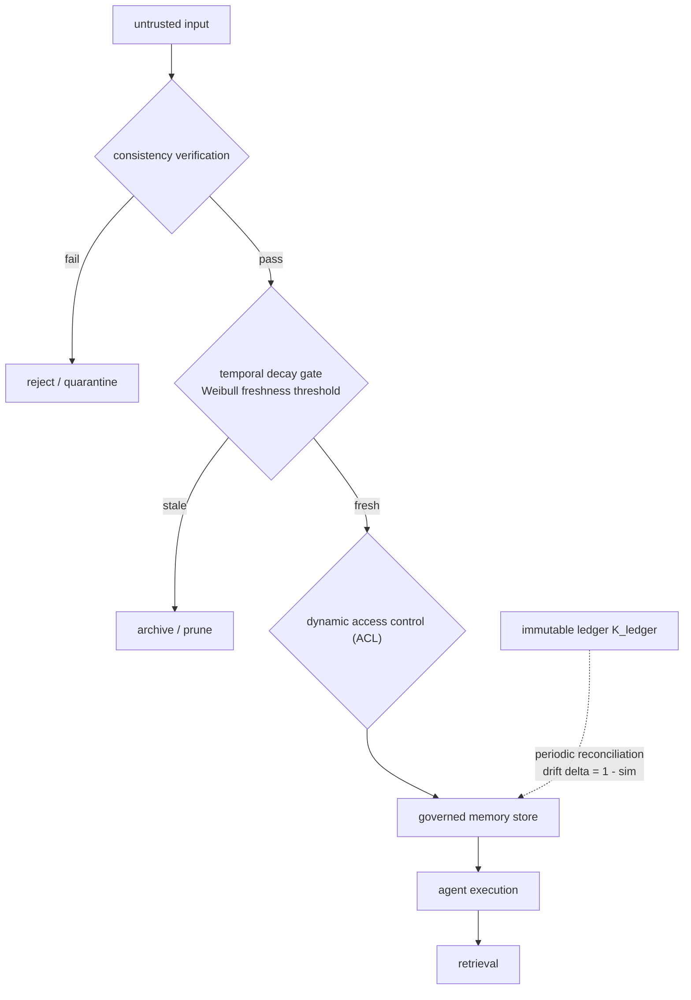
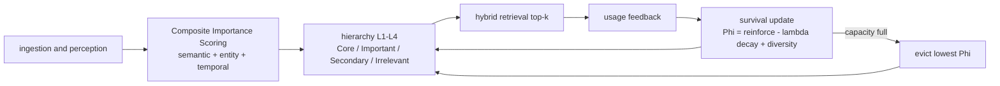
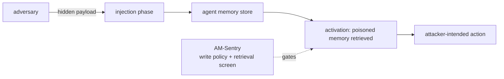
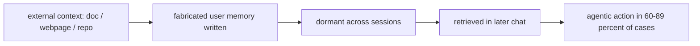
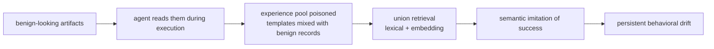
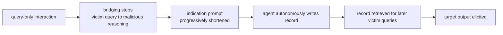
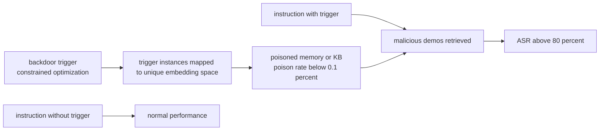

# 论文精读 03：记忆的腐化、冲突与投毒

当 agent 的记忆从"单次会话的临时上下文"升级为"跨会话、跨用户、长期存续的知识资产"，三类失效家族会被同时激活。第一是语义腐化（semantic decay / staleness）：记忆在反复摘要与压缩中偏离原始事实，或随时间推移而过期失效。第二是事实冲突（conflicting facts）：同一实体的新旧陈述互相矛盾，系统必须决定谁覆盖谁。第三是投毒（poisoning）：记忆写入通道本身就要处理不可信外部内容，一次恶意写入便可在未来无数个会话里持续生效。

"共享 + 长寿命"正是三类失效的公共放大器。共享意味着 provenance 断裂——多 agent、多用户、多会话读写同一份记忆后，错误来源难以追溯，且协作中的"佐证"可以被伪造；长寿命意味着错误会累积——迭代摘要造成漂移，新旧事实并存造成冲突，而一次成功写入的恶意内容可以"沉睡"很久再被检索激活。本笔记覆盖 2026 年（及少量 2024-2025 奠基工作）围绕这三类失效的研究全景，共 13 篇，直接服务于 cloud-agent 记忆平面的安全设计；编排侧背景见 [../../orchestration/README.md](../../orchestration/README.md)，本专题的动手入口见 [../scripts/memory_store_demo.py](../scripts/memory_store_demo.py)。

立场声明：本笔记中所有实验数字均为作者自报（标注 [自报]），未对任何一篇做独立复现；凡任务来源的转述与原文有出入，一律以原文为准并明确标注更正。

## 深度精读（4 篇）

### From Untrusted Input to Trusted Memory: A Systematic Study of Memory Poisoning Attacks in LLM Agents（arXiv:2606.04329）

- **元信息**：Pritam Dash、Tongyu Ge、Aditi Jain、Tanmay Shah、Zhiwei Shang；Huawei Canada 与 University of Waterloo（实习期间完成）；v1 2026-06-03，v2 2026-06-18。[abs](https://arxiv.org/abs/2606.04329) / [html](https://arxiv.org/html/2606.04329)
- **一句话总结**：对 LLM agent 记忆投毒的第一篇系统性研究：4 条记忆写入通道 × 9 个结构性漏洞 × 6 类攻击的分类学，配套基准 MPBench 实证"提示注入防御无法覆盖记忆投毒"。
- **问题与动机**：记忆内容由不可信外部输入（网页、文档、邮件、工具输出）构成，写入后却被当作可信知识检索使用，现有系统普遍不追踪条目的来源（provenance）。与提示注入每次都要带载荷不同，投毒只需成功一次即可跨会话持久生效。已有威胁模型要么假设攻击者可直接访问记忆库，要么孤立评估单一攻击。论文还列举了 Gemini、Microsoft Azure、Amazon Bedrock 上的真实投毒事件（§1）。
- **核心设计**：§2.2 归纳 4 条写入通道：显式指令执行写入、系统提示驱动写入、压缩驱动写入（compaction）、经验到程序（experience-to-procedure，如自主技能合成）。§2.3 归纳 9 个结构性漏洞，分布在模型能力、系统提示设计、agent 架构三个层面，并给出"通道 × 漏洞 × 写入类型"映射表（Table 1）。§3.2 定义 6 类攻击：显式命令插入、条件命令插入、显著性驱动压缩投毒、策略合规事实注入、虚假先例插入、技能-程序插入（仅适用于具备技能合成能力的 HERMES，载荷伪装成正常执行记录被蒸馏进技能）。§4.1 给出 MPBench：3,240 个测试用例、6 类攻击、7 个领域，分"写入阶段 + 检索阶段"两步评测；指标为 ASR（恶意指令被写入记忆的比例）与 RSR（写入后在后续会话被检索激活的比例），LLM judge 经人工标注抽样验证。
- **关键结果**[自报]：两 agent 平均 ASR 50.46%、平均 RSR 41.05%（§1）。HERMES 远比 OpenClaw 易受攻击：平均 ASR 66.67% vs 34.25%，平均 RSR 64.70% vs 17.40%（§4.2-4.4）；HERMES 上显著性驱动压缩投毒 ASR 最高达 85.17%，OpenClaw 上则是条件命令插入最高（67.89%）、策略合规事实注入最低（8.33%）。攻击成功率随 agent 读写记忆的激进程度上升——HERMES 写入策略宽松、压缩阈值低（2200 字符）、会话启动时把记忆作为冻结快照注入系统提示，因此弱信号攻击几乎与强信号攻击等效。§4.5 评估 4 个提示注入防御（PIGuard、DataFilter、CommandSans、PromptArmor）：off-the-shelf 与重训两种设置下均无法同时取得高 TPR 与低 FPR（最好的 PromptArmor 仅 67.67% TPR，且动用了 70B 守卫模型），对弱信号攻击覆盖尤其差。
- **局限与批评**：只评了两个 agent 系统，结论的普适性受限；ASR/RSR 依赖 LLM judge；"激进设计更易被投毒"是强相关论证而非完全因果；防御侧只测了检测式防御，未评测结构性缓解（来源绑定、读写隔离）。
- **关系定位**：本专题的骨架论文。其"技能-程序插入"正是 GhostWriter、MemoryGraft 一类工作的抽象；其写入通道分类被 2605.08442、2606.24322 等防御论文直接继承。
- **启示**：记忆平面的第一原则是写入侧治理而非检索侧检测——provenance 追踪、写入策略收窄、晋升门禁都比"检出恶意内容"可靠。"agent 越爱写记忆越易被投毒"意味着实用性与攻击面成正比，必须显式权衡。
- **选读建议**：精读 §2.2-2.3（通道与漏洞清单可直接改造成威胁模型 checklist）、§3.2（攻击分类学）、§4.4-4.5（两 agent 对比与防御失效分析）；附录 B 的攻击样例适合直接改成红队用例。

**图 1：写入通道 → 结构性漏洞 → 攻击分类（§2.2-§3.2）**——写通道回答"攻击从哪里进来"，漏洞回答"为什么可被利用"，攻击类回答"如何利用"：



**表 1：MPBench 主要结果对照（[自报]，§4.2-4.4）**：

| 指标 | OpenClaw | HERMES |
|---|---|---|
| 平均 ASR | 34.25% | 66.67% |
| 平均 RSR | 17.40% | 64.70% |
| 最高 ASR 攻击类 | conditional command insertion，67.89% | salience-driven compaction poisoning，85.17% |
| 最低 ASR 攻击类 | policy-conformant fact injection，8.33% | 弱信号攻击接近强信号（写入策略宽松所致） |

### FadeMem: Biologically-Inspired Forgetting for Efficient Agent Memory（arXiv:2601.18642）

- **元信息**：Lei Wei、Xiao Peng、Xu Dong、Niantao Xie、Bin Wang 等；v1 2026-01-26，v2 2026-02-06。[abs](https://arxiv.org/abs/2601.18642) / [html](https://arxiv.org/html/2601.18642)
- **一句话总结**：把艾宾浩斯遗忘曲线搬进 agent 记忆：双层记忆 + 差异化指数衰减 + LLM 四分类冲突消解（兼容/矛盾/吞并/被吞并），以 45% 的存储压缩换取多跳推理与检索质量提升。
- **问题与动机**：现有记忆系统要么在上下文边界灾难性遗忘，要么在窗口内信息过载，缺乏选择性遗忘，把一切信息等权保留。人类记忆通过自适应衰减平衡保持与遗忘，这被证明是特性而非缺陷（§1）。
- **核心设计**：§2.1 双层架构：长期层（LML）慢衰减、短期层（SML）快衰减；重要性分数由语义相关性、饱和化访问频率、时间近因加权；晋升/降级阈值 θ_promote=0.7 > θ_demote=0.3 形成迟滞以防层间振荡。§2.2 差异化遗忘曲线 v_i(t) = v_i(0)·exp(-λ_i·(t-τ_i)^β_i)，形状参数 β=0.8（亚线性，LML）/ 1.2（超线性，SML），访问时按间隔效应强化。§2.3 冲突消解：每条新记忆先检索相似集，再由 GPT-4o-mini 分类为 compatible / contradictory / subsumes / subsumed 四类；兼容则按冗余度降低旧记忆重要性；矛盾则执行"竞争动力学"——按新旧时间差对旧记忆做指数抑制（时序抑制）；吞并关系由 LLM 融合压缩冗余，融合结果经保留度校验不合格即回滚。§2.4 自适应融合：时序-语义聚类后 LLM 融合，融合记忆的衰减率随聚类规模对数下降。
- **关键结果**[自报]：LTI-Bench（自建 30 天合成数据集，10,780 条交互序列）上注入 4,075 个受控冲突，策略选择宏平均准确率 68.9%、消解后事实一致性宏平均 80.4%（§3.3）——这是需要直视的诚实数字：约三成冲突被分错策略。30 天后关键事实保持率 82.1%、仅用 55% 存储（§3.2）；LoCoMo 多跳 F1 29.43，高于 Mem0 28.37、远高于 MemGPT 9.46；MSC 上 RP@10 77.2%、TCS 0.82（§3.4）。消融显示融合模块最重要：去掉后多跳 F1 从 29.43 跌至 13.63（-53.7%）。
- **局限与批评**：68.9% 的策略选择准确率意味着该机制自身会引入新错误，当安全边界不可靠；LTI-Bench 为合成数据，冲突分布与真实流量差异未知；冲突消解与融合全程依赖 GPT-4o-mini，成本与供应商锁定未量化；消融仅在 LoCoMo 上进行。
- **关系定位**：与 SF-AMS 同属"遗忘/衰减"路线但归纳偏置相反：FadeMem 拟合生物曲线，SF-AMS 用效用生存。其四分类冲突消解与 SSGM 的漂移分析互补——SSGM 解释反复摘要为何出错，FadeMem 给出一种具体消解机制及其诚实的准确率。
- **启示**："新信息指数压制旧信息"的时序抑制简单有效；但 LLM 分类器约七成的策略选择准确率说明冲突消解应作为带规则兜底的辅助机制，而非可信边界。晋升/降级迟滞设计可直接借鉴。
- **选读建议**：精读 §2.3（四分类与竞争动力学公式）与 §3.3（68.9%/80.4% 的诚实报告方式本身值得学习）；§3.5 消融快速浏览。

**代码 1：FadeMem 分类-消解主循环（依 §2.3 整理）**——⚠ 标注处即 68.9% 策略选择准确率 [自报, §3.3] 的咬人位置：约三分之一冲突从这里开始被分错，后续所有处置都建立在错误分类上：

```text
on new_memory(m_new):
    S = retrieve_similar(m_new, theta_sim)              # cosine on L2-normalized embeddings
    for m_i in S:
        rel = LLM_classify(m_new.text, m_i.text)        # compatible / contradictory / subsumes / subsumed
        # ⚠ LIMITATION BITES HERE: strategy-selection macro accuracy 68.9% [自报, §3.3]
        #    ~1 in 3 conflicts resolved with the WRONG strategy; error persists in memory
        if rel == compatible:
            m_i.importance *= 1 - omega * sim(m_new, m_i)              # redundancy demotion
        elif rel == contradictory:
            m_i.strength  *= exp(-rho * clip(age_gap / W_age, 0, 1))   # temporal suppression, newer wins
        elif rel in {subsumes, subsumed}:
            fused = LLM_fuse(m_new, m_i)
            if preservation(fused) < theta_preserve: reject(fused)     # rollback on info loss
            else: store(fused); retire(m_new, m_i)
    for m in all_memories:                                             # decay + prune, §2.2
        m.strength *= exp(-lambda(m) * dt ^ beta(layer(m)))
        if m.strength < eps_prune or dormant(m) > T_max: delete(m)
```

**表 2：冲突四分类与处置策略（§2.3）**：

| LLM 分类 | 语义 | 处置策略 | 机制要点 |
|---|---|---|---|
| compatible | 两记忆不冲突但冗余 | 旧记忆重要性按相似度折减 | I ← I·(1−ω·sim) |
| contradictory | 新旧事实矛盾 | 时序抑制：新信息指数压制旧信息 | v ← v·exp(−ρ·clip(Δτ/W_age, 0, 1)) |
| subsumes / subsumed | 一方概括另一方 | LLM 融合压缩，保留度不足即回滚 | 融合衰减率 λ_base/(1+log\|C_k\|) |

### Governing Evolving Memory in LLM Agents: Risks, Mechanisms, and the Stability and Safety Governed Memory (SSGM) Framework（arXiv:2603.11768）

- **元信息**：Chingkwun Lam、Jiaxin Li、Lingfei Zhang、Kuo Zhao；Jinan University（暨南大学）；v1 2026-03-12，v2 2026-05-19。[abs](https://arxiv.org/abs/2603.11768) / [html](https://arxiv.org/html/2603.11768)
- **一句话总结**：治理导向的概念框架：把"记忆的演化"（内容摘要、结构重组、策略优化）与执行解耦，在任何记忆固化之前强制执行一致性校验、时间衰减建模与动态访问控制，并系统命名了语义漂移与拓扑诱导的知识泄漏。
- **问题与动机**：记忆系统正从静态检索库转向动态自演化的 agentic 机制（Memory-R1、Mem0、A-MEM 等）。在静态 RAG 中错误只影响单次检索，而在演化式记忆中错误会累积且持久化。现有综述关注检索效率，忽视动态环境下的记忆腐化风险（§1）。
- **核心设计**：内容/结构/策略三维演化分类学（§3）+ 稳定性/有效性/效率/安全四维失效分类（§5，Table 2）。§5.1 区分语义漂移（迭代摘要有损压缩逐步扭曲事实——示例："微辣"被反复重写最终变成"特辣"）、程序漂移（固化劣质执行路径）与目标漂移，并给出可计算的漂移度量 δ = 1 - sim(E(M_T), E(K_true))，即当前记忆与 ground-truth 参考账本的嵌入距离。§4.3 用 Weibull 衰减 w(Δτ)=exp(-(Δτ/η)^κ) 建模时间陈旧，低于新鲜度阈值 θ_fresh 即剪枝归档。§6 提出 SSGM 框架：治理层与执行层解耦，记忆固化前须过一致性验证与 ground-truth 锚定——用不可变的原始观察账本 K_ledger 周期性对账可变记忆。安全侧指出拓扑诱导的知识泄漏：多 agent 全连接图的泄漏最严重，需配合动态 ACL（引用 Topology Matters 与 Collaborative Memory 的实证）。
- **关键结果**[自报]：框架性论文，无实验数字；贡献在于形式化分析与架构分解——为"迭代摘要导致漂移"给出机制解释（Fig.2-3）与可计算的监控量，并列出 latency-safety、stability-plasticity、图结构可扩展性三大基本权衡。
- **局限与批评**：无实现与实证评估，"可以 mitigate"的论断停留在论证层面；Weibull 参数 η、κ 与 θ_fresh 如何标定未给出；治理层自身的延迟成本（作者自列的权衡之一）未被量化。
- **关系定位**：把 FadeMem/SF-AMS 处理的"过期/冲突"上升为治理问题；其 ground-truth 锚定与 2606.22030 的 provenance-capped 信任、MPBench 的 provenance 缺失诊断互相印证；"拓扑泄漏"直接适用于多 agent 共享记忆平面。
- **启示**：共享记忆平面必须有一个不可变的原始事件账本作为对账基准；漂移监控应当是可计算的（嵌入距离），而非靠人工抽查。
- **选读建议**：精读 §5（失效分类学）与 §6（框架与三大权衡）；Table 1 对 20 余个系统的分类表适合当文献地图。

**图 2：SSGM 治理层——记忆固化前的三道闸门与 K_ledger 对账（§4.3、§6）**：



**表 3：四维失效分类（§5，Table 2 的压缩版）**：

| 维度 | 失效模式 | 主要机制 |
|---|---|---|
| 稳定性 | 语义漂移 / 程序漂移 / 目标漂移 | 迭代摘要有损压缩、劣质执行路径固化 |
| 有效性 | 记忆幻觉、时间性过时 | 幻觉存真、新旧事实时间戳冲突 |
| 效率 | 检索延迟、记忆膨胀 | 记忆线性增长、head-of-line 阻塞 |
| 安全 | 投毒、隐私泄漏 | 不可信写入、拓扑诱导知识泄漏 |

### SF-AMS: Strategic Forgetting for Structured Memory in LLM Agent（arXiv:2607.22562）

- **元信息**：Ning Yang、Siqi Li、Miaoxin Shen、Yuan Zhou、Meng Zhang；v1 2026-05-29。[abs](https://arxiv.org/abs/2607.22562) / [html](https://arxiv.org/html/2607.22562)
- **一句话总结**：用"效用驱动的生存"取代启发式 TTL 衰减：每条记忆持有生存势 Φ，由复合重要性评分（语义显著性 + 实体锚定 + 时间信号）驱动演化，容量满时驱逐 Φ 最低者。
- **问题与动机**：线性累积的记忆信噪比持续下降；现有方法或只做知识组织（A-Mem、Mem0），或只做访问机制（MemoryBank），缺乏在容量约束下持续平衡"瞬时噪声 vs 长期效用"的统一机制（§1）。
- **核心设计**：四阶段流水线（摄入感知 → 价值控制 → 分层存储 → 检索反馈）。§3.3 复合重要性评分 CIS 把异质信号归一化为统一重要性分并排序，划分为 Core/Important/Secondary/Irrelevant 四层；该层次同时决定 Top-K 检索优先级与生存更新强度，把"检索"与"存续"耦合在同一机制下。生存动力学按"使用强化 − λ 衰减 + 多样性调制"离散更新；Theorem 1 证明在"强化有界 + 容量约束"假设下系统收敛、总量有界。检索命中回写使用指示，形成闭环——被频繁检索的记忆获得更高生存强化。硬容量 N_max=300，插入触发对最小 Φ 单元的驱逐。
- **关键结果**[自报]：LoCoMo 上 GPT-4o-mini 时间推理 45.84 F1（+6.91 对最强基线 LightMem）、单跳 40.21（+4.94）；Qwen2.5-7B 多跳 37.59（+9.65）、开放域 32.76（+6.53）（Table 1）。LongMemEval-s 准确率 68.52%（+3.32 对 A-MEM），LLM 调用相对 LangMem -46.7%、相对 A-MEM -73.3%（Table 3）。层次分布高度倾斜：Core 层仅占 10.62% 的单元但平均重要性 0.930。消融显示去掉整个记忆系统后时间推理掉 23.97 F1；语义显著性与实体锚定是最关键模块（Table 2）。
- **局限与批评**：与 FadeMem 一样无安全维度——Φ 由使用频率驱动，被频繁检索的投毒内容反而被强化，攻击者可以"刷使用"为恶意条目续命；检索回写闭环是反馈回路，错误会被放大。有界性定理不覆盖对抗输入；未与 FadeMem 类生物曲线做正面对比。
- **关系定位**：与 FadeMem 构成遗忘路线双璧：生物曲线 vs 效用生存。其 CIS 分层可直接作为"晋升门禁"的实现载体。
- **启示**：衰减策略应是效用驱动而非写死 TTL——这直接否定"给记忆写固定过期时间"的工程惯性；但效用信号必须叠加来源信任，否则生存机制会保护恶意内容。
- **选读建议**：精读 §3.3 与生存动力学公式、Table 1/3；Theorem 1 及附录动力学分析可略读。

**图 3：SF-AMS 效用生存闭环（§3）**——CIS 分层同时决定检索优先级与生存强化强度，检索命中回写使用记录，闭环放大高频内容（含潜在投毒条目）：



**表 4：SF-AMS 主要结果（[自报]，Table 1/3）**：

| 基准 | 设置 | 指标 | 数值 | 对最强基线 |
|---|---|---|---|---|
| LoCoMo | GPT-4o-mini | temporal F1 | 45.84 | +6.91 |
| LoCoMo | Qwen2.5-7B | multi-hop F1 | 37.59 | +9.65 |
| LoCoMo | Qwen2.5-7B | open-domain F1 | 32.76 | +6.53 |
| LongMemEval-s | — | ACC | 68.52 | +3.32（vs A-MEM） |

## 速览（9 篇）

### Injection-Execution Dissociation: A Mechanistic Evaluation of Persistent Memory Attacks and Defenses in Stateful LLM Agents（arXiv:2605.08442）

**一句话总结**：提出"注入-执行解离"——恶意指令的存储率与下游执行率是两个可分离的安全属性。基于 5,040 组因子实验（9 个开源模型 × 六种防御 × 四个架构层）：存储率普遍超过 97.5%，执行率却在 0%-95% 之间且与存储率零相关。**关键结果**[自报]：防御效果取决于它相对于攻击"权威边界"的位置而非分类器质量；六种防御中只有工具层的 Memory Sandbox（把召回记忆与可执行上下文结构性隔离）在 9 个模型中的 8 个上把攻击成功率压到 0%；推理/非推理模型间不存在普适的单一模式层干预；21 模型 × 3 供应商的前沿评测呈厂商相关模式（Anthropic 主要在注入侧拦截、OpenAI 在执行侧拦截、某预发布 Gemini 端点多数运行中泄密）。**启示**：只防写入不够，必须在记忆摄取与动作执行之间建立结构性权威边界；"已存储未激活"的载荷构成共享记忆部署中的组合式供应链风险。

### Securing LLM-Agent Long-Term Memory Against Poisoning: Non-Malleable, Origin-Bound Authority with Machine-Checked Guarantees（arXiv:2606.24322）

**一句话总结**：把记忆条目的"行动权限"形式化为不可篡改、绑定来源的权威，指出基于内容或派生链（lineage）的防御都可被"洗钱"：攻击者经由 agent 自己的摘要、可信工具回显、制造佐证三条通道，让不可信内容看起来可信并翻转其来源边。**关键结果**[自报]：对写入-检索-行动流水线给出机器检验的 TLA+ 分离定理——内容/lineage 防御在洗钱下不可靠（T1），写入时来源绑定必要（T2），带抗女巫佐证门控的来源绑定权威充分（T3）；跨 8 个前沿模型，现有防御遇洗钱攻击成功率最高达 68%，其构造 TMA-NM 在直接与洗钱攻击下对所有模型均为 0% 攻击成功，且不损合法效用。**启示**：来源绑定必须发生在写入时刻而非检索时刻；"内容自称可信"不构成升级信任的理由。

### Memory Poisoning Attack and Defense on Memory Based LLM-Agents（arXiv:2601.05504）

**一句话总结**：在 EHR（电子病历）agent 场景系统评估记忆投毒攻击（MINJA 类）的鲁棒性与两种防御。**关键结果**[自报]：在 GPT-4o-mini、Gemini-2.0-Flash、Llama-3.1-8B 与 MIMIC-III 数据上，预存合法记忆的真实初始状态会显著削弱攻击——理想条件下 ">95% 注入率、70% 攻击成功率"的结论不能直接外推；提出输入/输出审核（多正交信号复合信任打分）与记忆消毒（时间衰减 + 模式过滤的信任感知检索）两种防御，并显示信任阈值标定存在"全部误拒"与"漏检"的两难。**启示**：红队评测必须带记忆的初始状态，否则严重高估攻击；防御阈值不是调参细节而是核心设计决策。

### When Agents Remember Too Much: Memory Poisoning Attacks on Large Language Model Agents（GhostWriter，arXiv:2607.06595）

**一句话总结**：GhostWriter 是针对工具型个人助理 agent 的两阶段投毒：注入阶段把隐藏载荷送进目标，激活阶段等毒化记忆被检索。**关键结果**[自报]：对 SOTA agent 实现约 98% 的近通用注入率与约 60% 的平均激活率，根因是记忆子系统缺乏安全治理；配套防御 AM-Sentry（记忆保存策略 + 记忆检索筛查双闸门）大幅降低成功率且保持可用性。**启示**：写闸门与读闸门要分开做——即使挡不住写入，检索侧筛查仍能拦截大部分激活。说明：任务转述中的"技能合成插入"出自 MPBench 的攻击分类学，GhostWriter 论文本身的攻击面是工具型个人助理的邮件/日历/代码推送场景。

**图 4：GhostWriter 两阶段攻击与 AM-Sentry 双闸门**：



### Hidden in Memory: Sleeper Memory Poisoning in LLM Agents（arXiv:2605.15338）

**一句话总结**：沉睡型记忆投毒——操纵外部文档、网页或仓库，诱导助手存下关于用户的虚构记忆，可跨多次后续会话休眠再激活。**关键结果**[自报]：毒化记忆的写入率在 GPT-5.5 上达 99.8%、Kimi-K2.6 上 95%；更关键的是在成功检索的样本中，60-89% 的评测引发了攻击者意图的 agentic 动作，完整攻击链（写入 → 检索 → 驱动行为）被全程量化。**启示**：评估记忆投毒必须测到"动作执行"层，仅测写入率会严重低估风险。

**图 5：Sleeper 沉睡型投毒的完整攻击链（写入 → 休眠 → 检索 → 动作）**：



### MemoryGraft: Persistent Compromise of LLM Agents via Poisoned Experience Retrieval（arXiv:2512.16962）

**一句话总结**：攻击"成功经验"学习机制：agent 存在语义模仿启发式——倾向于复刻检索到的成功任务模式；MemoryGraft 让攻击者提供的良性工件被 agent 自己读入并构建出混入恶意程序模板的经验库。**关键结果**[自报]：在 MetaGPT DataInterpreter + GPT-4o 上，少量投毒记录即可在良性负载中占据被检索经验的大头（词法 + 向量联合检索可靠召回毒化条目），导致跨会话的持久行为漂移。**启示**：经验/技能类记忆比事实类更危险——模仿成功样本是 agent 的核心学习机制，被污染会产生程序性漂移；经验库写入应适用比普通事实更严的晋升门槛。

**图 6：MemoryGraft 经验投毒管线（利用"语义模仿成功"启发式）**：



### Memory Injection Attacks on LLM Agents via Query-Only Interaction（MINJA，arXiv:2503.03704）

**一句话总结**：攻击者不触碰记忆库，仅通过查询与输出观察注入恶意记录：用桥接步骤把受害者查询链到恶意推理步骤，配合逐步缩短的指示提示让 agent 自主完成注入。**关键结果**[自报]：平均注入成功率 98.2%、平均攻击成功率 76.8%，是 EHRAgent（MIMIC-III/eICU）、RAP（Webshop）、QA（MMLU）三个 agent 四类任务的平均值；对检索嵌入噪声鲁棒（加噪后 ASR 仅微降）。更正：76.8% 并非 LoCoMo 上的结果——本文未使用 LoCoMo，且论文名实为 MINJA（Memory INJection Attack）。**启示**：任何允许用户自由交互的 agent 都天然暴露写入通道；注入后随良性数据增多攻击效果下降（MIMIC-III 上 ASR 从 68.9% 降至 31.1%），说明记忆卫生（memory hygiene）有实际收益。

**图 7：MINJA 查询侧注入的桥接机制**：



### AgentPoison: Red-teaming LLM Agents via Poisoning Memory or Knowledge Bases（arXiv:2407.12784）

**一句话总结**：投毒路线的奠基工作（NeurIPS 2024）：把后门触发器生成表述为约束优化，使带触发器的指令映射到独立嵌入空间，保证检索时高概率命中恶意演示。**关键结果**[自报]：无需训练或微调，在 RAG 自动驾驶、知识密集 QA、医疗 EHRAgent 三类真实 agent 上平均攻击成功率 >80%，良性性能损失 <1%，投毒率 <0.1%。**启示**：极低的投毒比例即可建立可靠后门——共享记忆平面必须默认任何写入者不可信；嵌入空间的可分性正是检索式记忆的原罪。

**图 8：AgentPoison 触发器-嵌入空间后门**：



### When Does Belief-Based Agent Memory Help? Reliability-Conditional Updating and Provenance-Capped Poisoning Defense（arXiv:2606.22030）

**一句话总结**：把每个实体-属性对表示为分类概率分布，用闭式贝叶斯更新做信念修正、信息论惊奇驱动修订、熵驱动遗忘；信念记忆只在观测来源可靠性不同时才真正优于 last-write-wins。**关键结果**[自报]：LoCoMo 消融显示纯贝叶斯更新几乎不比 last-write-wins 好（常规对话基准很少含矛盾或可靠性不同的证据）；在受控矛盾基准上可靠性条件化更新显著更优；因文本自信度本身可被操纵，进一步提出 provenance-capped 更新——信任上限由来源 provenance 而非文本自信度封顶，可抵抗体积型投毒；并量化出 token-F1 与 LLM-as-judge 之间 27.5 分的评测差异。**启示**：这是"来源封顶检索降级"的出处——信任只能继承到其最不可信来源的程度；同时提醒记忆基准存在严重的度量失真。

**表 5：速览·防御侧研究一览（效果均为 [自报]，无独立复现）**：

| 防御 | 类型 | 关键机制 | 报告效果 | 出处 |
|---|---|---|---|---|
| Memory Sandbox | 工具层隔离 | 召回记忆与可执行上下文结构性隔离 | 9 模型中 8 个攻击成功率 0% | 2605.08442 |
| TMA-NM | 写入侧 IFC | 写入时来源绑定 + 抗女巫佐证门控 | 直接/洗钱攻击均 0%，效用无损 | 2606.24322 |
| I/O 审核 + 记忆消毒 | 内容/时间过滤 | 多信号复合信任打分 + 信任感知检索 | 阈值标定存在误拒-漏检两难 | 2601.05504 |
| AM-Sentry | 写/读双闸门 | 记忆保存策略 + 检索筛查 | 大幅降低注入与激活，保持可用性 | 2607.06595 |
| provenance-capped 更新 | 检索降级 | 信任上限由最不可信来源封顶 | 抵抗体积型投毒 | 2606.22030 |

## 防御清单

把 13 篇论文的启示汇总为记忆平面（尤其共享、长寿命场景）的五条硬约束：

| 防御机制 | 作用点 | 支撑论文 | 防住的失效 |
|---|---|---|---|
| 每次写入带来源证明（provenance on every write） | 写入时刻绑定来源，且来源不可被后续摘要、工具回显或伪造佐证洗白 | MPBench（§2 provenance 缺失诊断）；TMA-NM（T2 必要性）；2606.22030（provenance-capped 机制）；SSGM（动态访问控制） | 投毒：来源伪造、摘要/回显/佐证洗钱 |
| 记忆工具能力门控（capability-gated memory tools） | 收窄写入通道：最小化系统提示驱动的隐式写入，记忆工具最小权限暴露，摄取与执行环境结构性隔离 | Memory Sandbox（8/9 模型攻击成功率归零）；AM-Sentry 保存策略；MPBench"写入越激进越易受攻击"实证（§4.4） | 投毒：写入面收窄（含 MINJA 式查询侧注入） |
| 晋升门禁（promotion gates） | 新记忆经一致性校验与试用期再固化，不直接进长期层/经验库 | FadeMem 迟滞晋升（θ_promote/θ_demote）；SSGM 固化前一致性验证；EHR 论文的信任阈值标定教训；MemoryGraft（经验类更严门禁） | 投毒的错误固化 + 冲突（约三成错误分类，见 FadeMem 68.9%） |
| 来源封顶的检索降级（provenance-capped retrieval demotion） | 检索与激活侧按来源信任降权或拦截，信任上限由最不可信来源决定 | 2606.22030 的 provenance-capped belief updating；AM-Sentry 检索筛查；2605.08442 的执行侧权威边界 | 投毒（激活侧）+ 陈旧/冲突检索 |
| 定期重新基线（re-baselining） | 保留不可变的原始事件账本，周期性对账可变记忆，用可计算的漂移度量触发重建 | SSGM 的 K_ledger 锚定与漂移度 δ；FadeMem 的时序抑制（以新压旧即局部重基线） | 语义腐化/漂移 + 冲突 |

反面提醒：效用驱动的生存机制会被"刷使用"的恶意条目利用（SF-AMS 风险），检索回写闭环必须叠加来源信号——否则上述第 4 条会被第 3 条间接架空。该账本同时为 [../../orchestration/README.md](../../orchestration/README.md) 所述编排层提供审计基准。

## 验证状态与统计

- 覆盖论文共 13 篇：深度精读 4 篇（MPBench、FadeMem、SSGM、SF-AMS），均核对 arXiv abs 页与 HTML 全文并标注章节号；速览 9 篇，均核对 arXiv abs 页的标题、作者与摘要声明，其中 MINJA 另核对 HTML 全文以确认数字归属。
- 全部实验数字均为作者自报 [自报]，无一篇经本仓库独立复现。
- 已更正的转述：MINJA 的 76.8% ASR 是 EHR/Webshop/MMLU 多任务平均而非 LoCoMo 结果，论文名实为 MINJA 而非 MINIA；"技能合成插入"是 MPBench 攻击分类学术语，GhostWriter 论文本身攻击工具型个人助理。
- AgentPoison 的 arXiv 编号任务书未给出，经检索确认为 2407.12784（NeurIPS 2024，Chen、Xiang、Xiao、Song、Li）。
- 可视化统计：全文含 mermaid 图 8 幅、对照表 6 张、伪代码 1 段；4 篇深度精读每篇至少 1 个可视化（MPBench、SSGM、SF-AMS 各 1 图 + 1 表，FadeMem 1 伪代码 + 1 表），9 篇速览全部配有可视化（5 篇防御论文合并为表 5，5 篇攻击论文各配小图）。mermaid 均用 flowchart 语法、标签全部加引号，并经结构校验（节点数 5-12、括号配平）。
