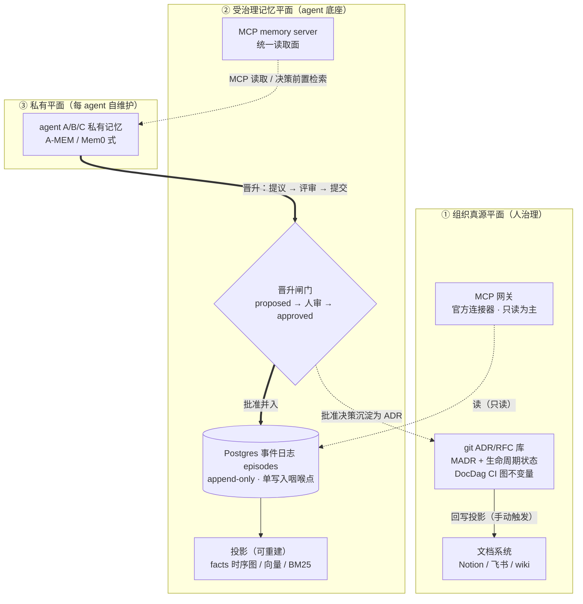

# 组织知识与决策记录：组织记忆的治理层

本笔记关注"组织记忆"（organizational memory）这一层：当多个人、多个 Agent 在同一组织里工作时，什么算组织的事实？决策依据存在哪？谁有权让一段记忆晋升成"组织级"？单 Agent 的工作记忆、情节记忆、语义记忆机制是底下的基础；本篇把视角抬高到治理层——知识从产生、记录、检索到失效的完整生命周期，以及 Agent 在其中扮演的角色。

证据质量在本篇里是核心议题，刻意分层：Walsh & Ungson 1991 是管理学经典概念论文（非实证）；AgenticAKM 是 2026 年的同行评审工作坊论文（样本小、作者自评）；其余大量内容是行业实践、博客与厂商文档，一律标注 [grey literature] 或 [厂商]，请按相应权重取用，不要把博客共识当成实验结论。存储层与读写路径的具体落地见 [[./05-cloud-memory-architecture.md]]；记忆驱动的状态机与持久执行形态对照见 [[../../orchestration/notes/state-machine-forms.md]]。

## 理论基线：组织记忆是什么

### Organizational Memory（Walsh & Ungson 1991, Academy of Management Review 16(1): 57–91）

- **元信息**：James P. Walsh, Gerardo Ungson，Academy of Management Review 第 16 卷第 1 期，1991 年，被引数位居组织记忆文献之首。类型：概念框架论文，无实验。[理论]

- **一句话总结**：组织记忆是"取自组织历史、可被用于当前决策的存量信息"，它分布在五个"储存仓"（bins）中，经由获取（acquisition）、保持（retention）、检索（retrieval）三个过程支撑组织决策循环。

- **问题与动机**：80 年代的实证研究发现组织"健忘"：人员流动导致决策理由丢失，重复犯错，组织无法从历史中学习。作者要回答：信息在组织里到底存在哪、怎么存、怎么取，以便让"组织学习"有落点。

- **核心设计**：五个储存仓。**个体（individuals）**——记忆主要在人脑里，人员流动是组织记忆的头号敌人；**文化（culture）**——共享的信念、价值观与假设，通过社会化获得，稳定但难以改变；**转换（transformations）**——把输入变成输出的规程与例程（SOP、流程），决策被固化在日常程序里；**结构（structures）**——正式与非正式角色，例如守门人、档案管理员、老资格工程师，他们本身就是记忆的索引；**生态（ecology）**——物理环境与其中的外部档案（文件柜、仓库、后来的共享盘与 wiki）。三个过程：获取（从环境里吸纳信息）、保持（写入各仓）、检索（决策时取出）。决策循环是：信息获取 → 决策 → 行动 → 结果反馈回记忆。作者还讨论了记忆的度量属性：信息分布的广度、准确性、可及性（accessibility）、保持时长，以及"检索可靠性/有效性/经济性"这组经典权衡。

五个储存仓到 Agent 世界的对应（本篇推导，grey literature 级综合，别当引文用）：

| 储存仓 | 原文含义 | Agent 世界对应物 | 典型失效 |
|--------|----------|------------------|----------|
| 个体 individuals | 记忆在人脑，人员流动即流失 | Agent 会话上下文，session 结束即蒸发 | 跨会话重复试错、每轮重付 token 重建语境 |
| 文化 culture | 共享信念与假设，经社会化获得 | 系统提示词、AGENTS.md、组织编码惯例 | 惯例无人维护，与真实代码漂移 |
| 转换 transformations | 固化在规程与例程里的决策 | CI 流程、代码模板、skill、runbook | 流程照走但理由失传 |
| 结构 structures | 角色本身即记忆索引（守门人、档案员） | 评审者、签署门、broker 审批角色 | 角色缺位 = 检索断链 |
| 生态 ecology | 物理环境与外部档案 | git ADR 库、wiki、SaaS 文档系统 | 档案在但指针腐烂、检索不到 |

- **关键结果**：无实验数据；贡献是给出了一个可引用的词汇表和一个把"记忆"与"决策"接起来的框架。[理论] 它的实际作用是：此后三十年讨论组织知识管理、知识流失、决策记录（ADR）的论文几乎都以它为引用锚点。

- **局限与批评**：这是本篇必须诚实说明的一点。"五个仓"模型在后续文献中被持续批评：它把记忆当作静态的"存货"（stock），而 Moorman & Miner（1998, AMR，组织即兴研究）等后续工作强调记忆也是在用的过程中被重构的"流程"（process）；五个仓之间边界模糊（文化与结构很难干净切分）；检索更接近重构式回忆而非去仓库取货；实证上很难分别测量五个仓；整个框架建立在信息加工隐喻上，对组织政治、权力与意义建构（sensemaking）着墨很少。本篇（以及下游所有讨论）应把它当作**词汇表**使用——"决策依据分布在人、文化、流程、角色、档案里"是有用的提醒——而不是经过验证的组织理论。

- **关系定位**：为本篇所有 Agent 时代的内容提供底座词汇。AgenticAKM 的"架构知识分散在代码、issue、文档里"正是 Walsh & Ungson"知识分散在五个仓"在代码库语境的重述；三平面架构（见综合节）可以读作对五个仓的治理化重排：个体仓 → 每 Agent 私有平面，规程/角色仓 → 受治理平面，外部档案仓 → 组织真源平面。

- **启示**：给 Agent 设计组织记忆时，先问"这条信息落在哪个仓、由谁保持、如何检索"，比直接上向量库重要。人员（Agent）流动即记忆流失——所以记忆必须外置到不随会话销毁的载体，但外置不等于可信，要有签署与失效机制。

- **选读建议**：读原文第 2 节（A Framework for Organizational Memory）与五个 retention facilities 的定义段，以及结论部分对 turnover 的讨论；约 35 页，概念密度高，前两遍抓住"bins + acquisition/retention/retrieval"即可，度量一节可跳过。

## 从代码库恢复架构知识并生成 ADR

### AgenticAKM：多智能体架构知识管理与 ADR 生成（arXiv:2602.04445，AGENT'26 工作坊论文，DOI 10.1145/3786167.3788416）

- **元信息**：Rudra Dhar 等，IIIT Hyderabad，2026 年 2 月投稿。发表于 AGENT'26（International Workshop on Agentic Engineering，里约热内卢，2026 年 4 月）工作坊，同行评审，但属于初步验证型短文。开源实现：github.com/sa4s-serc/AgenticAKM。

- **一句话总结**：把"架构知识管理（AKM）"从单次 LLM 调用拆成四个专职 Agent 组——提取、检索、生成、验证——由中央编排器协调，在 ADR 生成任务上，生成质量（作者组织的主观评分）显著高于单提示基线。

- **问题与动机**：架构知识（AK）分散在代码、提交历史、issue 追踪器、文档里，单个 prompt 塞不下也抓不准；直接让 LLM 生成 ADR 得到的是"看起来合理但缺乏深度"的文本——缺决策理由、缺历史语境、不可核验。这与 Walsh & Ungson 说的"知识分散在多个仓"是同一个问题的新形态。

- **核心设计**：中央编排器（Orchestrator）+ 人类架构师（Architect，配置流程、监督、可干预）之下分四组 Agent。**提取组（Extractor）**：Repo Summarizer（通读代码库产出架构摘要）、Issue Summarizer（从 issue 系统提取架构语境与痛点）、Document Summarizer（压缩现有文档）。**检索组（Retriever）**：ADR Retriever——对既有 ADR 的向量库做语义检索，在写新决策前先找相关旧决策；Architecture Diagram Retriever；Requirement Docs Retriever。**生成组（Generator）**：ADR Generator（基于摘要与检索结果起草 ADR，含 Title/Context/Decision/Consequences 等标准节）、Diagram Generator、Specification Docs Generator。**验证组（Validator）**：Repo Summary Validator（拿摘要对回源代码逐条核对）、ADR Validator（检查逻辑一致性、格式，并用向量检索把新 ADR 与旧 ADR 比对查冗余与矛盾）、Organization Policy Validator（对照组织预设架构原则）。工作流带反思环：摘要或 ADR 被验证组拒绝时打回生成组，最多三轮。其 ADR 实例化流程：摘要 → 验证 →（迭代）→ ADR 生成 → 验证 →（迭代）→ 落盘。

- **关键结果**：用户研究 13 名参与者（行业经验 0–6 年）提交 29 个各自熟悉的代码库（Python 17、JavaScript 12，1k–350k 行），盲评四种配置（基线/Agentic × Gemini-2.5-pro/gpt-5）的 ADR 集，5 分制。Agentic 方案总体质量 3.9 分，单提示基线 3.3 分，Relevance 4.3–4.1，Completeness 差距最大（基线"偶有遗漏、推理深度不足"）；定性反馈称 Agentic 产物"结构化、清晰""反映了真实的架构推理"，基线"空泛、抽象"。全部 [自报]：小规模、参与者即数据源、评分者知道研究目的之外的变量控制有限。

- **局限与批评**：作者自列：只做了 ADR 一种实例化；用户研究规模小且非工业场景；未做纵向研究。评论可补充：摘要-验证循环上限三轮是硬编码；验证器本身也是 LLM，"LLM 验 LLM"的可靠性上限就是模型能力；评分体系（相关性/连贯性/完整性/简洁性）不含"决策是否符合组织真实意图"这一治理维度；值得注意的是 Java 仓库上基线反超 Agentic 的现象，论文未解释。它回答"怎么生成得更快更好"，没回答"生成错了谁负责"。

- **关系定位**：是"ADR Retriever 先查旧再写新"这一反模式（决策重复/矛盾）的学术化表达；与 tianpan 的 arch-decision agent 实践互补——学术版把验证自动化，实践版把签署权留给人。其三段式"提取-检索-生成"与验证闭环，是通用知识管理流水线的参考形状。

- **启示**：①写新决策前先语义检索旧决策，应成为组织记忆写入路径的默认步骤；②验证组要用"对照真源"（代码、组织政策库）而不是"另一个 LLM 觉得好不好"；③Architect 角色在论文里存在感弱（实验时无人工干预运行），落到治理层时要把这个角色做实——见下文的签署门。

- **选读建议**：读 §3（四类 Agent 清单，是全文最有复用价值的部分）与 §4.1（ADR 实例化工作流）；§4.3 结果只看表格和定性引语即可。全文约 8 页，一小时以内。

## 行业实践（grey literature 与厂商文档）

以下条目都不是同行评审文献。MADR 与 Backstage 约定是事实性社区规范；DocDag 是单仓库工具；tianpan.co 是个人技术博客；企业索引与 MCP 服务器部分来自厂商文档。它们共同构成了 2026 年"组织记忆工程"的真实实践图景，但每条的可信边界请按标注理解。

### MADR v4 与 Backstage 的 ADR 约定（adr.github.io；backstage.io 官方文档）[grey literature / 厂商文档]

- **元信息**：MADR（Markdown Architectural Decision Records）当前版本 4.0.0（2024-09-17 发布），adr.github.io/madr。Backstage 的 ADR 约定见其官方文档 docs/architecture-decisions/ 页面。

- **一句话总结**：MADR 给"一条决策一个 Markdown 文件"定了结构化模板（状态、决策者、日期、问题语境、决策驱动、备选方案、决策结果、利弊、链接）；Backstage 给它定了治理约定：记录永不删除，只能被标记为 superseded 或 deprecated。

- **问题与动机**：决策记录的写法没有标准时，团队写出的东西从一句话到一篇论文都有，无法被 Agent 稳定消费；且 Wiki 式编辑让旧决策被悄悄改掉，失去"历史档案"属性。

- **核心设计**：MADR v4 模板字段：Status（proposed / accepted / deprecated / superseded by …）、Deciders、Date、Technical Story、Context and Problem Statement、Decision Drivers、Considered Options、Decision Outcome、Pros and Cons of the Options、Links。Backstage 约定原文（已逐字核对）："Records are never deleted but can be marked as superseded by new decisions or deprecated. Records should be stored under the `architecture-decisions` directory." 配套机制：新 ADR 用 `supersedes` 指针指回旧记录，旧记录保留全文，状态字段改写。

MADR v4 字段表（模板为社区规范 [grey literature]，消费要点列为本文归纳）：

| 字段 | 含义 | Agent 消费要点 |
|------|------|----------------|
| Status | proposed / accepted / deprecated / superseded by … | 检索时按状态过滤；superseded 记录仍可读、仍应被检到 |
| Deciders / Date / Consulted / Informed | 谁定的、何时、咨询/知会了谁 | provenance 的公文版，签署门的天然输入 |
| Context and Problem Statement | 触发决策的问题语境 | 判断该决策是否适用于当前任务的第一依据 |
| Decision Drivers | 决策驱动因素，按权重列出 | 新旧决策对比时的排序键 |
| Considered Options | 备选方案，**含被否决者** | 否定决策的栖息地；生成器必须逐条填满（见 tianpan 条目） |
| Decision Outcome | 最终选择 | — |
| Pros and Cons of the Options | 各方案利弊 | Agent 反驳旧决策时的弹药，也是复审入口 |
| Links / Technical Story | 关联工单与文档 | supersession 链与溯源链接的挂载点 |

- **关键结果**：MADR 是 GitHub ADR 组织维护的最流行模板之一，被大量团队与 Agent 技能（如各类 MADR manager skill）默认采用 [grey literature]。Backstage 约定成为"ADR 不可变"引用最多的出处 [厂商文档]。

- **局限与批评**：格式共识 ≠ 内容质量保证；MADR 对"否定决策"（考虑过但否决的方案）只有 Considered Options 一栏承载，实践中常被一句话带过，而这恰是 Agent 最容易踩坑的部分（见下条）。superseded 链接靠人工维护，会腐烂（见 DocDag）。

- **关系定位**：MADR 是"组织真源平面"的文件格式；Backstage 约定是 append-only 纪律的人工版本；DocDag 是它的机器校验。

- **启示**：给 Agent 的 ADR 消费/生成约定直接采用 MADR v4 字段即可，别自造格式；把"Considered Options 必须含被否决方案及其理由"写成生成器的硬约束。

- **选读建议**：adr.github.io/madr 的模板页与 Decisions 列表页（看一个真实项目的 ADR 序列长什么样）；Backstage 文档页只有几段，直接读原文。

### DocDag：把 ADR supersession 变成 CI 图不变量（github.com/Kaikei-e/DocDag）[grey literature]

- **元信息**：Go 语言开源工具，pkg.go.dev 与 GitHub 仓库可查（2026 年仍在维护），作者 Kaikei-e。单仓库、单命令行，无学术论文。

- **一句话总结**：读一目录带 YAML frontmatter 的 Markdown 文档，抽出类型化的有向图（文档之间的 supersedes 等关系），在 CI 里用 `docdag validate` 一行命令强制 DAG 不变量，违反即 exit 1。

- **问题与动机**：官方描述直指痛点："决策记录以 review 抓不到的方式腐烂：一条记录被 supersede 了两次但状态没更新；supersession 成环；`supersedes: 0042` 指向一个没人写过的文件。这些是图性质，所以可以用图检查来强制。"

- **核心设计**：frontmatter 里声明类型化边（如 `supersedes: "0042"`），工具构建文档图并校验：无环、指针可解析、状态与图一致；同时支持对图的查询（"这条决策链最新有效的是哪条"）。校验作为 CI 一步，和测试同一层级。

- **关键结果**：无受控实验；其价值主张是"把本该靠 review 自觉维护的链接纪律，变成机器强制的不变量" [grey literature]。

- **局限与批评**：只管链接的图结构，不管内容质量；引入新的 frontmatter 约定，与 MADR 的 Links 节是两套标记（可共存但需约定）；小工具，长期维护风险自担。

- **关系定位**：是 Backstage "永不删除、只能 supersede" 约定的工程 enforcement；对应 projectmem 的"写时解析 supersedes、不可解析即拒写"（见 [[./05-cloud-memory-architecture.md]]）——一个是 CI 时检查，一个是写入时拒绝，平台设计里两者可以都要。

- **启示**：组织真源平面（ADR 库）应把 supersession 指针的机器可校验性作为入库要求；Agent 生成 ADR 时，生成器负责写入 supersedes 边，校验器负责守住不变量，人只裁决内容。

- **选读建议**：pkg.go.dev 上的 DocDag 模块页（README 即全部文档）；源码一个包，值得半小时通读。

### 你删除的代码对你的编程 Agent 是不可见的（tianpan.co，2026-05-22）[grey literature]

- **元信息**：Tian Pan 个人博客（中英双语），2026-05-22 发布。公开部分可全文访问；后半部分（操作框架）在付费墙后，本篇引用的个别操作细节未能独立核验，已逐条标注。

- **一句话总结**：代码库只编码"正向决策"，"否定决策"（否决过的方案、删掉的代码、弃用的依赖）只存在于聊天记录和 PR 讨论里——而 Agent 的上下文从当前代码状态出发，对否定空间是盲的，所以会反复重新引入你昨天删掉的东西。

- **问题与动机**：作者的开场案例：周二你删了一个死工具模块，CI 全绿，合并；周三新开的 Agent 会话发现代码库"缺"一个小帮手，把同样的模块写了回来。Agent 没有故障，它只是在执行上下文告诉它的事。两个更深层的原因：其一，Agent 不会主动 `git log` 翻六个月历史；其二，就算翻了，git 只记录"改了什么"不记录"为什么"——"为什么"活在 Slack、postmortem 文档、PR 线程里，从不落回任何可被 grep 的位置。

- **核心设计**：作者给出五类"被重新提出"的失败模式（已核对公开原文）：**重建工具函数**（库里已有标准库替代，但代码里"看不见"）；**重新引入依赖**（moment.js 已迁到 Intl + date-fns，Agent 按训练数据惯性装回 moment）；**恢复被删测试**（当初因测试实现细节/掩盖真实回归而删，新测试"通过"反而更难反驳）；**重新合并服务/模块**（当初因部署节奏/爆炸半径而拆分，Agent 看见的是两个"本该共享基类"的文件）；**复活逻辑死分支**（删掉某个 `if` 里的守卫，而那守卫只为某单一客户的数据形状存在，测试里根本没有）。作者的心智模型："代码库编码正向决策，沟通渠道编码负向决策；Agent 只摸得到前者。要让 Agent 尊重否定决策，代码库必须开始承载它们。"配套的运营做法（付费墙后，标注为未独立核验）：arch-decision agent 负责在重大变更时起草 MADR 格式 ADR——尤其是"我们考虑过 X 并否决，因为 Y"——且没有人类签署前不能继续落地，把签署门作为流程硬点。[grey literature]

- **关键结果**：无实验数据；是实践观察归纳。其价值在于把"否定决策不可见"命名成一个可操作的问题。[grey literature]

- **局限与批评**：单作者经验帖；失败模式分类完备性未经验证；"否定决策全部落库"的成本（每条聊天否决都写成 ADR？）公开部分未给出筛选标准，按语义应由"签署门+检索到的重复提案"来节流；付费墙使方法学部分无法被第三方复核。

- **关系定位**：与 AgenticAKM 正好互补：AgenticAKM 自动"生成"决策记录，本文强调记录里最容易缺的是"否决"那一半；与 Backstage/MADR 的 Considered Options 字段对接——被否决方案不是文书装饰，是 Agent 的护栏。

- **启示**：①组织记忆的写入提示词里，显式要求"记录否决方案 + 理由 + 当时的触发事件"；②检索侧要在 Agent 准备"新增"代码/依赖/测试前，先查否定决策库（这正是 projectmem precheck 的文件级版本，见 [[./05-cloud-memory-architecture.md]]）；③arch-decision agent 的"无签署不落地"是治理层签署门的最简形态，直接收进三平面架构。

- **选读建议**：公开部分约十分钟可读完，重点是"五类失败模式"与"git diff 不是 rationale"两节；付费部分请自行判断订阅价值。

### 企业知识索引与官方 MCP 服务器：Glean、Onyx、Notion、Atlassian、飞书 [grey literature / 厂商文档]

- **元信息**：Glean（商业企业搜索，glean.com）；Onyx（开源企业搜索，原 Danswer，github.com/onyx-dot-app/onyx，onyx.app）；Notion 官方远程 MCP（mcp.notion.com，github.com/makenotion/notion-mcp-server）；Atlassian 官方远程 MCP（github.com/atlassian/atlassian-mcp-server，覆盖 Jira/Confluence/JSM/Bitbucket/Compass，OAuth 2.1）；飞书/Lark 官方 MCP（@larksuiteoapi/lark-mcp）。

- **一句话总结**：组织的文档真源（wiki、工单、IM 文档）大多已在 SaaS 里；2025–2026 年这些 SaaS 厂商相继发布官方 MCP 服务器，使 Agent 经 MCP 网关只读接入组织真源成为默认选项；Onyx/Glean 代表了"权限感知索引"一路——把源系统的 ACL 同步进索引，检索即按权限裁剪。

- **问题与动机**：没有索引时，Agent 要么完全摸不到组织文档（知识真空），要么用服务账号全开权限接入（检索即越权泄露，等于把 ACL 拍平成超管视角）。权限感知索引解决的是后者。

- **核心设计**：Onyx 的做法（开源可查证）：50+ 连接器把文档连同其源系统权限一起抽取、切块、嵌入，查询时按请求者身份做 permission-trimmed retrieval，回答带来源引用；可自托管。Glean 是同一思路的商业闭源版。Microsoft ai-agent-runbooks 仓库（github.com/microsoft/ai-agent-runbooks）把两类接入模式并列成官方实践：Copilot Connector Knowledge Onboarding 模式——把第三方内容（ServiceNow、Jira、Confluence、Salesforce、Workday、文件共享）连同正确 ACL 同步进 Graph 索引；MCP Federated Connectors 模式——不建源索引、按需实时只读检索外部系统。这个仓库没有"synced for knowledge, federated for volatile records"这句原文，该句是对两条模式的分工概括（稳定知识走同步索引、易变记录走联邦查询），引用时请标为转述。[grey literature / 厂商文档]

- **关键结果**：官方 MCP 服务器的存在性与覆盖范围均已逐条核对（见元信息）。[厂商文档] Onyx 的权限感知检索是其主打能力，有大量部署案例报道 [grey literature]。

- **局限与批评**：①权限同步必然滞后于源系统授权变更——离职/转岗后的窗口期是真实风险；②"联邦查询"路径把鉴权与限速推给各源系统，源系统 API 能力参差；③经 MCP 把 SaaS 接进 Agent 上下文，等于把注入面扩到全部企业文档——Onyx 类索引的 permission trimming 只防"读越权"，不防"内容带毒"（见 [[./05-cloud-memory-architecture.md]] 的安全节）；④MCP 工具集过宽时，Agent 的误调用面增大，网关侧需要工具白名单与审计。

- **关系定位**：构成三平面架构里"组织真源平面"的异构接入层：git ADR 仓库之外，wiki/工单/文档系统经 MCP 网关只读进入；索引类（Onyx/Glean）适合做稳定知识，联邦类（MCP connectors）适合易变记录。

- **启示**：自建平台不需要造索引——两台服务器的规模上，"Agent 直读官方 MCP + 本地只读缓存"即可；但如果组织文档面变大，应优先评估 Onyx 这类带 ACL 同步的自托管索引，而不是裸接 MCP。

- **选读建议**：microsoft/ai-agent-runbooks 仓库的 02-patterns/ 下两个模式的 README（各约 5–10 页，是两条模式的权威叙述）；Onyx 仓库 README 与其权限模型文档。

### Letta shared memory / MemFS 与 Zep 的授权外置（letta.com、help.getzep.com）[厂商文档]

- **元信息**：Letta（原 MemGPT）官方文档 docs.letta.com：Shared memory 概念页与 MemFS（Context Repositories）配置页；Zep/Graphiti 官方文档 help.getzep.com 与 getzep/graphiti 仓库 README。

- **一句话总结**：Letta 把"多块可编辑记忆"做成 git 仓库（每个 shared memory 仓库就是一个 Git 仓库，Agent 的 memory blocks 与文件双向同步）；Zep/Graphiti 则在官方文档中把 group 级授权明确外置给接入应用——两条合起来说明：记忆同步机制已商品化，但权限治理仍是使用方的责任。

- **问题与动机**：多 Agent 共享记忆需要"一处写入、多处可见"的载体；git 是现成的带历史、可审计、可权限控制的载体。Letta 的做法是让记忆块本身活在 git 仓库里：往 `system/` 目录写文件并 push，块就自动创建并挂到 Agent 上；`git rm` 并 push 即解除挂载；`letta shared-memory sync` 管理挂载。社区补丁 letta-external-memfs 把 MemFS 的后端从 Letta 自带的 git 代理改指到外部 Git 托管（Gitea/GitHub/GitLab），且被 Letta 团队背书为自托管推荐路径。

- **核心设计**：shared memory 仓库 = Git 仓库；MemFS 把 Agent 的 memory filesystem block 与 git 目录树镜像；冲突与历史由 git 语义承载。Zep 侧：Graphiti 以 `group_id` 做分区键，但官方文档口径是认证与授权由接入应用实现与强制（该口径在社区文档与官方材料中反复出现；本次核验未能抓到逐字原文页面，按转述处理）。[厂商文档]

- **关键结果**：Letta 的 git 记忆已可实操（letta-code 的 `/sleeptime`、`/doctor` 等命令围绕它）；Zep 侧 group_id 数据隔离可用，但 group ↔ 用户的授权映射不含在记忆服务内。[厂商]

- **局限与批评**：Letta git 记忆解决的是同步与历史，不解决"写入内容可信与否"——任何能 push 的 Agent 都能污染所有挂载该仓库的 Agent，git 历史可审计但不能自动止损；Zep 的授权外置意味着使用方必须在查询路径上自行做 group→principal 的判定，漏做即裸奔。

- **关系定位**：Letta shared memory 是"受治理记忆平面"的一个现成实现选项（块经 PR 评审后 merge 进 git 仓库 = 人类签署门的 git 原生形态）；Zep 的授权外置是三平面架构必须自建授权层的原因。

- **启示**：①共享块仓库用 git 承载，签署门用 branch protection + PR 实现，天然获得审计历史；②记忆服务的 ACL 不能假设厂商提供——平台必须在自己的查询路径上实现 group→用户判定与污点过滤（见 05 的读路径设计）。

- **选读建议**：docs.letta.com/concepts/shared-memory/ 一页；letta 的 syncing-memory-filesystem 技能文档（含 git 命令示例）；Graphiti 的 MCP server README（看 group 管理工具面）。

## 综合：三面组织记忆架构

把上面的理论与实践收拢成一个可落地的分层。三个平面按"可信度的准入成本"从低到高排：

**平面一：组织真源平面（org truth plane）**。git 里的 ADR 仓库 + 异构文档系统（Notion/Confluence/飞书/wiki）经 MCP 网关只读接入。规则：ADR append-only、永不删除只标 superseded（Backstage 约定）；supersedes 指针机器可校验（DocDag 或写时拒解析）；MADR v4 为文件格式，Considered Options 必须承载被否决方案与理由（tianpan 的否定决策 + AgenticAKM 的 Retriever 先查旧）；Agent 经 MCP 只读，写入只能以提案形式交给人。这一平面回答 Walsh & Ungson 的"外部档案仓"在 Agent 时代的位置。

**平面二：受治理记忆平面（governed memory plane）**。MCP 服务化的组织范围记忆：共享块、技能、runbook、跨项目教训。规则：写入走 proposal → human approve 两阶段（arch-decision agent 的签署门泛化）；共享载体可用 git（Letta shared memory 同款语义）；每条带 provenance（谁提的、依据哪次会话、置信度、审阅状态）。这一平面是 Agent 间协作的真正公约数——它对应"转换/规程仓 + 角色仓"。

**平面三：每 Agent 私有平面（private plane）**。会话情节、私有笔记、实验性判断。规则：默认对其他 Agent 不可见；带明确的晋升路径（promotion path）——私有事实经提案进入平面二，平面二中的组织决策经签署固化为平面一的 ADR；晋升失败/过期的自动降级回原平面。projectmem 的跨项目机器级 store（library lessons）就是一条单级晋升路径的雏形。

三个平面之间的流动是组织记忆的"代谢"：只有带 provenance、过签署、可失效的记录能向上；向下只有"被 supersede"，没有"被删除"。

静态版同 ../images/fig1_memory_planes.png（matplotlib 版教学图，同目录 gen_figures.py 生成；该图还标注了防腐化四件套与失效模式，此处从略），读路径用虚线、晋升路径用加粗：




晋升工作流（私有平面 → 受治理平面 → 组织真源；存储落点即 05 的写路径三）：

```text
function promote(candidate, agent_id):
    # 1. Agent 只能提案——组织域永远不接受 agent 直写
    p = proposals.insert(content=candidate, proposed_by=agent_id, review_state="pending")
    # 2. 先查旧决策（ADR Retriever 语义）：重复/矛盾在这一步暴露
    p.similar = semantic_search(candidate, scope=org_trust)
    # 3. 签署门：人裁决（arch-decision agent 的"无签署不落地"）
    if human_review(p) != "approve": return STAY_PRIVATE        # 留在原平面
    # 4. 写入目标平面；supersedes 写时解析，解析不了/有歧义即整单拒写
    if p.kind == "block_update":
        blocks.insert(new_version, source_proposal_id=p.id)     # 与提案状态同事务
    if p.kind == "adr":
        target = resolve_supersedes(p.supersedes_ref)           # 不存在/二义 → raise，回滚
        adr_repo.commit(p, supersedes=target)                   # 旧记录永不删除，仅标 superseded
    audit.insert(actor="human-gate", action="promote", object=p.id)
```

**防衰减机制一览**（机制 → 支撑 → 防止什么）：

| 机制 | 支撑论文/实践 | 防止什么 |
|------|---------------|----------|
| ADR 不可变 + supersede 链 | Backstage 官方约定；MADR v4 status 字段 | 旧决策被删除后"为什么不用 X"无法回答；决策考古断档 |
| 写新决策前先语义检索旧决策 | AgenticAKM 的 ADR Retriever（arXiv:2602.04445） | 重复/矛盾决策；Agent 反复重提已否决方案 |
| supersession 指针的机器校验 | DocDag（CI 图不变量）；projectmem 写时解析拒写（arXiv:2606.12329） | 指针腐烂：悬空、成环、状态与图不一致 |
| 否定决策显式落库（否决方案+理由+触发事件） | tianpan.co 2026-05 与五类失败模式 | Agent 复活已删代码/依赖/测试/服务拆分/守卫分支 |
| 人类签署门（提案-批准两阶段） | arch-decision agent 实践（付费墙后，未独立核验）；AgenticAKM 的 Architect 角色 | 组织记忆被单个 Agent 的幻觉或一次投毒写入固化 |
| 权限感知索引（ACL 随内容同步） | Onyx（开源）/Glean（商业）；Microsoft ai-agent-runbooks 的 Connector 模式 | 检索即越权泄露；离职/转岗窗口期外的持续越权 |
| 易变记录走联邦查询、不进索引 | ai-agent-runbooks 的 MCP Federated Connectors 模式 | 索引陈旧、快照漂移；为易变数据维护索引的成本 |
| 记忆晋升路径 + provenance 列 | 本综合（模式层）；存储侧见 [[./05-cloud-memory-architecture.md]] | 私有猜想被当成组织事实；无法溯源的记忆污染全域 |
| 定期 re-baseline 与隔离区 | AWS 投毒防护示例（quarantine）；行业 re-baseline 实践（见 05） | 陈旧/被投毒记忆的慢性影响跨会话累积 |

最后一条诚实声明：本综合本身是 [grey literature] 级别的综合——五个机制里只有三个有学术或准学术来源，签署门与晋升路径主要来自单篇博客与本文推导。把它们当作设计假设来评审，而不是当作被验证的结论。
