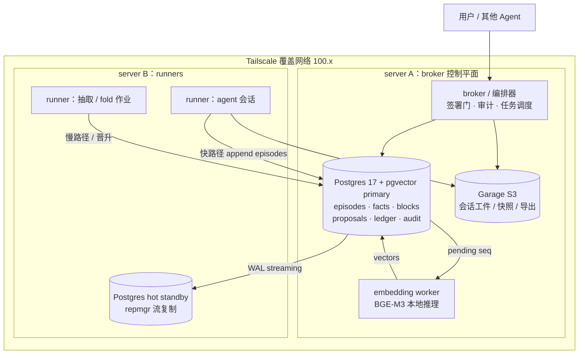
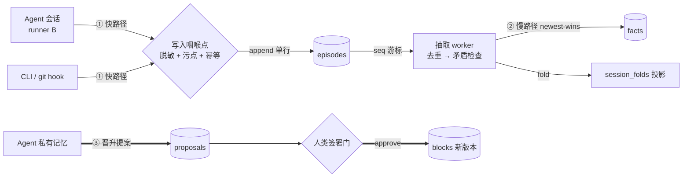
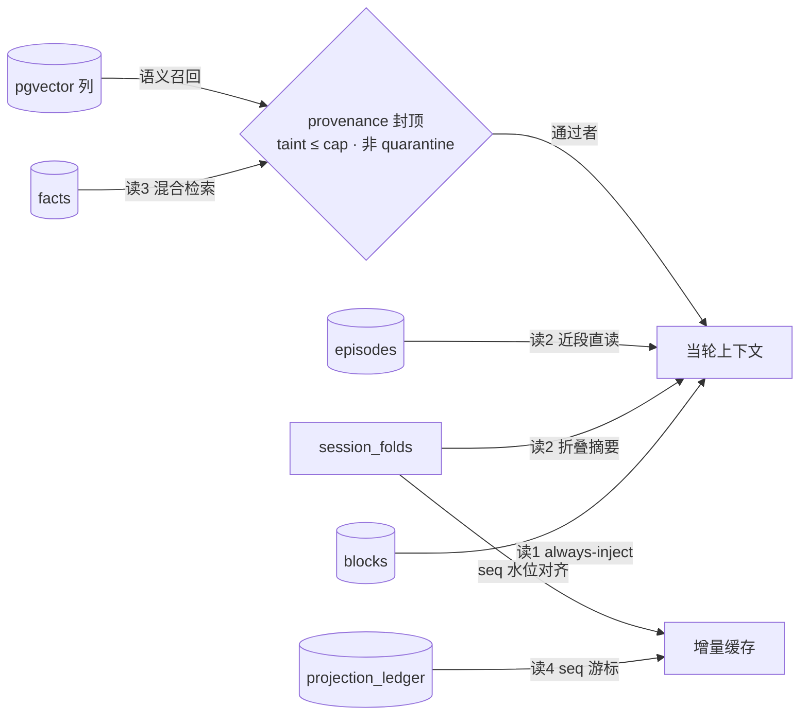

# 云端记忆架构：双机自托管 Agent 平台的记忆存储设计

本笔记把记忆系统落到具体的存储架构上：一个自托管的两服务器 Agent 平台——server A 跑 broker 控制平面，server B 跑 runners——存储底座是 Postgres 17 + pgvector、Garage S3 对象存储与 Tailscale 覆盖网络。要回答的问题是：单一强制存储该长什么样？事件溯源的记忆层如何服务化？写入与读取各有哪些路径、各带什么数据契约？以及，当记忆本身成为攻击面时，平台要付出哪些结构性代价？

证据分层与 [[./04-org-knowledge-and-adrs.md]] 同规则：arXiv 条目标注版本与自报范围，框架与厂商内容标 [厂商]，博客与示例代码标 [grey literature]。与 MaintainAll 云侧设计的对应关系见 cloud-agent-design.md §13（仓库外文档，此处仅文字提及，不做链接）。理论侧"哪些机制防记忆衰减"已在 04 的综合节给出，本篇是其存储层实现。



## 事件溯源记忆：projectmem 与 ESAA

### projectmem：本地优先、事件溯源的编码 Agent 记忆层（arXiv:2606.12329，v2 2026-09-30）

- **元信息**：Ripon Chandra Malo、Tong Qiu，University of Utah。开源实现 github.com/riponcm/projectmem（Python ≥3.10，PyPI 安装，运行时依赖仅 Typer、MCP SDK、watchdog，约 1.5 MB，无数据库引擎；论文描述 v0.3.3）。v2 于 2026-09-30 修订。

- **一句话总结**：把项目开发史记录为 append-only 的类型化事件日志（issue/attempt/fix/decision/note），由确定性投影折叠成 Agent 可读的摘要，经 MCP 暴露；在 Agent 修改文件前，文件级的 advisory precheck 把该文件上"已失败过的做法"回喂给它——作者称之为 Memory-as-Governance。

- **问题与动机**：编码 Agent 跨会话丢失项目特有的来龙去脉：重读源码、重问昨天答过的问题、重推架构决策，最贵的失败模式是重试已经失败过的修复。瓶颈不是模型能力而是缺一层持久的项目记忆。注意它对自己的定位很克制：记录的是"发生过什么"，意图（plan）单独放 plan.md，不混入事件日志——"计划被修改的次数和被遵守的次数一样多"，意图与结果混记会污染日志。

- **核心设计**：六个要点。①**单一写入咽喉点**：无论 CLI、git hook 还是 MCP 工具写入，都经同一个函数——归一化时间戳、做密钥脱敏、追加一行 JSON 到 events.jsonl、再重新生成投影。②**确定性投影**：summary.md 是日志的 fold（外加唯一人工输入 PROJECT_MAP.md 的项目用途段），规则固定——每个 issue 列最近状态与修复及最近三次失败尝试；未退役的决策全列；只留最近十条 note；最多列 20 个被引用文件。投影永远可从日志重建，坏了 regenerate 即可，与"可变记忆"设计形成对照。③**判定门 precheck_file(path)**：返回六类信号——回望 30 天的（失败尝试、高churn ≥4 次提交、近期 revert、最近一条相关决策）与不设时限的（该文件未关闭 issue、引用它但可能已过时的记忆）；同一文件失败尝试 ≥3 次把严重度从 warn 升为 block。只读记忆与 git 元数据、从不读文件内容；确定性；代价是一次日志扫描加两次 git 调用。advisory 默认不拦 commit（严格模式留给人/CI 手动开）；snooze 静默本身也被记日志。④**写时 supersedes 解析**：decision 事件可带 supersedes 字段，写入时从完整 id 或唯一前缀解析，解析不了或歧义直接拒写——引用不可能指向未来事件，因此链上无环（acyclic by construction）；retired 集在读时算（被引用事件集合），退役事件留在日志里不动，从摘要和 precheck 输出中隐去，搜索结果里标注 (superseded)；反转链天然收敛到最新决策。⑤**脱敏**：模式匹配、锚定替换为 [REDACTED:kind]；**fail-open 设计**——脱敏器自身报错时事件原样写入，用"可能存进一个密钥"换"写入永不中断"。⑥**Agent 协议**：AI_INSTRUCTIONS.md、CLAUDE.md/AGENTS.md 桥接文件与 MCP 指令三层告知 Agent 先读摘要和项目图、改文件前先调 precheck；新项目先填图（Setup Mode）后进入维护模式；论文明说这一切**不被强制执行**，Agent 可以跳过——自研究因此只统计"写了什么"而非"该写什么"。

- **关键结果**：全部 [自报]。作者自跑的六个月双机自研究：27 个项目 3,228 条去重事件，56% 是 issue 生命周期事件；427 个被修复关闭的 issue 中 86 个在事件日志顺序里首次修复前至少有一次失败尝试——"这些历史是后续告警的候选对象，而不是告警阻止了失败的证据"（原文的诚实措辞）。延迟基准（合成仓库 1,500 事件日志）：分析中位耗时 42.0 秒降到 79.3 毫秒；每次检查的 git 子进程从 1,500 个降到 2 个，且告警输出保持不变。

- **局限与批评**：论文自列三组硬限制。**无进程间锁**——并发写者不协调；**非原子**——日志与投影分两步更新，崩溃间隙摘要滞后，append 中途崩溃留下撕裂行，读取器报错指出行号、需手工修复；**脱敏 fail-open**——模式不认识的新型密钥会漏，脱敏器故障则整条明文入库。另有两处方法论提醒：precheck 的阈值（30 天窗口、4 提交 churn、3 次失败升级）是工程默认值，论文明确说未做经验优化、未评估其效用；advisory 门"报告哪些做法失败过"，并不对比"你正要提的改法"与"早先失败的改法"。以及 supersedes 关系"只与写入者维护得一样完整"——不带引用的反转会留下两条并存决策。

- **关系定位**：是"文件级否定决策护栏"（见 [[./04-org-knowledge-and-adrs.md]] tianpan 条目）的第一个开源完整实现；其"写时解析 supersedes"与 DocDag 的"CI 校验图不变量"是同一条纪律在写入侧与检查侧的两种落点；其事件溯源形态与 ESAA（下条）同构但目标不同——projectmem 服务单 Agent 的项目记忆，ESAA 服务多 Agent 流水线的治理审计。

- **启示**：单机文件版的三处硬伤（锁、原子性、fail-open）恰好都是 Postgres 一句话能修的部分——这正是"服务器平台如何修复本地优先设计的已知限制"的教科书对照：**写入咽喉点变成事务内的 INSERT；日志与投影同事务提交（或经 outbox 表）；撕裂行不可能存在；脱敏失败可以 fail-closed 进隔离区；advisory 门在 broker 侧可以升级为强制门**。迁移时不要丢掉它的三条纪律：append-only、确定性投影、判定门只读元数据不读内容。

- **选读建议**：§2 设计节（日志/投影/判定门/supersession/durability 五小节，全文精华，约 30 分钟）；§3 实现节只看数据生命周期图；§6 局限与 §7 相关工作值得通读以校准预期。

### ESAA / ESAA-Security：事件溯源 + CQRS 的代理软件工程治理（arXiv:2603.06365，2026-03-06）

- **元信息**：Elzo Brito Dos Santos Filho 等。ESAA-Security 是 ESAA 架构在安全审计域的特化论文；v1 仅 11 KB，属短文/说明性稿件，未见大规模实验。

- **一句话总结**：ESAA（Event-Sourced Architecture for Agents）把"启发式的 Agent 认知"与"确定性的状态变更"分开：Agent 在受约束的协议下发出结构化意图（intention），编排器验证后把接受的结果持久化到 append-only 日志，派生视图作为投影重建，并用重放加哈希校验一致性——安全审计被建模成契约与事件治理下的证据流，而不是与 LLM 的自由对话。

- **问题与动机**：AI 加速生成代码后，功能正确但结构不安全的系统增多；用 prompt 做安全评审存在覆盖不均、可复现性差、发现无证据支撑、无不可变审计轨迹四个问题。ESAA-Security 把安全评审操作化为四阶段流水线（侦察 reconnaissance、域审计执行、风险分类、最终报告），26 个任务、16 个安全域、95 个可执行检查，产出结构化检查结果、漏洞清单、严重度分级、风险矩阵、修复建议、执行摘要与 markdown/JSON 终稿。

- **核心设计**：一句话概括即完整架构：**intention → orchestrator 校验 → append-only 事件日志 → 读模型作为投影**。写侧只有编排器能动状态；Agent 只能提议。任何派生视图（漏洞清单、风险矩阵）都随时可从日志重放重建；重放结果与存储哈希比对即一致性验证。这是教科书式的事件溯源 + CQRS：事件日志是写模型，报告视图是读模型。

- **关键结果**：无对照实验；主张是架构性质层面的——终稿报告"可审计 by construction"（结构可审计），可复现（重放即复现）。[自报/架构主张]

- **局限与批评**：短文，未给出大规模实证；意图 schema 的设计质量决定整个系统的天花板，论文未展开；重放校验能保证"日志没被篡改"，不能保证"日志里记的就是真相"——Agent 编造并通过校验的意图依然入库，这是事件溯源管不到的地方，需要 projectmem 式的判定门或人类签署门补位。

- **关系定位**：为平台提供治理骨架：runners 上的 Agent 会话只发意图，broker（编排器）校验后写 Postgres——与下面的三条写路径一一对应；其教训也直接适用：校验保一致性不保真实性。

- **启示**：①平台里"Agent 提议、broker 裁决、事件入库、投影服务读取"的分层直接照抄；②审计轨迹（谁、何时、依据哪条会话、做了什么变更）应是存储 schema 的一等列，不是外挂日志；③重放能力在双机上很廉价——WAL 归档 + Garage 快照即可。

- **选读建议**：全文很短，一次读完；把"agents emit structured intentions under constrained protocols"那段与 projectmem 的写入咽喉点对读，两者合起来就是本平台的写入契约。

## 存储工程蒸馏

以下各节是面向本平台（2 服务器、Postgres + Garage S3 + Tailscale）的选型论证，每条标来源与证据等级。原则：**单一强制存储**——一个组件必须存在，其余全部可选可换。

**Postgres 17 + pgvector 作为唯一强制存储**。所有记忆态（episodes/facts/blocks/proposals/ledger/audit）进一套 Postgres；pgvector 承担向量检索，免去第二个向量库。理由：两服务器规模上，每多一个强制有状态组件就多一份备份/监控/故障域；pgvector 的 HNSW 索引在十万到百万级行的记忆场景完全够用 [grey literature，工程共识]。与本文 schema 配套的 provenance 列约定：`created_by`（谁写的：agent/user/hook/pipeline）、`session_id`（哪次会话）、`source_taint`（污点深度，见安全节）、`confidence`（抽取置信度）、`supersedes_id`（失效链指针）、`review_state`（auto / human_confirmed / quarantined）——每张记忆表都带这六列，04 的三平面架构就靠它们落地。

**核心表一览（列级契约）**。六张表的角色一句话说清；六列 provenance 契约见上段不再重复，完整 DDL 见"三条写路径"一节。

| 表 | 专有列 | 角色 |
|----|--------|------|
| episodes | episode_id, agent_id, session_id, seq, kind, payload, created_at | 快路径唯一写点；UNIQUE(session_id, seq) 即幂等键 |
| facts | fact_id, subject, predicate, object, valid_from, valid_until, source_episode_id | 慢路径产出；valid_until NULL = 当前成立，失效不删除 |
| blocks | block_id, agent_id（'shared' = 受治理）, name, content, version, source_proposal_id, updated_at | 晋升产物；version 单调递增 |
| proposals | proposal_id, kind, content, proposed_by, reviewer, reviewed_at, target_block | 晋升通道；review_state: pending / approved / rejected |
| projection_ledger | projection, entity_id, seq, state, updated_at | 投影游标；embedding 与 fold 两类消费者共用 |
| audit | audit_id（identity）, at, actor, action, object, before, after, session_id | 只插不改；ESAA 重放校验的消费者 |

**图数据库的许可证问题（Graphiti 选型）**。Graphiti（getzep/graphiti，论文 arXiv:2501.13956）是时序知识图的标杆实现，但其可用后端实质只剩 Neo4j 5.26（社区版 GPLv3）与 FalkorDB 1.1.2（SSPL v1）——前者 copyleft、后者 SSPL 对服务化不友好；Kuzu 支持已被标记 deprecated（上游停止维护）；Neptune 是云绑定选项 [厂商文档，Graphiti README 逐条核对]。若坚持单数据库，许可证干净的替代是 **Apache AGE**（Postgres 扩展，openCypher，Apache 许可证），代价是 Graphiti 官方没有 AGE 驱动，要么自写 driver 要么放弃 Graphiti 的抽取管线 [grey literature，多方对比资料一致]。本平台结论：第一版不上图——facts 表的 (subject, predicate, object) + 递归 CTE 足够表达 supersession 链；真要时序图时优先评估 AGE 而不是为 Graphiti 引入第二个有状态服务。

**Mem0 的两阶段抽取与 v3 ADD-only 重构**。Mem0 OSS（github.com/mem0ai/mem0；论文 arXiv:2504.19413）的经典管线分两相：extraction——LLM 结合全局对话摘要与近期消息窗口抽取候选记忆；update——LLM 对每条候选与检索到的既有记忆比对，输出 ADD / UPDATE / DELETE / NOOP [厂商/论文]。但 2026 年的 v3 重构把管线改成 **ADD-only 单遍抽取**（官方迁移文档 docs.mem0.ai/migration/oss-v2-to-v3，2026-08："with ADD-only extraction, hybrid search, and entity-aware retrieval"，且明说"记忆条数会随时间增长而不做合并，这是设计使然：检索负责相关性排序"）[厂商文档]。冲突点：截至本次核验，第三方分析与论文引用的 OSS 代码路径仍是 ADD/UPDATE/DELETE/NOOP 两阶段（如 arXiv:2601.06490 的算法描述），官方文档口径与开源实现是否已同步，**以仓库当前代码为准，引用前先验证**——任务方提示的"2026 年 4 月 ADD-only 重构报告与 OSS 代码路径冲突"经核对应修正为"重构文档（2026 年中）与第三方可见的 OSS 路径不一致"。对本平台的启示：失效用"新行 + supersedes_id + valid_until"表达（同 projectmem 的读时 retired），UPDATE/DELETE 物理操作从记忆层消失。

**Letta 块模型与 sleep-time compute**。Letta（原 MemGPT，论文 arXiv:2310.08560）的三层：core memory blocks（persona/human 小块，始终驻留上下文，Agent 可用工具自编辑）；archival memory（pgvector 支撑的外部存储，按需检索）；recall memory（对话全史）。[厂商文档] 与本平台直接相关的两个点：其一，**block 是可编辑的最小治理单元**——本 schema 的 blocks 表即此模型；其二，**sleep-time compute**——后台异步做记忆整理（巩固、去重、摘要），把记忆维护移出请求关键路径；Letta 报告其 sleep-time 智能体在 AIME、GSM8K 等基准上取得帕累托改进 [厂商，自报]。对应本平台 runner B 上的"慢路径"作业。

**LangGraph 的命名空间元组与 checkpointer**。LangGraph 的跨线程存储以命名空间元组组织，如 `("users", user_id, "memories")`、`("tasks", task_id, "docs")`——分层隔离直接落在键空间里；Postgres checkpointer 把状态落到 `checkpoints` / `checkpoint_blobs` / `checkpoint_writes` 表，跨线程 store 用 `store` / `store_blobs` 表 [厂商文档]。启示：本平台的 `agent_id` + `scope` 列即等价物；若未来直接复用 LangGraph 运行时，表结构已对齐，不必迁移。

**两节点 HA：repmgr 与 Patroni 的取舍**。本平台两服务器：**repmgr**（EDB 的流复制管理器）是更贴合的形态——primary 注册、standby clone、`repmgrd` 守护自动 failover，支持 witness 防脑裂，两节点即可跑（接受 failover 时需人工/脚本确认的风险）[厂商文档]。**Patroni** 走 DCS（etcd/Consul/Raft）仲裁，官方实践要求奇数仲裁成员——两节点配置需要第三个 witness（或云上一个小仲裁实例），否则 DCS 自身脑裂等于没做 HA [厂商文档]。双机取舍：选 repmgr 主+热备 + 每日 Garage 快照兜底；接受"备机同时也是 runner，failover 时先抢资源"这个容量瑕疵，或把 runner 作业做成可暂停。误用提醒：不要把 Patroni 的 DCS 仲裁塞进两节点还指望自动 failover。

**embedding 流水线移出请求路径**。嵌入生成放独立 worker（server A 上与 broker 同机即可）：记忆表写入时只记 `embedding_pending=true`（或经 projection_ledger 的 seq 游标），worker 消费游标、调用本地 **BGE-M3**（BAAI FlagEmbedding，100+ 语言、最长 8192 token、dense+sparse+multi-vector 三模式 [厂商/论文]）写回向量列。请求路径只做向量查询。这样换嵌入模型 = 重建 projection_ledger 对应分区的向量列，不动业务表。

## 三条写路径

所有写入都过 broker 侧的写入咽喉点（学 projectmem），每条路径一张核心表。三条路径的关系（数字对应下文各节）：



**写路径一：快路径——情节直写**。Agent 会话运行中追加 episode，只插不改，延迟敏感。

```sql
CREATE TABLE episodes (
  episode_id    uuid PRIMARY KEY DEFAULT gen_random_uuid(),
  agent_id      text   NOT NULL,
  session_id    text   NOT NULL,
  seq           bigint NOT NULL,               -- 会话内单调
  kind          text   NOT NULL,               -- message | tool_call | tool_result | observation
  payload       jsonb  NOT NULL,
  created_at    timestamptz NOT NULL DEFAULT now(),
  created_by    text   NOT NULL,               -- agent | user | hook
  source_taint  smallint NOT NULL DEFAULT 0,
  confidence    real,
  review_state  text NOT NULL DEFAULT 'auto',
  supersedes_id uuid,
  UNIQUE (session_id, seq)
);
```

咽喉点的完整契约（学 projectmem 的"一个函数"，补上服务器版才有的三件：fail-closed 脱敏、幂等、同事务投影游标）：

```text
function write_event(event, actor):                  # MCP 工具 / CLI / hook / worker 全部共用此入口
    event.ts = normalize_timestamp(now())
    try:
        event.payload = redact_secrets(event.payload)    # 锚定模式替换 → [REDACTED:kind]
    except ScrubberError:                                # 服务器版不必 fail-open
        quarantine(event, reason="redactor_error")       # 隔离区落库，可对调用方返回成功（quarantine 模式）
        return QUARANTINED
    event.source_taint = compute_taint(actor, event)     # 0 = clean；读到用户/外部数据即 >0，单向不回落
    key = (event.session_id, event.seq)                  # 幂等键：重试与重放折叠为同一条
    with transaction():
        if exists(episodes, key): return DUPLICATE
        insert(episodes, event)
        insert(projection_ledger, projection="embedding:episodes",
               entity_id=event.episode_id, seq=next_seq(), state="pending")
        insert(audit, actor=actor, action="episode.append", object=key)
    return ACCEPTED
```

**写路径二：慢路径——抽取与时效失效**。后台作业（runner B，sleep-time 语义）把 episodes 折叠成 facts；冲突用 newest-wins：同 (subject, predicate) 的新事实写入同事务把旧行 `valid_until` 置位，物理行永不 DELETE——与 Mem0 v3 的 ADD-only 同向，且失效链就是审计链。慢路径作业循环（读路径二的 fold 与 facts 表都由它产出；newest-wins 失效不删除）：

```text
function extraction_loop(batch_size=100):
    while True:
        batch = select(episodes where extracted=false order by seq limit batch_size)
        for ev in batch:
            candidates = llm_extract(ev)                     # 全局摘要 + 近期消息窗口 → 候选事实
            retrieved  = hybrid_search(candidates, k=8)      # 向量 + BM25 召回既有 facts
            for c in candidates:
                if dup := exact_match(c, retrieved):
                    link_duplicate(c, dup); continue         # 重复：只记链接，不新增行
                contra = contradiction_check(c, retrieved)   # 与现存事实冲突？
                with transaction():
                    if contra:                                # newest-wins：新行上位，旧行时间作废
                        insert(facts, c, supersedes_id=contra.id)
                        update(facts, set valid_until=now() where id=contra.id)
                    else:
                        insert(facts, c, valid_until=null)
                    mark_extracted(ev)                        # 游标推进，崩溃后按 extracted 标记幂等重跑
```

```sql
CREATE TABLE facts (
  fact_id       uuid PRIMARY KEY DEFAULT gen_random_uuid(),
  subject       text NOT NULL,
  predicate     text NOT NULL,
  object        text NOT NULL,
  valid_from    timestamptz NOT NULL DEFAULT now(),
  valid_until   timestamptz,                   -- NULL = 当前成立
  supersedes_id uuid REFERENCES facts(fact_id),
  confidence    real NOT NULL DEFAULT 0.5,
  review_state  text NOT NULL DEFAULT 'auto',
  source_episode_id uuid NOT NULL REFERENCES episodes(episode_id),
  created_by    text NOT NULL,
  session_id    text NOT NULL,
  source_taint  smallint NOT NULL DEFAULT 0
);
CREATE INDEX facts_current ON facts (subject, predicate) WHERE valid_until IS NULL;
```

**写路径三：晋升——带人类门**。私有平面 → 受治理平面的唯一通道：提案落表，人批准，同事务写 blocks 新版本并记审计。未批准的提案永远只是提案。

```sql
CREATE TABLE proposals (
  proposal_id  uuid PRIMARY KEY DEFAULT gen_random_uuid(),
  kind         text NOT NULL,                  -- block_update | skill | org_scope
  content      jsonb NOT NULL,
  proposed_by  text NOT NULL,
  session_id   text,
  review_state text NOT NULL DEFAULT 'pending',-- pending | approved | rejected
  reviewer     text,
  reviewed_at  timestamptz,
  target_block text
);

CREATE TABLE blocks (                            -- always-inject 的可编辑记忆
  block_id     uuid PRIMARY KEY DEFAULT gen_random_uuid(),
  agent_id     text NOT NULL,                   -- 'shared' 表示受治理平面
  name         text NOT NULL,
  content      text NOT NULL,
  version      int  NOT NULL DEFAULT 1,
  source_proposal_id uuid REFERENCES proposals(proposal_id),
  created_by   text NOT NULL,
  session_id   text,
  source_taint smallint NOT NULL DEFAULT 0,
  confidence   real,
  review_state text NOT NULL DEFAULT 'auto',
  supersedes_id uuid,
  updated_at   timestamptz NOT NULL DEFAULT now()
);
-- 批准动作 = 单事务: UPDATE proposals SET review_state='approved', ...;
--                  INSERT blocks (... version = 旧 version+1, source_proposal_id = 该提案)
```

## 四条读路径

四条读路径的关系（数字对应下文各节）：



**读路径一：always-inject blocks**。每轮请求固定注入的块（预算硬上限内），等价 Letta core memory。

```sql
SELECT name, content, version FROM blocks
WHERE agent_id IN ('shared', :agent) AND review_state <> 'quarantined'
ORDER BY name;
```

**读路径二：session-start fold**。新会话启动时取"近段直读 + 远段折叠摘要"：先拉本会话最近 N 条 episode，再取最近一次 fold 覆盖更早历史；fold 本身由 runner B 周期生成，存到 `session_folds(agent_id, source_seq_hi, summary, generated_at)`，用 seq 水位对齐。

```sql
SELECT payload FROM episodes
WHERE session_id = :sid ORDER BY seq DESC LIMIT 200;
SELECT summary FROM session_folds
WHERE agent_id = :agent AND source_seq_hi <= :known_hi
ORDER BY source_seq_hi DESC LIMIT 1;
```

**读路径三：查询时混合检索，provenance 封顶降级**。向量 + 关键词混合后按 provenance 过滤降级：污点超过会话阈值、`review_state='quarantined'`、或 auto 且 confidence 低于下限的条目直接出局——这就是"provenance-capped demotion"，把安全节的污点语义落进读路径。

```sql
SELECT subject, predicate, object, confidence, source_taint, review_state
FROM facts
WHERE subject = :subject AND valid_until IS NULL
  AND review_state <> 'quarantined'
  AND source_taint <= :taint_cap
  AND (review_state = 'human_confirmed' OR confidence >= :floor)
ORDER BY confidence DESC, valid_from DESC;
```

**读路径四：seq 键控缓存**。嵌入与折叠投影都经 ledger 游标增量失效——读侧只要 `seq > last_seen` 的行，缓存键带游标版本。

```sql
CREATE TABLE projection_ledger (
  projection  text   NOT NULL,     -- 'embedding:facts' | 'fold:session' | ...
  entity_id   uuid   NOT NULL,
  seq         bigint NOT NULL,
  state       text   NOT NULL,     -- pending | done | failed
  updated_at  timestamptz NOT NULL DEFAULT now(),
  PRIMARY KEY (projection, entity_id)
);
-- worker: SELECT ... WHERE state='pending' ORDER BY seq LIMIT n; 处理后置 done 并写回向量/摘要
```

审计表兜底全部写路径：`audit(audit_id, at, actor, action, object, before jsonb, after jsonb, session_id)`，identity 列做主键，只插不改；ESAA 的重放校验消费它。

## 记忆安全：写入路径即投毒通道

### MPBench：记忆投毒的系统化研究（arXiv:2606.04329，v2 2026-06-18）

- **元信息**：Pritam Dash 等。基准 + 威胁模型论文，v2 2026-06-18。

- **一句话总结**：持久记忆让 Agent 得以跨会话学习，也让一次对抗性写入获得对 Agent 行为的长期影响力；MPBench 识别出四条记忆写入通道与九种结构性漏洞，归纳六类投毒攻击，并证明"记忆读写越积极的 Agent 越容易被利用"，现有 prompt injection 防线覆盖不了记忆投毒。

- **问题与动机**：投毒的可怕在于延迟触发——一次写入，数周后经由检索命中生效，与当时会话里有什么内容无关。

- **核心设计**：四条写入通道（ conversation 内容、工具返回、文件/外部内容、记忆系统自身的抽取写入——以本平台的 schema 看，四条路分别对应 episodes 的快路径、tool_result 载荷、RAG 语料、facts 的慢路径）；九种漏洞分布在模型能力、系统提示设计、Agent 系统架构三层；六类攻击 taxonomy。基准结论：读写记忆越激进（写得多、检索得深）的 Agent 越容易被投毒利用；现有注入防御对记忆投毒基本无效。

- **关键结果**：上述威胁模型与"aggressive memory → more exploitable"趋势为论文自报 [自报]；"现有 prompt injection defenses fail to cover memory poisoning attacks"同样是其基准上的结论 [自报]。其量化强度按攻击类别而异，引用具体数字请回到原文表格。

- **局限与批评**：基准环境为研究者构造的受控场景；防御侧只给了方向性结论（写入门控、来源标注、检索隔离），未给出端到端的量产方案。

- **关系定位**：给本平台的直接要求：`source_taint` 列、quarantine 状态、晋升门不是锦上添花，是写入通道的最小安全件。

- **启示**：把记忆写入当成不可信输入处理——与对待用户粘贴文本同一等级，甚至更高（它会被未来的自己读）。

- **选读建议**：读威胁模型节（通道 + 漏洞 taxonomy）与六类攻击的定义；防御节可对照下一条（写入门控）一起看。

### 注入-执行解离与写入门控（arXiv:2605.08442，v5 2026-08-04）

- **元信息**：Jun Wen Leong 等。5,040 次运行的因子实验 + 21 个模型的加载语料评估，2026 年 5–8 月历经五版修订。

- **一句话总结**：注入成功与执行成功是可分离的安全属性——恶意指令以超过 97.5% 的比率被存进持久记忆，但下游执行率从 0% 到 95% 不等且与存储率无关；因此"只挡写入"不够，必须在记忆摄取与动作执行之间结构性 enforce 权威边界。

- **问题与动机**：延迟触发攻击跨会话边界存活（经 RAG 检索复活）。作者把威胁模型重新表述为：防存储 ≠ 防执行，两道门要分开建。

- **核心设计**：5,040 次运行 × 九个开源模型，六个防御 × 四个架构层因子组合。关键发现：防御效果由它**相对于攻击权威边界的位置**决定，不由分类器质量决定；唯一把九个模型里八个的攻陷率打到 0% 的是 **Memory Sandbox**——工具层的结构性隔离，把检索回来的记忆与可执行上下文隔开（召回内容进"数据区"，进不了"指令区"）。推理模式消融给出双分离：没有任何单一 schema 层干预对推理与非推理两类模型同时安全。厂商相关模式（21 模型加载语料）：Anthropic 主要在注入侧拦截，OpenAI 在执行侧拦截，一个 Gemini 预发布端点在多数运行中外泄——厂商差异大于模型差异。

- **关键结果**：存储率 >97.5%、执行率 0–95% 无相关、Memory Sandbox 8/9 模型 0% 攻陷——全部 [自报]，但样本量（N=40/条件，头部模型补到 N=172）在同类工作里偏大，且五版修订显示作者持续加固实验设计。

- **局限与批评**：受控基准不等于真实工作负载；Memory Sandbox 是对召回内容降权处理的架构约定，在"记忆恰好是完成任务所需指令"的场景存在可用性张力；预发布端点的结果可能不代表量产行为。

- **关系定位**：与本节另两条合读正好是"写入侧-存储侧-执行侧"三段防线：Muse（下条）给存储侧的污点与凭据隔离，本条给执行侧的沙箱语义，MPBench 给威胁清单。

- **启示**：本平台的读路径三里"污点封顶降级"只是半截；完整的另一半是执行侧约束——被标记 tainted 或未经评审的记忆只以"引用数据"身份进入提示，绝不被拼进工具参数或系统指令区；这正是 Agent 工作负载下"注入-执行解离"的直接落地。

- **选读建议**：先读摘要与威胁模型重构（"injection-execution dissociation"段），再读 Memory Sandbox 定义与厂商相关模式节；实验细节按引用需要回查。

### Muse 的代理凭据与污点标签（Meta 安全架构发布，2026-09-08；媒体技术分析）[grey literature]

- **元信息**：Meta 于 2026-09-08 发布其个人 AI Agent "Muse" 的安全架构；以下细节来自 Forkast News（2026-09-24）与 VentureBeat（2026-09-22）的技术分析，非 Meta 一手文档。

- **一句话总结**：Muse Secure VM 用 eBPF 污点追踪、凭据代理化（surrogation）与主机侧权限权威（Sentinel）在操作系统层圈住 Agent——模型必然出错，所以把安全放进模型绕不开的内核层。

- **问题与动机**：消费级 Agent 连接大量个人服务，一旦模型被注入或 hallucinate，后果是真实世界的（发消息、下单、改密码）。架构假设：Agent 一定会犯错，基础设施必须是最后防线。

- **核心设计**：每用户 Linux VM 分两个安全域：runtime cell（systemd-nspawn 容器，跑 Agent harness 与工具）与 host 域（放安全敏感服务）。**Sentinel** 是所有 connector 动作与网络出向的唯一权威——Agent 只能提议，放行与否由 Sentinel 裁决。eBPF 污点追踪：cgroup 程序做网络拦截与进程归属，LSM hook 挂接污点传播——工具进程起步是 clean；一旦读了用户数据即 tainted，clean 且落在窄白名单内的网络请求可自动放行，tainted 进程失去自动放行权、进入更严的审批流。**凭据代理化**：`hatch-authd` 守护进程管凭据存储与代理，Agent 拿到的 surrogate token 不带任何实际权限，真密钥由 Sentinel 在网络边界即时注入——就算模型整体被攻陷也摸不到认证令牌。已知对抗实例：Patrick Wardle 披露的 macOS 零日（隐藏偏好键劫持听写流、窃取认证令牌），Meta 12 小时热修——证明"host 自己被打穿时该模型也有缝"。

- **关键结果**：无受控实验；架构已随 Muse 发布实装 [grey literature，媒体报道]。bug bounty 顶格 $300,000（账户接管 $130,000 档，覆盖影响单用户的成功注入），Meta 自承注入是行业未解问题——用市场价格给残余风险定价，而非宣称已消除。

- **局限与批评**：垂直整合方案，单机/单 VM 假设，不直接映射到本平台的多 runner 服务化形态；媒体转述可能与一手文档有出入；零日案例恰恰说明 host 层自身的攻击面同样要计入。

- **关系定位**：三条可迁移件：①surrogate 凭据——平台侧凭证库（broker 持有真凭据，runner 上的 Agent 只见一次性代理句柄，用时由 broker 注入）直接对应我们的 Tailscale + broker 拓扑；②taint 标签——正是 schema 里 `source_taint` 列的运行时版（Muse 在进程级标，我们在记录级标）；③"Agent 提议、独立权威裁决"——broker 签署门与 Sentinel 同构。

- **启示**：记忆与凭据同构——都不给 Agent 真东西，只给代理，真值由平台在边界处注入；污点一旦标记就不可逆地降权（tainted 进程回不到 clean），我们的 `source_taint` 语义应同样单向。

- **选读建议**：Forkast 分析文（本篇细节主源）十分钟；VentureBeat 文补零日案例；一手材料以 Meta 发布的安全架构文档为准（本次未直接核验）。

### 再基线与隔离区：quarantine 与 re-baseline [grey literature]

- **元信息**：AWS 示例仓库 sample-agent-memory-poisoning-defense 的 ARCHITECTURE.md（2026-08）；行业安全指南的 re-baseline 建议（如 nhimg.org 2026-09 的"expire and re-baseline long-term memory periodically"）。均为非评审资料。

- **一句话总结**：对可疑记忆写入"假装成功、实则隔离"（quarantine），对长期记忆周期性地过期与重建基线（re-baseline）——投毒无法被单点防御消灭时，用遏制加换血把它限制在可承受窗口内。

- **问题与动机**：MPBench 显示投毒通道多且现有注入防御覆盖不了；注入-执行解离显示已存Payload可长期休眠。承认防不住，转问：如何让单次投毒的影响有界？

- **核心设计**：AWS 示例的 quarantine 模式：写入接口对 Agent 返回成功，内容实际写入隔离命名空间，永不可检索——攻击者拿不到"写入失败"的反馈信号，防御者获得分析样本。re-baseline：给长期记忆设保留期，到期整体过期重建；与读路径三的 `review_state='quarantined'` 与 blocks 的版本重建直接对应。本平台的具体形态：precheck 门（学 projectmem）发现写入内容命中投毒特征 → 落 quarantine 而非 facts；定期 job 把低置信、长期未被检索确认的 auto 记忆批量降级，触发 Agent 重建工作基线。

- **关键结果**：无实验；是防御模式的工程表述 [grey literature]。

- **局限与批评**：quarantine 对"慢速、低感知"投毒有效，但对写入即生效的内部恶意 Agent 无效；re-baseline 丢记忆与降能力之间的平衡点没有公式，只能按域调；这两件都必须配合审计表才能复盘。

- **关系定位**：与本节三条 [自报] 学术结论构成闭环：MPBench 列威胁、2605.08442 定边界、Muse 给机制、quarantine/re-baseline 给运维收尾。

- **启示**：把"换血"写成 cron，而不是写成事故响应预案。

- **选读建议**：AWS 示例的 ARCHITECTURE.md 一页；其余按运维需要回查。

## 小结

两服务器平台的记忆架构可以压成四句话：单一强制存储（Postgres 17 + pgvector）承载全部记忆态，事件日志为写模型、投影与摘要为读模型（projectmem + ESAA 的合流）；写入永远经 broker 咽喉点分三条路径——快路径直插、慢路径 ADD-only 时效失效、晋升必须过人；读取按四路消费，其中混合检索以 provenance 列封顶降级；安全上把记忆写入视为投毒通道，污点标签、代理凭据、隔离区与周期性再基线是最小防线集。所有机制的存储落点都已在本篇的六张表与一张审计表里，与 04 的三平面架构一一对应。未决项：Graphiti/AGE 的图选型留待真出现时序图需求再评估；Mem0 v3 的 ADD-only 与 OSS 实现的一致性引用前须核码。
